# C言語単体テスト自動生成ツール - クラス図

```mermaid
classDiagram
    class CTestAutoGenerator {
        -CCodeParser parser
        -TruthTableGenerator truth_table_gen
        -UnityTestGenerator test_generator
        -IOTableGenerator io_table_gen
        -ExcelWriter excel_writer
        +__init__()
        +generate_all(c_file_path, output_dir) dict
        +_validate_input(c_file_path) bool
    }

    class CCodeParser {
        -Preprocessor preprocessor
        -ASTBuilder ast_builder
        -ConditionExtractor cond_extractor
        +parse(c_file_path) ParsedData
        -_read_file(path) str
        -_extract_function_info(ast) dict
    }

    class Preprocessor {
        -dict defines
        -list include_paths
        +preprocess(code) str
        -_remove_comments(code) str
        -_process_defines(code) str
        -_handle_includes(code) str
    }

    class ASTBuilder {
        -pycparser.CParser parser
        +build_ast(code) AST
        -_add_fake_includes(code) str
        -_handle_parse_error(error) None
    }

    class ConditionExtractor {
        -list conditions
        -int current_line
        +extract_conditions(ast) list
        +visit_FuncDef(node) None
        +visit_If(node) None
        +visit_Switch(node) None
        -_analyze_binary_op(node) dict
        -_extract_switch_cases(node) list
    }

    class TruthTableGenerator {
        -ConditionAnalyzer analyzer
        -MCDCPatternGenerator mcdc_gen
        +generate(parsed_data) TruthTableData
        -_generate_test_number() int
        -_format_table_row(condition, pattern) dict
    }

    class ConditionAnalyzer {
        +analyze_condition(condition) dict
        -_is_simple_condition(cond) bool
        -_is_or_condition(cond) bool
        -_is_and_condition(cond) bool
        -_split_binary_op(cond) tuple
    }

    class MCDCPatternGenerator {
        +generate_or_patterns() list
        +generate_and_patterns() list
        +generate_switch_patterns(cases) list
        -_calculate_mcdc_combinations(n_conditions) list
    }

    class UnityTestGenerator {
        -MockGenerator mock_gen
        -TestFunctionGenerator func_gen
        -CommentGenerator comment_gen
        -PrototypeGenerator proto_gen
        +generate(truth_table, parsed_data) TestCode
        -_generate_header() str
        -_generate_includes() str
        -_generate_setup_teardown() str
    }

    class MockGenerator {
        -list external_functions
        -dict mock_templates
        +generate_mocks(parsed_data) str
        +generate_mock_variables() str
        +generate_mock_functions() str
        +generate_reset_function() str
        -_get_return_type(func_name) str
    }

    class TestFunctionGenerator {
        -BoundaryValueCalculator boundary_calc
        +generate_test_function(test_case, parsed_data) str
        -_generate_test_name(test_case) str
        -_generate_variable_init(test_case) str
        -_generate_mock_setup(test_case) str
        -_generate_assertions(test_case) str
        -_generate_call_count_check(test_case) str
    }

    class CommentGenerator {
        +generate_comment(test_case, parsed_data) str
        -_format_target_branch(test_case) str
        -_format_conditions(test_case) str
        -_format_expected_behavior(test_case) str
    }

    class PrototypeGenerator {
        +generate_prototypes(functions) str
        -_format_prototype(func_info) str
    }

    class BoundaryValueCalculator {
        +calculate_boundary(operator, value, truth) int
        -_parse_comparison(expression) dict
    }

    class IOTableGenerator {
        -VariableExtractor var_extractor
        +generate(test_code, truth_table) IOTableData
        -_extract_input_variables(test_code) list
        -_extract_output_variables(test_code) list
        -_map_test_to_values(test_case) dict
    }

    class VariableExtractor {
        +extract_inputs(test_function) list
        +extract_outputs(test_function) list
        -_is_input_variable(var_name) bool
        -_is_output_variable(var_name) bool
    }

    class ExcelWriter {
        -openpyxl.Workbook workbook
        +write_truth_table(data, filepath) None
        +write_io_table(data, filepath) None
        -_format_header(worksheet, headers) None
        -_apply_cell_style(cell, style) None
    }

    class ParsedData {
        +str file_name
        +str function_name
        +list conditions
        +list external_functions
        +list global_variables
        +dict function_info
        +to_dict() dict
    }

    class TruthTableData {
        +list test_cases
        +str function_name
        +int total_tests
        +to_excel_format() list
        +to_dict() dict
    }

    class TestCode {
        +str header
        +str includes
        +str type_definitions
        +str mock_code
        +str test_functions
        +str setup_teardown
        +str prototypes
        +save(filepath) None
        +to_string() str
    }

    class IOTableData {
        +list input_variables
        +list output_variables
        +list test_data
        +to_excel_format() list
    }

    %% 関係性
    CTestAutoGenerator --> CCodeParser
    CTestAutoGenerator --> TruthTableGenerator
    CTestAutoGenerator --> UnityTestGenerator
    CTestAutoGenerator --> IOTableGenerator
    CTestAutoGenerator --> ExcelWriter

    CCodeParser --> Preprocessor
    CCodeParser --> ASTBuilder
    CCodeParser --> ConditionExtractor
    CCodeParser --> ParsedData

    TruthTableGenerator --> ConditionAnalyzer
    TruthTableGenerator --> MCDCPatternGenerator
    TruthTableGenerator --> TruthTableData

    UnityTestGenerator --> MockGenerator
    UnityTestGenerator --> TestFunctionGenerator
    UnityTestGenerator --> CommentGenerator
    UnityTestGenerator --> PrototypeGenerator
    UnityTestGenerator --> TestCode

    TestFunctionGenerator --> BoundaryValueCalculator

    IOTableGenerator --> VariableExtractor
    IOTableGenerator --> IOTableData

    ParsedData --o CCodeParser
    TruthTableData --o TruthTableGenerator
    TestCode --o UnityTestGenerator
    IOTableData --o IOTableGenerator
```



## 各クラスの責務

### CTestAutoGenerator（ファサード）
- 全体の処理フローを制御
- 各コンポーネントの連携
- エラーハンドリング

### CCodeParser（C言語解析）
- C言語ソースコードの読み込みと前処理
- ASTの構築
- 条件分岐の抽出

### TruthTableGenerator（真偽表生成）
- MC/DC条件の分析
- 真偽パターンの生成
- Excelフォーマット用データ構造の作成

### UnityTestGenerator（テストコード生成）
- Unityテストフレームワーク形式のコード生成
- モック/スタブの生成
- テスト関数の生成

### IOTableGenerator（I/O表生成）
- 入力変数・出力変数の抽出
- テストケース毎の値のマッピング

### ExcelWriter（Excel出力）
- openpyxlを使用したExcelファイル生成
- セルのフォーマット設定
```
