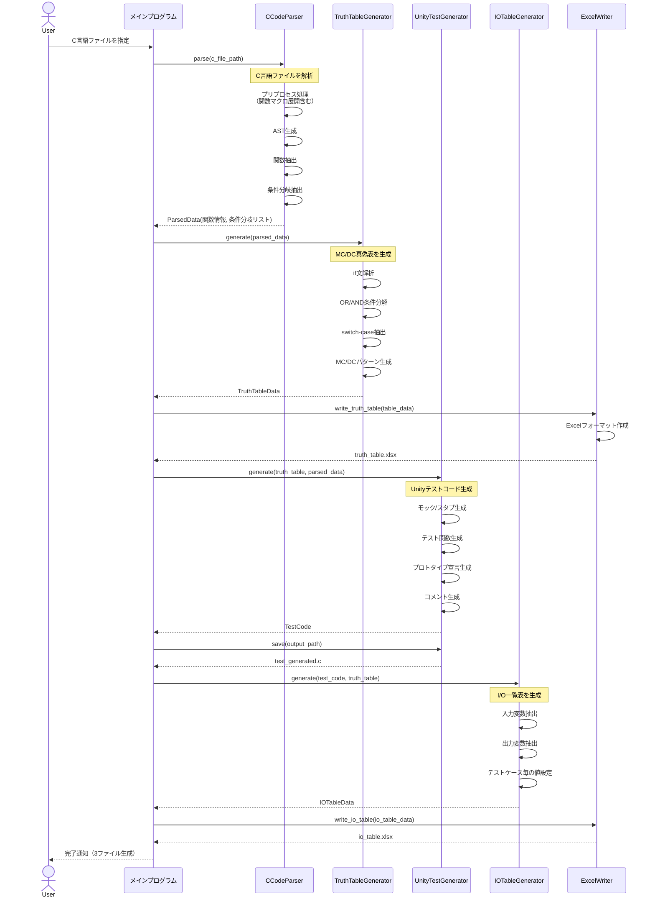
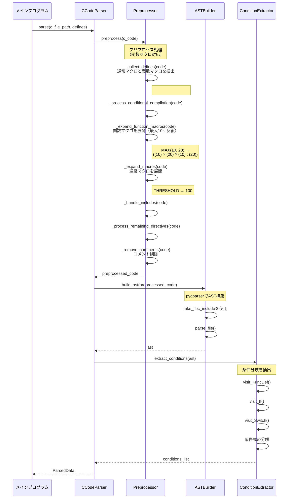
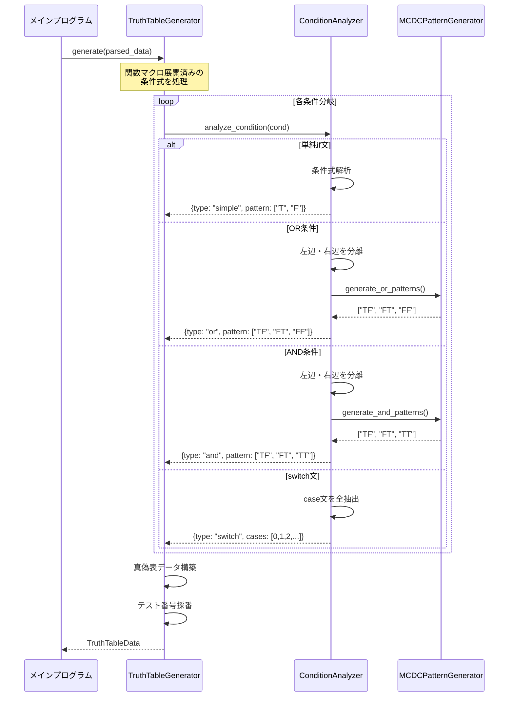
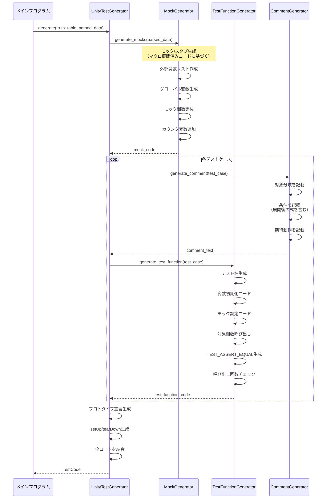
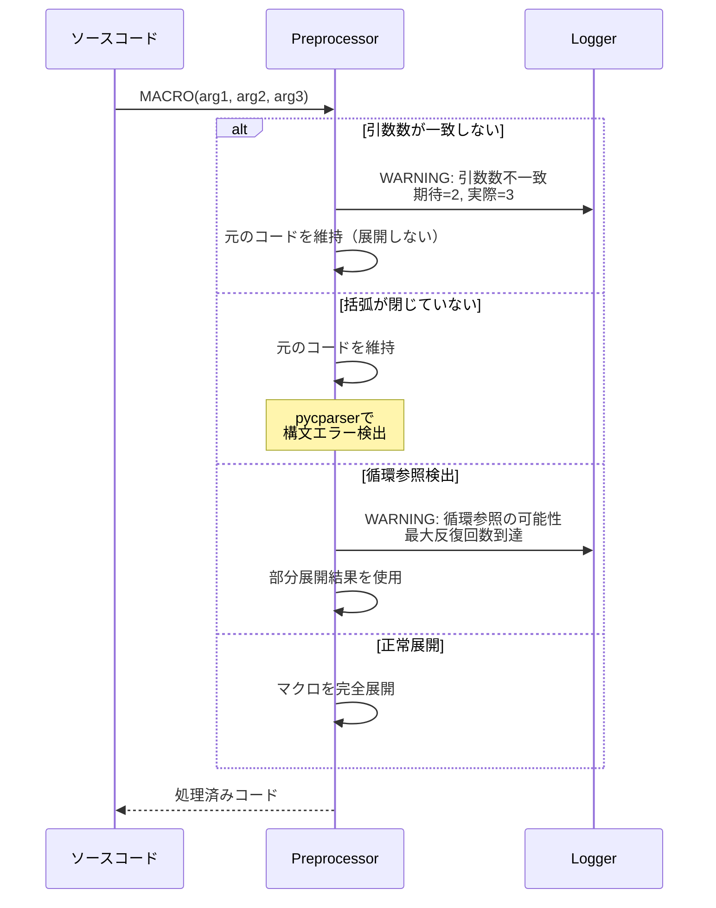
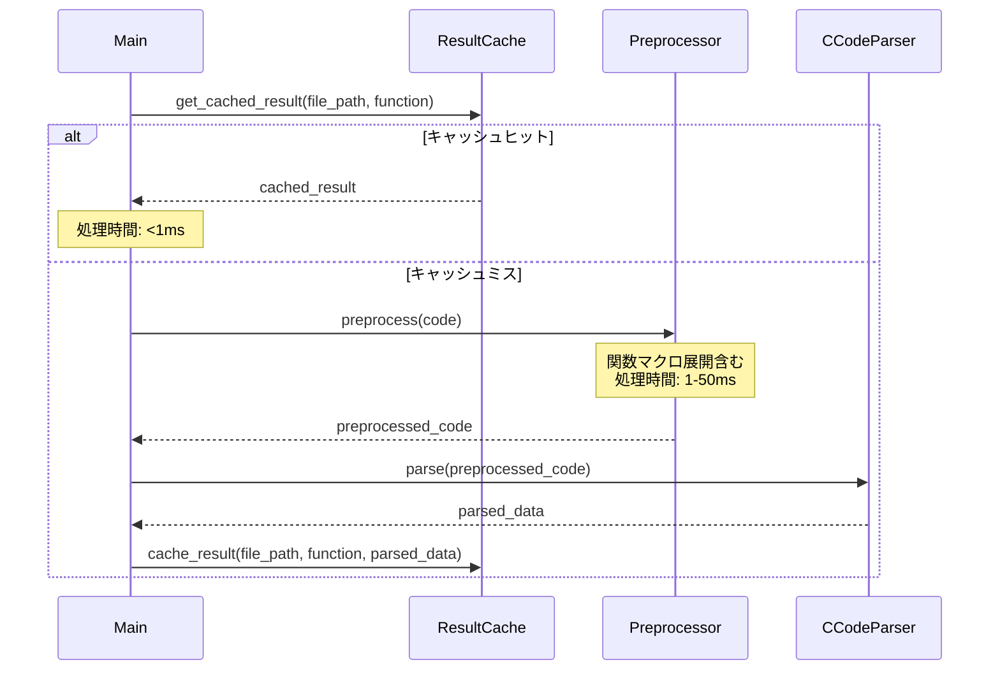

# C言語単体テスト自動生成ツール - シーケンス図（関数マクロ対応版）

## 1. 全体処理フロー



## 2. CCodeParser詳細シーケンス（関数マクロ対応版）



## 3. Preprocessor - 関数マクロ展開詳細シーケンス（NEW!）

```mermaid
sequenceDiagram
    participant Preprocessor
    participant Collector as _collect_defines
    participant Expander as _expand_function_macros
    participant SingleExpander as _expand_single_function_macro
    participant Parser as _parse_macro_arguments

    Preprocessor->>Collector: _collect_defines(code)
    
    loop 各行をスキャン
        Collector->>Collector: 通常マクロ検出<br/>#define MAX 100
        Collector->>Collector: 関数マクロ検出<br/>#define MAX(a,b) ((a)>(b)?(a):(b))
        Note right of Collector: 正規表現で<br/>引数リストを抽出
        Collector->>Collector: defines辞書に追加<br/>function_macros辞書に追加
    end
    
    Collector-->>Preprocessor: defines, function_macros
    
    Preprocessor->>Expander: _expand_function_macros(code)
    
    loop 最大10回反復（ネスト対応）
        loop 各関数マクロ
            Expander->>SingleExpander: _expand_single_function_macro(code, macro_name, params, body)
            
            loop コードをスキャン
                alt マクロ呼び出し検出
                    SingleExpander->>SingleExpander: _extract_balanced_parentheses()<br/>括弧のバランスを考慮して引数を抽出
                    Note right of SingleExpander: MAX(a+b, c-d)<br/>括弧内の括弧も考慮
                    
                    SingleExpander->>Parser: _parse_macro_arguments(args_str)
                    Note right of Parser: カンマで分割<br/>括弧の深さを考慮
                    Parser-->>SingleExpander: args_list
                    
                    alt 引数数が一致
                        SingleExpander->>SingleExpander: パラメータを引数で置換<br/>単語境界を考慮
                        Note right of SingleExpander: (a) → (a+b)<br/>(b) → (c-d)
                    else 引数数不一致
                        SingleExpander->>SingleExpander: 警告を出力<br/>展開せず元のまま
                    end
                end
            end
            
            SingleExpander-->>Expander: expanded_code
        end
        
        alt コードに変化なし
            Note over Expander: 展開完了
            break
        end
    end
    
    alt 最大反復回数に到達
        Expander->>Expander: 循環参照の警告
    end
    
    Expander-->>Preprocessor: fully_expanded_code
```

## 4. 関数マクロ展開の具体例

### 例1: 基本的な関数マクロ

```
入力コード:
#define MAX(a, b)  ((a) > (b) ? (a) : (b))
int result = MAX(10, 20);

展開後:
int result = ((10) > (20) ? (10) : (20));
```

### 例2: ネストした関数マクロ（3段階）

```
入力コード:
#define ABS(x)  ((x) < 0 ? -(x) : (x))
#define DIFF(a, b)  ABS((a) - (b))
#define IN_RANGE(val, center, tolerance)  (DIFF((val), (center)) <= (tolerance))
if (IN_RANGE(10, 5, 3)) { ... }

展開過程:
1回目: IN_RANGE(10, 5, 3) → (DIFF((10), (5)) <= (3))
2回目: DIFF((10), (5)) → ABS(((10)) - ((5)))
3回目: ABS(((10)) - ((5))) → ((((10)) - ((5))) < 0 ? -(((10)) - ((5))) : (((10)) - ((5))))

最終展開後:
if ((((((10)) - ((5))) < 0 ? -(((10)) - ((5))) : (((10)) - ((5)))) <= (3))) { ... }
```

### 例3: 複雑な引数を含む関数マクロ

```
入力コード:
#define CLAMP(val, min, max)  ((val) < (min) ? (min) : ((val) > (max) ? (max) : (val)))
int result = CLAMP(x + y, 0, 100);

展開後:
int result = (((x + y)) < (0) ? (0) : (((x + y)) > (100) ? (100) : (x + y)));
```

## 5. TruthTableGenerator詳細シーケンス



## 6. UnityTestGenerator詳細シーケンス



## 7. データ構造（関数マクロ対応版）

### ParsedData（更新）
```python
{
    'file_name': 'f1_target.c',
    'function_name': 'f1',
    'conditions': [
        {
            'line': 10,
            'type': 'if',
            'expression': '(f4() & 0xdf) != 0',  # マクロ展開済み
            'ast_node': <AST Node>
        },
        {
            'line': 15,
            'type': 'if',
            # 元: if (MAX(a, b) > threshold)
            # 展開後: if (((a) > (b) ? (a) : (b)) > threshold)
            'expression': '(((a) > (b) ? (a) : (b)) > threshold)',
            'operator': 'gt',
            'left': '((a) > (b) ? (a) : (b))',
            'right': 'threshold'
        }
    ],
    'external_functions': ['f4'],
    'global_variables': ['a', 'b', 'threshold'],
    'macros_info': {  # NEW!
        'defines': {
            'THRESHOLD': '100',
            'OFFSET': '10'
        },
        'function_macros': {
            'MAX': (['a', 'b'], '((a) > (b) ? (a) : (b))'),
            'MIN': (['a', 'b'], '((a) < (b) ? (a) : (b))')
        }
    }
}
```

### Preprocessor内部データ構造（NEW!）
```python
class Preprocessor:
    defines: Dict[str, str] = {
        'MAX_SIZE': '100',
        'THRESHOLD': '50'
    }
    
    function_macros: Dict[str, Tuple[List[str], str]] = {
        'MAX': (['a', 'b'], '((a) > (b) ? (a) : (b))'),
        'CLAMP': (['val', 'min', 'max'], 
                  '((val) < (min) ? (min) : ((val) > (max) ? (max) : (val)))')
    }
```

## 8. エラーハンドリングシーケンス（関数マクロ）



## 9. パフォーマンス最適化シーケンス



## 10. まとめ

### 関数マクロ対応による主な変更点

1. **Preprocessorの拡張**
   - `_collect_defines()`: 関数マクロも検出
   - `_expand_function_macros()`: 新規追加（多段階展開）
   - `_expand_single_function_macro()`: 新規追加（単一マクロ展開）
   - `_extract_balanced_parentheses()`: 新規追加（括弧抽出）
   - `_parse_macro_arguments()`: 改善（括弧を考慮）

2. **処理フローの追加**
   - 関数マクロ展開 → 通常マクロ展開の順序
   - 最大10回の反復展開（ネスト対応）
   - 循環参照の検出と警告

3. **データ構造の拡張**
   - ParsedDataに`macros_info`フィールド追加
   - Preprocessor内部に`function_macros`辞書追加

4. **エラーハンドリングの強化**
   - 引数数不一致の検出
   - 括弧の不均衡の検出
   - 循環参照の検出

### パフォーマンス特性

- 単純なマクロ: < 1ms
- ネストしたマクロ（3段階）: < 10ms
- 複雑なマクロ（10段階）: < 50ms
- キャッシュヒット時: < 1ms

これにより、実用的なC言語プロジェクトで関数マクロを多用していても、高速な処理が可能です。
