# MC/DC テスト実装 クラス図

## 全体構造

## テストケースクラス階層

```mermaid
classDiagram
    class TestCase {
        <<abstract>>
        +pattern String
        +expected_result bool
        +execute() void
        +validate() void
    }

    class BaselineTest {
        +pattern "TTFFFFFT"
        +expected_result true
        +description "Baseline case: all conditions satisfied"
        +execute() void
    }

    class C1IndependenceTest {
        +pattern "FTFFFFFT"
        +expected_result false
        +description "Validates C1 (act) independence"
        +execute() void
    }

    class ORConditionsTest {
        +pattern "TFFFFFFT"
        +expected_result false
        +description "Validates OR conditions requirement"
        +execute() void
    }

    class C8IndependenceTest {
        +pattern "TTFFFFFF"
        +expected_result false
        +description "Validates C8 (power_push) independence"
        +execute() void
    }

    class C3IndependenceTest {
        +pattern "TFTFFFFT"
        +expected_result true
        +description "Validates C3 (seq==2) independence"
        +execute() void
    }

    class C4IndependenceTest {
        +pattern "TFFTFFFT"
        +expected_result true
        +description "Validates C4 (seq==3) independence"
        +execute() void
    }

    class C5IndependenceTest {
        +pattern "TFFFTFFT"
        +expected_result true
        +description "Validates C5 (seq==6) independence"
        +execute() void
    }

    class C6IndependenceTest {
        +pattern "TFFFFTFT"
        +expected_result true
        +description "Validates C6 (seq==7) independence"
        +execute() void
    }

    class C7IndependenceTest {
        +pattern "TFFFFFTT"
        +expected_result true
        +description "Validates C7 (seq==8) independence"
        +execute() void
    }

    TestCase <|-- BaselineTest
    TestCase <|-- C1IndependenceTest
    TestCase <|-- ORConditionsTest
    TestCase <|-- C8IndependenceTest
    TestCase <|-- C3IndependenceTest
    TestCase <|-- C4IndependenceTest
    TestCase <|-- C5IndependenceTest
    TestCase <|-- C6IndependenceTest
    TestCase <|-- C7IndependenceTest
```

## 条件評価構造

## MC/DC カバレッジ分析構造

## データフロー構造

## 関係図の説明

### 1. 全体構造
- **UnityFramework**: テストフレームワークの基盤
- **TestSuite**: 9つのテストケースを実装
- **GlobalState**: テスト対象の状態を保持
- **ConditionEvaluator**: 条件式を評価

### 2. テストケースクラス階層
- 各テストケースは抽象クラス `TestCase` を継承
- 9つの具体的なテストケースがそれぞれの独立性を検証

### 3. 条件評価構造
- **ComplexCondition**: 複合条件全体を表現
- **ANDCondition**: AND演算子でつながる条件
- **ORCondition**: OR演算子でつながる6つの条件 (C2-C7)
- **AtomicCondition**: 8つの原子的条件 (C1-C8)

### 4. MC/DC カバレッジ分析構造
- **MCDCAnalyzer**: カバレッジ分析のコア
- **ConditionPair**: 条件の独立性を検証するペア
- **CoverageMatrix**: 各条件の評価結果を記録
- **IndependenceProof**: 各条件の独立性証明
- **TruthTable**: 真偽表の表現
- **CoverageReport**: 最終レポート生成

### 5. データフロー構造
- **TestInput**: テストケースの入力データ
- **TestOutput**: テスト実行結果
- **TestContext**: テスト実行のコンテキスト
- **TestResult**: 個別テスト結果
- **TestReport**: 全体のテストレポート

## クラス間の主要な関係

1. **使用関係 (uses)**
   - TestSuite は UnityFramework を使用
   - ConditionEvaluator は GlobalState を読み取り

2. **包含関係 (contains)**
   - GlobalState は StateDefinition と HandyData を包含
   - StateDefinition は StateBitfield を包含
   - HandyData は複数の情報構造を階層的に包含

3. **継承関係 (inherits)**
   - 9つのテストケースは TestCase を継承
   - 8つの原子条件は AtomicCondition を継承

4. **生成関係 (creates/produces)**
   - MCDCAnalyzer は各種分析オブジェクトを生成
   - TestContext は TestResult を生成

## まとめ

この構造により、以下が達成されています：

- **明確な責任分離**: 各クラスが明確な役割を持つ
- **拡張性**: 新しいテストケースや条件を容易に追加可能
- **保守性**: 階層化により変更の影響範囲が限定的
- **テスト性**: 各コンポーネントを独立してテスト可能
- **MC/DC準拠**: DO-178C規格のMC/DC要件を満たす設計
