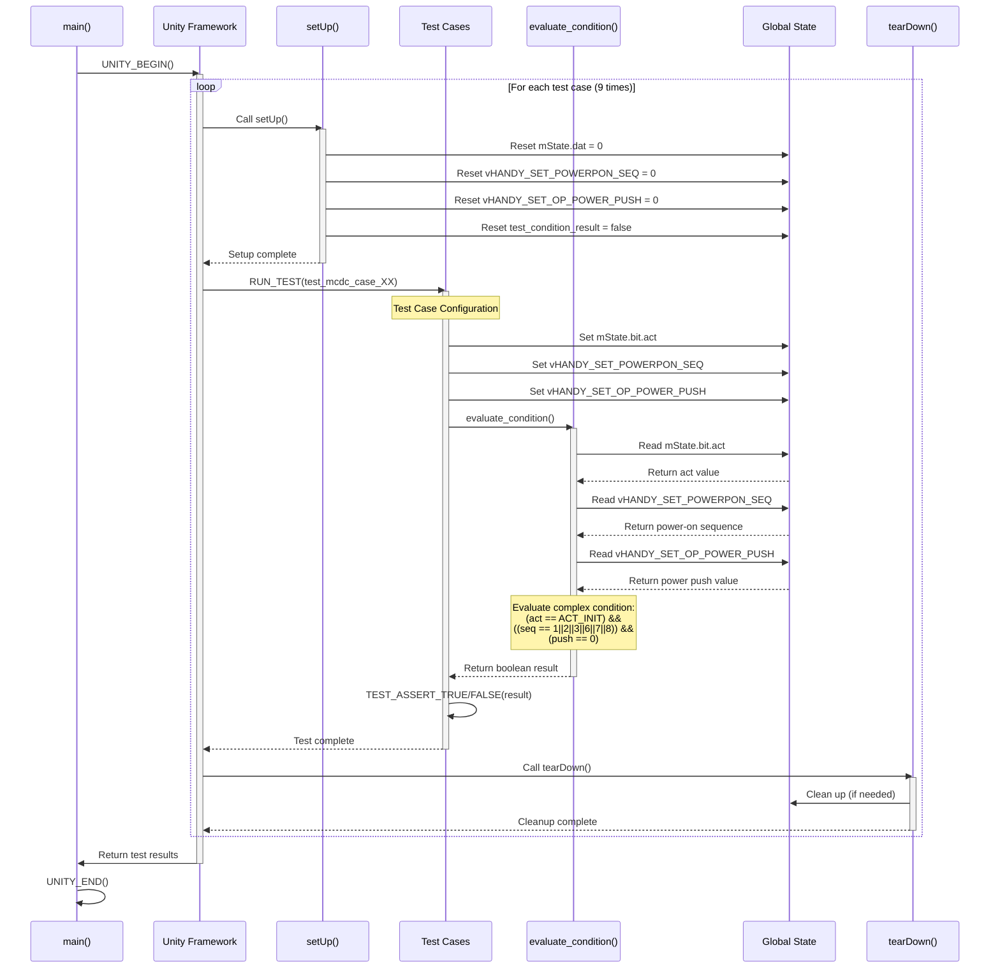
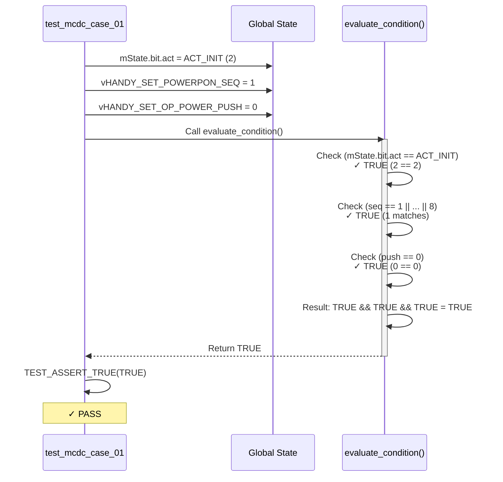
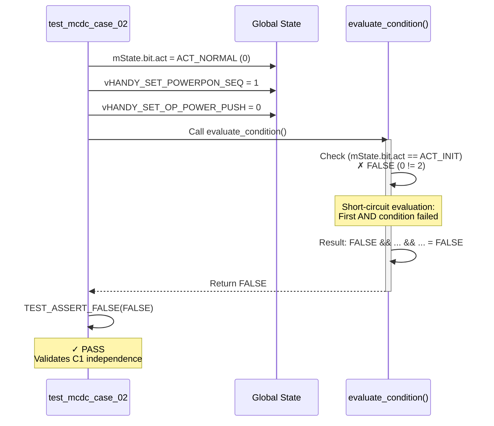
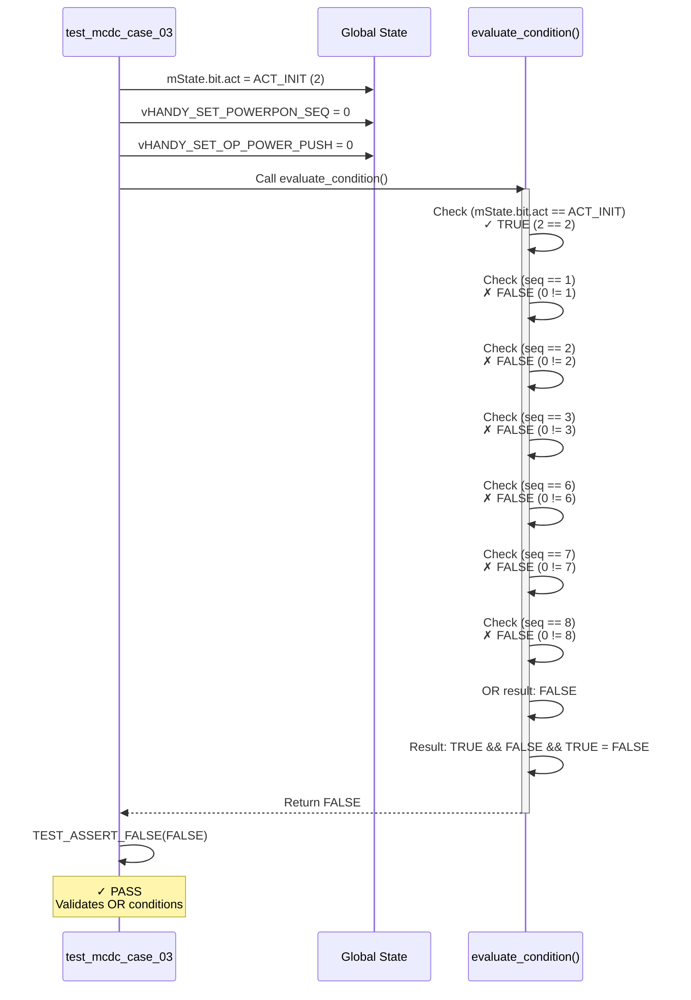
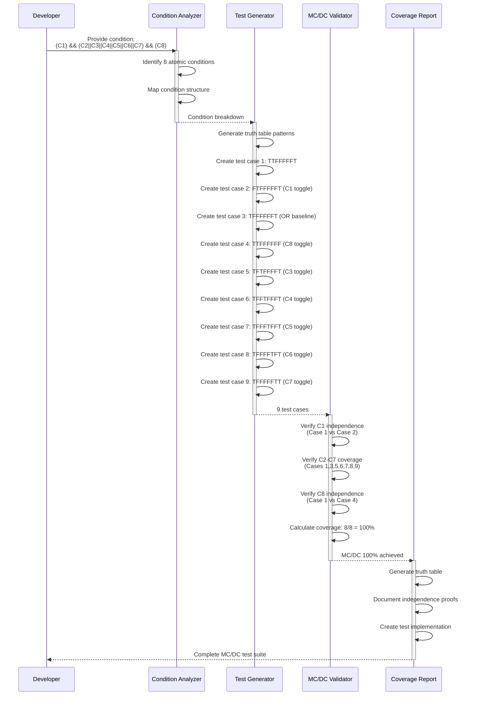
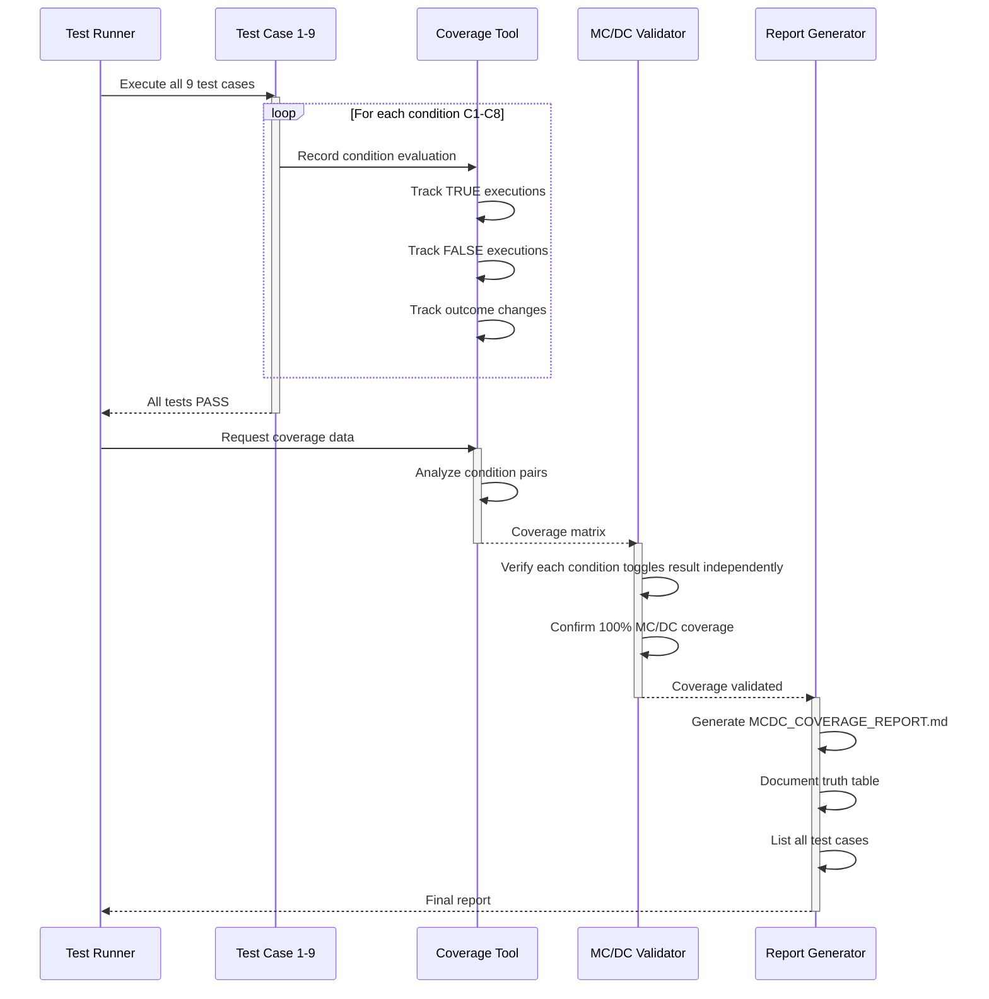

# MC/DC テスト実装 シーケンス図

## テスト実行フロー

## テストケース実行詳細

### Case 1: TTFFFFFT (Baseline)

### Case 2: FTFFFFFT (C1 Independence)

### Case 3: TFFFFFFT (OR Conditions)

## MC/DC カバレッジ達成フロー

## テスト実行とカバレッジ検証

## まとめ

このシーケンス図は、MC/DC 100%カバレッジを達成するテスト実装の完全なフローを示しています：

1. **テスト実行フロー**: Unity フレームワークでの9つのテストケース実行
2. **個別テストケース**: 各テストケースの詳細な実行シーケンス
3. **MC/DC達成フロー**: 条件分析からテスト生成、カバレッジ検証まで
4. **検証フロー**: テスト実行後のカバレッジ検証とレポート生成

各シーケンスは、DO-178C規格のMC/DC要件を満たすために必要な全てのステップを含んでいます。
