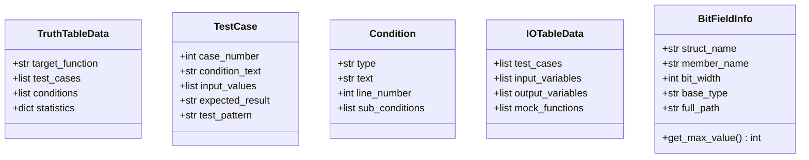
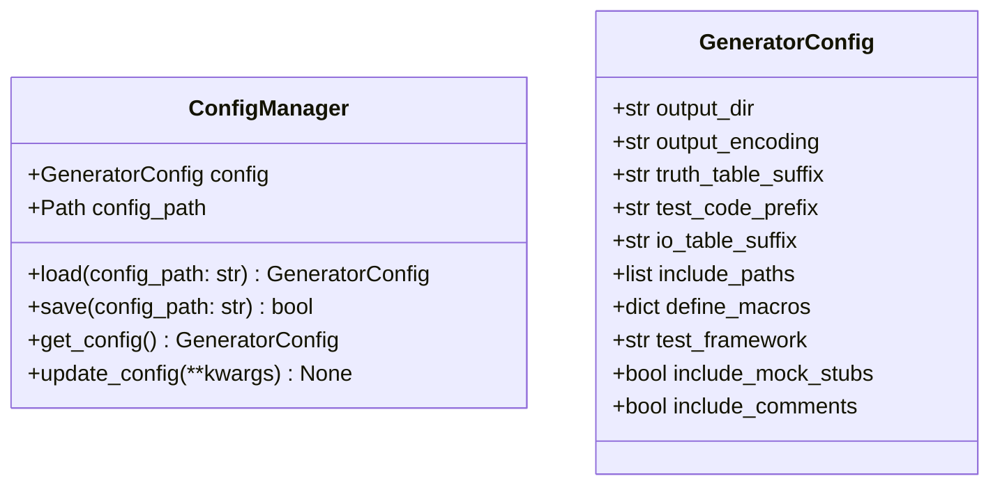
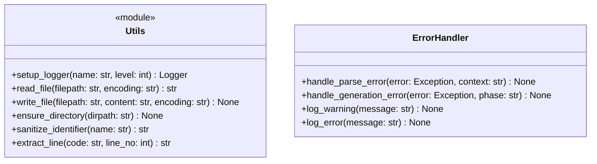

# C言語単体テスト自動生成ツール - クラス図 (v2.10.1)

```mermaid
classDiagram
    class EncodingConfig {
        <<module>>
        -str OUTPUT_ENCODING
        +load_encoding_config(config_path: str) str
        +get_output_encoding() str
        +set_output_encoding(encoding: str) None
    }
    
    class CTestAutoGenerator {
        -CCodeParser parser
        -TruthTableGenerator truth_table_gen
        -UnityTestGenerator test_generator
        -IOTableGenerator io_table_gen
        -ExcelWriter excel_writer
        -dict config
        -bool standalone_mode
        +__init__(config: dict)
        +generate_all(c_file_path, output_dir) GenerationResult
        -_validate_input(c_file_path) bool
        -_init_components() None
    }

    class CCodeParser {
        -Preprocessor preprocessor
        -ASTBuilder ast_builder
        -ConditionExtractor cond_extractor
        -TypedefExtractor typedef_extractor
        -VariableDeclExtractor var_extractor
        +parse(c_file_path) ParsedData
        -_read_file(path) str
        -_extract_function_info(ast) dict
    }

    class Preprocessor {
        -dict defines
        -list include_paths
        +preprocess(code) str
        -_remove_comments(code) str
        -_process_defines(code) str
        -_handle_includes(code) str
        -_extract_and_remove_directives(code) tuple
    }

    class ASTBuilder {
        -pycparser.CParser parser
        +build_ast(code) AST
        -_add_fake_includes(code) str
        -_handle_parse_error(error) None
        -_load_standard_types() str
    }

    class ConditionExtractor {
        -list conditions
        -int current_line
        +extract_conditions(ast) list
        +visit_FuncDef(node) None
        +visit_If(node) None
        +visit_Switch(node) None
        -_analyze_binary_op(node) dict
        -_extract_switch_cases(node) list
    }

    class TypedefExtractor {
        -dict standard_types
        +extract_typedefs(ast) list
        +extract_struct_definitions(ast) list
        -_walk_ast(ast) generator
        -_parse_typedef_struct(node, resolve_types) StructDefinition
        -_parse_direct_struct(node, resolve_types) StructDefinition
        -_is_typedef_struct(node) bool
        -_load_standard_types() dict
    }

    class TruthTableGenerator {
        -ConditionAnalyzer analyzer
        -MCDCPatternGenerator pattern_gen
        +generate(parsed_data) TruthTableData
        -_process_if_condition(condition) list
        -_process_switch_condition(condition) list
        -_create_test_case(pattern) dict
    }

    class UnityTestGenerator {
        -TestFunctionGenerator func_gen
        -MockGenerator mock_gen
        -PrototypeGenerator proto_gen
        -bool include_target_function
        +generate(truth_table, parsed_data) TestCode
        +generate_standalone(truth_table, parsed_data, source_code) str
        -_generate_header() str
        -_generate_includes() str
    }

    class TestFunctionGenerator {
        +generate(test_case, parsed_data) str
        -_generate_setup(variables) str
        -_generate_mock_setup(mocks) str
        -_generate_function_call(function) str
        -_generate_assertions(expected) str
        -_generate_struct_assertions(struct_def) str
    }

    class IOTableGenerator {
        -IOVariableExtractor extractor
        +generate(test_code, truth_table) IOTableData
        -_extract_io_variables(test_function) dict
        -_classify_variables(variables) dict
    }

    class ExcelWriter {
        +write_truth_table(data, filepath) None
        +write_io_table(data, filepath) None
        -_create_header_style() dict
        -_format_worksheet(ws) None
    }

    class TestCode {
        +str header
        +str includes
        +str type_definitions
        +str prototypes
        +str mock_variables
        +str mock_functions
        +str test_functions
        +str setup_teardown
        +str target_function_code
        +str main_function
        +to_string() str
        +save(filepath: str, encoding: str) None
    }

    class ParsedData {
        +FunctionInfo function_info
        +list conditions
        +list typedefs
        +list variable_declarations
        +list macro_definitions
        +list struct_definitions
        +list bitfield_info
    }

    class StructDefinition {
        +str name
        +list members
        +get_all_members_flat() list
    }

    class StructMember {
        +str name
        +str type
        +int bit_width
        +StructDefinition nested_struct
        +is_nested() bool
    }

    class GenerationResult {
        +Path truth_table_path
        +Path test_code_path
        +Path io_table_path
        +bool success
        +str error_message
    }

    %% 関係
    CTestAutoGenerator --> CCodeParser: uses
    CTestAutoGenerator --> TruthTableGenerator: uses
    CTestAutoGenerator --> UnityTestGenerator: uses
    CTestAutoGenerator --> IOTableGenerator: uses
    CTestAutoGenerator --> ExcelWriter: uses
    CTestAutoGenerator --> EncodingConfig: uses
    CTestAutoGenerator --> GenerationResult: creates
    
    CCodeParser --> Preprocessor: uses
    CCodeParser --> ASTBuilder: uses
    CCodeParser --> ConditionExtractor: uses
    CCodeParser --> TypedefExtractor: uses
    CCodeParser --> ParsedData: creates
    
    ParsedData --> StructDefinition: contains
    StructDefinition --> StructMember: contains
    StructMember --> StructDefinition: references
    
    UnityTestGenerator --> TestFunctionGenerator: uses
    UnityTestGenerator --> TestCode: creates
    TestCode --> EncodingConfig: uses
    
    TruthTableGenerator --> MCDCPatternGenerator: uses
    IOTableGenerator --> IOVariableExtractor: uses
```

## 主要なデータ構造

## 設定管理

## ユーティリティクラス

## 更新履歴

### v2.10.1 (2025-11-21)
- **EncodingConfigモジュール追加**: 出力エンコーディングの管理
- **TestCode.save()メソッド更新**: エンコーディングパラメータ対応
- **config.ini対応**: output_encoding設定の読み込み

### v2.9.0 (2025-11-21)
- **TypedefExtractor強化**: 2パス処理による構造体定義解決
- **StructDefinition.get_all_members_flat()**: ネスト構造体の再帰展開
- **StructMember.nested_struct**: ネスト構造体参照の追加

### v2.8.0
- **TestFunctionGenerator**: ネスト構造体アサーション対応
- **ビットフィールド処理**: BitFieldInfoクラス追加

### v2.7.0
- 初期バージョン

## クラス間の主要な相互作用

1. **初期化フェーズ**
   - `EncodingConfig`モジュールが`config.ini`から設定を読み込み
   - `CTestAutoGenerator`が各コンポーネントを初期化

2. **解析フェーズ**
   - `CCodeParser`が入力ファイルを解析（自動エンコーディング検出）
   - `TypedefExtractor`が2パス処理で構造体定義を解決

3. **生成フェーズ**
   - `TruthTableGenerator`がMC/DC真偽表を生成
   - `UnityTestGenerator`がテストコードを生成

4. **出力フェーズ**
   - `TestCode.save()`が設定されたエンコーディングで保存
   - `ExcelWriter`がExcelファイルを生成

## 設計原則

1. **単一責任の原則**: 各クラスは明確に定義された1つの責任を持つ
2. **依存性逆転の原則**: 高レベルモジュールは低レベルモジュールに依存しない
3. **開放閉鎖の原則**: 拡張に対して開いており、修正に対して閉じている
4. **インターフェース分離の原則**: 不要な依存関係を避ける
5. **設定可能性**: 重要なパラメータは設定ファイルから変更可能
