# AutoUniTestGen v2.8.0 クラス図

**更新日**: 2025-11-20  
**バージョン**: v2.8.0

## 概要
v2.8.0では構造体メンバー情報の抽出とアサーション生成機能を追加しました。

```mermaid
classDiagram
    %% データ構造層
    class ParsedData {
        +file_name: str
        +function_name: str
        +conditions: List[Condition]
        +external_functions: List[str]
        +global_variables: List[str]
        +function_info: FunctionInfo
        +enums: Dict[str, List[str]]
        +enum_values: List[str]
        +bitfields: Dict[str, BitFieldInfo]
        +typedefs: List[TypedefInfo]
        +variables: List[VariableDeclInfo]
        +macros: Dict[str, str]
        +macro_definitions: List[str]
        +struct_definitions: List[StructDefinition] ← v2.8.0
        +get_struct_definition(type_name: str) StructDefinition ← v2.8.0
        +to_dict() Dict
    }

    class StructDefinition {
        <<v2.8.0>>
        +name: str
        +members: List[StructMember]
        +is_typedef: bool
        +original_name: str
        +to_dict() Dict
        +get_member(member_name: str) StructMember
        +get_all_members_flat(prefix: str) List[tuple]
    }

    class StructMember {
        <<v2.8.0>>
        +name: str
        +type: str
        +bit_width: int
        +is_pointer: bool
        +is_array: bool
        +array_size: int
        +nested_struct: StructDefinition
        +to_dict() Dict
        +get_full_type() str
    }

    class Condition {
        +line: int
        +type: ConditionType
        +expression: str
        +operator: str
        +left: str
        +right: str
        +conditions: List[str]
        +cases: List[Any]
        +ast_node: Any
        +parent_context: str
        +to_dict() Dict
    }

    class FunctionInfo {
        +name: str
        +return_type: str
        +parameters: List[Dict]
        +local_variables: List[str]
        +to_dict() Dict
    }

    class TypedefInfo {
        +name: str
        +typedef_type: str
        +definition: str
        +dependencies: List[str]
        +line_number: int
        +to_dict() Dict
    }

    class BitFieldInfo {
        +struct_name: str
        +member_name: str
        +bit_width: int
        +base_type: str
        +full_path: str
        +get_max_value() int
        +get_mask() int
        +to_dict() Dict
    }

    class TestCase {
        +no: int
        +truth: str
        +condition: str
        +expected: str
        +test_name: str
        +comment: str
        +input_values: Dict
        +output_values: Dict
        +to_dict() Dict
    }

    class TruthTableData {
        +function_name: str
        +test_cases: List[TestCase]
        +total_tests: int
        +to_dict() Dict
    }

    class TestCode {
        +header: str
        +includes: str
        +type_definitions: str
        +prototypes: str
        +mock_variables: str
        +mock_functions: str
        +test_functions: str
        +setup_teardown: str
        +target_function_code: str
        +main_function: str
        +to_string() str
        +save(filepath: str) None
    }

    class IOTableData {
        +input_variables: List[str]
        +output_variables: List[str]
        +test_data: List[Dict]
        +to_dict() Dict
        +to_excel_format() List[List]
    }

    %% パーサー層
    class CCodeParser {
        -preprocessor: Preprocessor
        -ast_builder: ASTBuilder
        -condition_extractor: ConditionExtractor
        -typedef_extractor: TypedefExtractor
        -variable_extractor: VariableDeclExtractor
        +parse(c_file_path: str, target_function: str) ParsedData
        -_extract_function_info(ast, target_function) FunctionInfo
        -_extract_external_functions() List[str]
        -_extract_global_variables(ast) List[str]
        -_extract_enums(ast) Tuple
    }

    class TypedefExtractor {
        -logger: Logger
        -typedefs: List[TypedefInfo]
        -source_lines: List[str]
        -standard_types: Set[str]
        +extract_typedefs(ast, source_code) List[TypedefInfo]
        +extract_struct_definitions(ast) List[StructDefinition] ← v2.8.0
        -_walk_ast(node, depth) Generator ← v2.8.0
        -_is_typedef_struct(node) bool ← v2.8.0
        -_is_direct_struct(node) bool ← v2.8.0
        -_parse_typedef_struct(node) StructDefinition ← v2.8.0
        -_parse_direct_struct(node) StructDefinition ← v2.8.0
        -_extract_struct_members(struct_node) List[StructMember] ← v2.8.0
        -_parse_member_decl(decl) StructMember ← v2.8.0
        -_extract_type_info(type_node) Dict ← v2.8.0
        -_load_standard_types() Set[str]
        -_filter_standard_typedefs(typedefs) List[TypedefInfo]
    }

    class Preprocessor {
        -macro_definitions: Dict[str, str]
        -function_macros: Dict[str, Tuple]
        -included_headers: Set[str]
        -bitfields: Dict[str, Tuple]
        +preprocess(code: str) str
        +get_bitfields() Dict[str, Tuple]
        -_load_standard_types() None
        -_extract_and_remove_macros(code) str
    }

    class ASTBuilder {
        -logger: Logger
        +build_ast(preprocessed_code: str) Any
        -_create_fake_headers() str
    }

    class ConditionExtractor {
        -logger: Logger
        -target_function: str
        +extract_conditions(ast) List[Condition]
    }

    class VariableDeclExtractor {
        -logger: Logger
        +extract_variables(ast, target_function, conditions) List[VariableDeclInfo]
    }

    %% テスト生成層
    class TestFunctionGenerator {
        -logger: Logger
        -mock_generator: MockGenerator
        +generate_test_function(test_case: TestCase, parsed_data: ParsedData) str
        -_generate_function_call(parsed_data: ParsedData) str
        -_generate_variable_init(test_case: TestCase, parsed_data: ParsedData) str
        -_generate_assertions(test_case: TestCase, parsed_data: ParsedData) str
        -_generate_struct_assertions(type_name: str, var_name: str, parsed_data: ParsedData) List[str] ← v2.8.0
        -_is_struct_type(type_name: str) bool
        -_is_function(name: str, parsed_data: ParsedData) bool
        -_is_enum_constant(name: str, parsed_data: ParsedData) bool
    }

    class UnityTestGenerator {
        -logger: Logger
        -test_function_generator: TestFunctionGenerator
        -mock_generator: MockGenerator
        -comment_generator: CommentGenerator
        -prototype_generator: PrototypeGenerator
        +generate_test_code(truth_table: TruthTableData, parsed_data: ParsedData) TestCode
        -_generate_standalone_test_code(test_code: TestCode, parsed_data: ParsedData) TestCode
    }

    class MockGenerator {
        -logger: Logger
        +generate_mock_variables(parsed_data: ParsedData) str
        +generate_mock_functions(parsed_data: ParsedData) str
        +generate_reset_function(parsed_data: ParsedData) str
    }

    class TruthTableGenerator {
        -logger: Logger
        -condition_analyzer: ConditionAnalyzer
        -mcdc_generator: MCDCPatternGenerator
        +generate_truth_table(parsed_data: ParsedData) TruthTableData
    }

    class IOTableGenerator {
        -logger: Logger
        -variable_extractor: VariableExtractor
        +generate_io_table(test_code: str, parsed_data: ParsedData) IOTableData
    }

    %% メインコントローラー
    class CTestAutoGenerator {
        -parser: CCodeParser
        -truth_table_gen: TruthTableGenerator
        -test_gen: UnityTestGenerator
        -io_table_gen: IOTableGenerator
        -excel_writer: ExcelWriter
        +generate(input_file: str, target_function: str, output_dir: str, mode: str) Dict
        -_validate_input_file(file_path: str) None
        -_validate_output_dir(dir_path: str) None
    }

    %% 関係
    ParsedData *-- StructDefinition : contains
    ParsedData *-- Condition : contains
    ParsedData *-- FunctionInfo : contains
    ParsedData *-- TypedefInfo : contains
    ParsedData *-- BitFieldInfo : contains
    
    StructDefinition *-- StructMember : contains
    StructMember --> StructDefinition : nested_struct
    
    CCodeParser --> ParsedData : creates
    CCodeParser --> TypedefExtractor : uses
    CCodeParser --> Preprocessor : uses
    CCodeParser --> ASTBuilder : uses
    CCodeParser --> ConditionExtractor : uses
    CCodeParser --> VariableDeclExtractor : uses
    
    TypedefExtractor --> StructDefinition : creates
    TypedefExtractor --> StructMember : creates
    
    TestFunctionGenerator --> ParsedData : uses
    TestFunctionGenerator --> StructDefinition : queries
    TestFunctionGenerator --> MockGenerator : uses
    
    UnityTestGenerator --> TestFunctionGenerator : uses
    UnityTestGenerator --> TestCode : creates
    
    TruthTableGenerator --> TruthTableData : creates
    IOTableGenerator --> IOTableData : creates
    
    CTestAutoGenerator --> CCodeParser : uses
    CTestAutoGenerator --> TruthTableGenerator : uses
    CTestAutoGenerator --> UnityTestGenerator : uses
    CTestAutoGenerator --> IOTableGenerator : uses
```

## v2.8.0での主な変更点

### 新規追加クラス
1. **StructDefinition**
   - 構造体定義全体を表現
   - メンバーのフラット展開機能を提供

2. **StructMember**
   - 構造体の個々のメンバーを表現
   - ネストした構造体への参照を保持

### 既存クラスの拡張
1. **ParsedData**
   - `struct_definitions`フィールド追加
   - `get_struct_definition()`メソッド追加

2. **TypedefExtractor**
   - `extract_struct_definitions()`メソッド追加
   - AST走査と構造体解析メソッド群追加

3. **TestFunctionGenerator**
   - `_generate_struct_assertions()`メソッド追加
   - 構造体メンバーごとのアサーション生成

### クラス間の新しい関係
- ParsedData → StructDefinition（集約）
- StructDefinition → StructMember（構成）
- StructMember → StructDefinition（ネスト参照）
- TestFunctionGenerator → StructDefinition（クエリ）

## 未実装機能（v2.9.0予定）
- ネストした構造体の完全な型解決
- 構造体定義間の相互参照解決
- ポインタ/配列メンバーの高度な処理
