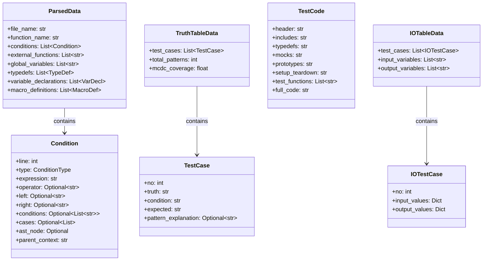
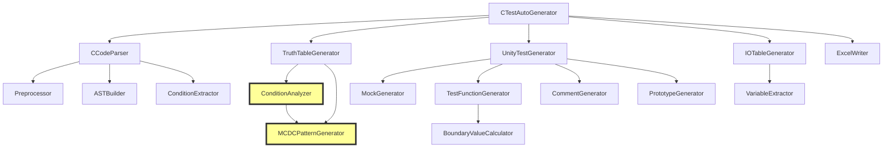

# C言語単体テスト自動生成ツール - クラス図 v2.6.0

**更新日**: 2025-11-19  
**バージョン**: v2.6.0  
**主な変更**: MCDCPatternGeneratorとConditionAnalyzerの拡張

---

## 全体構成図

```mermaid
classDiagram
    class CTestAutoGenerator {
        -CCodeParser parser
        -TruthTableGenerator truth_table_gen
        -UnityTestGenerator test_generator
        -IOTableGenerator io_table_gen
        -ExcelWriter excel_writer
        +__init__()
        +generate_all(c_file_path, output_dir) dict
        +_validate_input(c_file_path) bool
    }

    class CCodeParser {
        -Preprocessor preprocessor
        -ASTBuilder ast_builder
        -ConditionExtractor cond_extractor
        -TypedefExtractor typedef_extractor
        -VariableDeclExtractor var_extractor
        +parse(c_file_path, target_function) ParsedData
        -_read_file(path) str
        -_extract_function_info(ast) dict
        -_extract_typedefs(ast) list
        -_extract_variables(ast) list
    }

    class Preprocessor {
        -dict defines
        -list include_paths
        -Logger logger
        +preprocess(code) str
        -_remove_comments(code) str
        -_process_defines(code) str
        -_handle_includes(code) str
        -_expand_macros(code) str
    }

    class ASTBuilder {
        -pycparser.CParser parser
        -Logger logger
        +build_ast(code) AST
        -_add_fake_includes(code) str
        -_handle_parse_error(error) None
    }

    class ConditionExtractor {
        -list conditions
        -int current_line
        -str current_function
        -Logger logger
        +extract_conditions(ast) list
        +visit_FuncDef(node) None
        +visit_If(node) None
        +visit_Switch(node) None
        -_analyze_binary_op(node) dict
        -_extract_all_conditions(node, operator) list
        -_extract_switch_cases(node) list
        -_node_to_str(node) str
    }

    class TruthTableGenerator {
        -ConditionAnalyzer analyzer
        -MCDCPatternGenerator mcdc_gen
        -Logger logger
        +generate(parsed_data) TruthTableData
        -_generate_test_number() int
        -_format_table_row(condition, pattern) dict
    }

    class ConditionAnalyzer {
        <<v2.6.0 Enhanced>>
        -Logger logger
        +analyze_condition(condition) dict
        -_analyze_simple_condition(condition) dict
        -_analyze_or_condition(condition) dict
        -_analyze_and_condition(condition) dict
        -_analyze_switch(condition) dict
        -_suggest_test_values(expression) dict
        -_parse_comparison(expression) dict
        +is_simple_condition(expression) bool
        +is_or_condition(expression) bool
        +is_and_condition(expression) bool
        +split_binary_condition(expression, operator) tuple
        -_remove_outer_parentheses(expr) str
    }

    class MCDCPatternGenerator {
        <<v2.6.0 Major Update>>
        -Logger logger
        +generate_or_patterns(n_conditions) list
        +generate_and_patterns(n_conditions) list
        +generate_switch_patterns(cases) list
        +generate_mcdc_patterns_for_complex(top_operator, conditions) list
        -_extract_or_conditions(condition) list
        -_extract_and_conditions(condition) list
        -_extract_mixed_conditions(condition) list
        -_remove_outer_parens(expr) str
        -_generate_patterns_for_structure(top_operator, conditions, structure) list
        -_generate_or_group_patterns_with_structure(top_operator, total, start, count, structure) set
        -_generate_and_group_patterns(top_operator, total, start, count) set
        -_generate_simple_condition_patterns_with_structure(top_operator, total, index, structure) set
        -_create_base_pattern_for_and(total, structure) list
        +pattern_to_string(pattern) str
        +explain_pattern(pattern, operator) str
    }

    class UnityTestGenerator {
        -MockGenerator mock_gen
        -TestFunctionGenerator func_gen
        -CommentGenerator comment_gen
        -PrototypeGenerator proto_gen
        -Logger logger
        +generate(truth_table, parsed_data) TestCode
        -_generate_header() str
        -_generate_includes() str
        -_generate_setup_teardown() str
        -_combine_all_parts() str
    }

    class MockGenerator {
        -list external_functions
        -dict mock_templates
        -Logger logger
        +generate_mocks(parsed_data) str
        +generate_mock_variables() str
        +generate_mock_functions() str
        +generate_reset_function() str
        -_get_return_type(func_name) str
        -_generate_call_counter() str
    }

    class TestFunctionGenerator {
        -BoundaryValueCalculator boundary_calc
        -Logger logger
        +generate_test_function(test_case, parsed_data) str
        -_generate_test_name(test_case) str
        -_generate_variable_init(test_case) str
        -_generate_mock_setup(test_case) str
        -_generate_function_call(test_case) str
        -_generate_assertions(test_case) str
    }

    class BoundaryValueCalculator {
        -Logger logger
        +calculate_boundary_values(condition, truth_value) dict
        -_parse_comparison_operator(condition) dict
        -_calculate_for_greater_than(value, is_true) int
        -_calculate_for_less_than(value, is_true) int
        -_calculate_for_equal(value, is_true) int
    }

    class CommentGenerator {
        -Logger logger
        +generate_comment(test_case, parsed_data) str
        -_format_condition_description(condition) str
        -_format_truth_pattern(pattern) str
        -_format_expected_behavior(expected) str
    }

    class PrototypeGenerator {
        -Logger logger
        +generate_prototypes(functions, mocks) str
        -_generate_static_declaration(func_name) str
        -_sort_declarations(declarations) list
    }

    class IOTableGenerator {
        -VariableExtractor var_extractor
        -Logger logger
        +generate(test_code, truth_table) IOTableData
        -_extract_io_mapping(test_code, test_case) dict
        -_format_io_table_row(test_case, io_data) dict
    }

    class VariableExtractor {
        -Logger logger
        +extract_input_variables(test_code) list
        +extract_output_variables(test_code) list
        -_parse_assignment_statements(code) list
        -_parse_assert_statements(code) list
    }

    class ExcelWriter {
        -Logger logger
        +write_truth_table(truth_table_data, output_path) None
        +write_io_table(io_table_data, output_path) None
        -_create_workbook() Workbook
        -_format_header(worksheet) None
        -_write_data_rows(worksheet, data) None
        -_apply_borders(worksheet) None
    }

    %% 関係性
    CTestAutoGenerator --> CCodeParser
    CTestAutoGenerator --> TruthTableGenerator
    CTestAutoGenerator --> UnityTestGenerator
    CTestAutoGenerator --> IOTableGenerator
    CTestAutoGenerator --> ExcelWriter

    CCodeParser --> Preprocessor
    CCodeParser --> ASTBuilder
    CCodeParser --> ConditionExtractor

    TruthTableGenerator --> ConditionAnalyzer
    TruthTableGenerator --> MCDCPatternGenerator

    ConditionAnalyzer --> MCDCPatternGenerator : v2.6.0 uses

    UnityTestGenerator --> MockGenerator
    UnityTestGenerator --> TestFunctionGenerator
    UnityTestGenerator --> CommentGenerator
    UnityTestGenerator --> PrototypeGenerator

    TestFunctionGenerator --> BoundaryValueCalculator

    IOTableGenerator --> VariableExtractor
```



---

## MCDCPatternGenerator詳細（v2.6.0拡張）



---

## ConditionAnalyzer詳細（v2.6.0拡張）



---

## データ構造クラス



---

## v2.6.0の主要な変更点

### 1. MCDCPatternGenerator

**新機能**:
- `generate_mcdc_patterns_for_complex()`: ネスト条件の処理
- 再帰的なOR/AND展開メソッド
- 構造ベースのパターン生成

**処理フロー**:
```
条件展開 → 構造分析 → パターン生成 → 重複削除
```

### 2. ConditionAnalyzer

**強化内容**:
- ネスト構造の自動検出
- 複雑条件の自動判定
- 新メソッドへの自動切り替え

**判定ロジック**:
```python
has_nested = any('||' in cond or '&&' in cond for cond in conditions)
if has_nested:
    # 新メソッド使用
    patterns = mcdc_gen.generate_mcdc_patterns_for_complex(...)
else:
    # 従来メソッド
    patterns = mcdc_gen.generate_and_patterns(...)
```

---

## クラス間の依存関係



**凡例**:
- 🟨 黄色: v2.6.0で大幅拡張されたクラス

---

## メソッド複雑度（v2.6.0）

| クラス | メソッド | 複雑度 | 行数 |
|--------|----------|--------|------|
| MCDCPatternGenerator | generate_mcdc_patterns_for_complex | 高 | ~50 |
| MCDCPatternGenerator | _extract_or_conditions | 中 | ~40 |
| MCDCPatternGenerator | _generate_patterns_for_structure | 高 | ~60 |
| ConditionAnalyzer | _analyze_and_condition | 中 | ~60 |
| ConditionAnalyzer | _analyze_or_condition | 中 | ~60 |

---

## 設計原則

### 1. 単一責任の原則（SRP）
各クラスは1つの責任のみを持つ:
- `MCDCPatternGenerator`: パターン生成のみ
- `ConditionAnalyzer`: 条件分析のみ
- `TruthTableGenerator`: 真偽表生成のみ

### 2. 開放閉鎖の原則（OCP）
- 新しいメソッドを追加（`generate_mcdc_patterns_for_complex`）
- 既存メソッドは変更なし（後方互換性）

### 3. 依存性逆転の原則（DIP）
- `ConditionAnalyzer`は`MCDCPatternGenerator`に依存
- インターフェースを通じた疎結合

---

## 変更履歴

### v2.6.0 (2025-11-19)
- ✅ MCDCPatternGeneratorに7つの新規メソッド追加
- ✅ ConditionAnalyzerのネスト検出機能追加
- ✅ データ構造にhas_nestedフラグ追加
- ✅ 再帰的展開アルゴリズムの実装

### v2.5.0以前
- 基本的なクラス構成
- 単純なOR/AND条件のみ対応

---

**注**: このクラス図は、v2.6.0で実装されたネストしたAND/OR条件のMC/DC処理を正確に反映しています。
