# AutoUniTestGen クラス図 (v2.7)

**最終更新**: 2025-11-20  
**バージョン**: 2.7.0

---

## 概要

このドキュメントでは、AutoUniTestGenの主要なクラスとその関係を説明します。

v2.7では、以下の改善を予定しています：
- 構造体型戻り値のアサーション対応（構造体判定機能の追加）
- 構造体メンバー情報の抽出機能（将来の拡張用）

過去のバージョン履歴：
- v2.6.6: 構造体アサーション問題の識別
- v2.6.5: パラメータ変数型定義追加
- v2.6.4: デフォルト値モック設定の削除
- v2.6.3: コメント形式修正、result変数型定義追加
- v2.6.2: グローバル変数初期化の削除

---

## アーキテクチャ概要

```
┌─────────────────────────────────────────────────────────┐
│                    CLI Layer                             │
│  (cli.py, main.py, batch_processor.py)                  │
└───────────────┬─────────────────────────────────────────┘
                │
┌───────────────▼─────────────────────────────────────────┐
│            Core Generator Layer                          │
│  (c_test_auto_generator.py, config.py)                  │
└─┬─────────┬──────────┬──────────┬───────────┬──────────┘
  │         │          │          │           │
  │         │          │          │           │
┌─▼─────┐ ┌▼────────┐ ┌▼────────┐ ┌▼─────────┐ ┌▼────────┐
│Parser │ │Truth    │ │Test     │ │IO Table  │ │Output   │
│Layer  │ │Table    │ │Generator│ │Generator │ │Layer    │
└───────┘ └─────────┘ └─────────┘ └──────────┘ └─────────┘
```

---

## クラス図（Mermaid）

```mermaid
classDiagram
    %% ===== エントリーポイント =====
    class Main {
        +main()
        -parse_arguments()
        -run_generation()
    }
    
    %% ===== CLIレイヤー =====
    class CLI {
        +create_parser() ArgumentParser
        +main()
        -run_single_mode()
        -run_batch_mode()
        -run_batch_dir_mode()
        -get_version() str
    }
    
    class BatchProcessor {
        -config: Dict
        -parallel: bool
        -workers: int
        +process_batch(config_path: str) List~GenerationResult~
        -process_single(task: Dict) GenerationResult
        -process_parallel(tasks: List) List~GenerationResult~
    }
    
    class ConfigManager {
        -config_file: str
        -config: Dict
        +load_config(path: str)
        +get(key: str) Any
        +set(key: str, value: Any)
        +save()
    }
    
    %% ===== コアジェネレータ =====
    class CTestAutoGenerator {
        -parser: CCodeParser
        -truth_table_generator: TruthTableGenerator
        -test_generator: UnityTestGenerator
        -io_table_generator: IOTableGenerator
        -excel_writer: ExcelWriter
        -config: Dict
        -no_overwrite: bool
        -standalone_mode: bool
        +generate_all(c_file, function, output_dir) GenerationResult
        +generate_truth_table_only() GenerationResult
        +generate_test_code_only() GenerationResult
        +generate_io_table_only() GenerationResult
        -_init_components()
    }
    
    class GenerationResult {
        +truth_table_path: Path
        +test_code_path: Path
        +io_table_path: Path
        +success: bool
        +error_message: str
        +__str__() str
    }
    
    %% ===== パーサーレイヤー =====
    class CCodeParser {
        -preprocessor: Preprocessor
        -ast_builder: ASTBuilder
        -condition_extractor: ConditionExtractor
        -function_extractor: FunctionExtractor
        -typedef_extractor: TypedefExtractor
        -defines: Dict
        -include_paths: List
        +parse(source_file, target_function) ParsedData
        -_preprocess(source: str) str
        -_build_ast(preprocessed: str) AST
        -_extract_function_info(ast) FunctionInfo
        -_extract_conditions(ast) List~Condition~
        -_extract_typedefs(ast) List~TypeDef~
        -_extract_struct_definitions(ast) List~StructDefinition~ 🆕v2.7
    }
    
    class Preprocessor {
        -defines: Dict
        -include_paths: List
        +preprocess(source: str) str
        -remove_comments(source: str) str
        -expand_macros(source: str) str
        -handle_directives(source: str) str
        -resolve_includes(source: str) str
    }
    
    class ASTBuilder {
        +build(preprocessed_code: str) AST
        -parse_with_pycparser(code: str) AST
        -handle_parse_error(error: Exception)
    }
    
    class ConditionExtractor {
        +extract(ast: AST, function_name: str) List~Condition~
        -visit_if_stmt(node)
        -visit_switch_stmt(node)
        -classify_condition_type(expr) ConditionType
        -extract_simple_condition(node) Condition
        -extract_compound_condition(node) Condition
    }
    
    class FunctionExtractor {
        +extract_function_info(ast, name) FunctionInfo
        +extract_parameters(func_node) List~Parameter~
        +extract_local_variables(func_body) List~Variable~
        +extract_external_functions(ast) List~str~
    }
    
    class TypedefExtractor {
        +extract_typedefs(ast) List~TypeDef~
        +extract_struct_definitions(ast) List~StructDefinition~ 🆕v2.7
        -parse_typedef_node(node) TypeDef
        -parse_struct_node(node) StructDefinition 🆕v2.7
    }
    
    class CodeExtractor {
        +extract_function_body(source, func_name) str
        +extract_macros(source) List~Macro~
        +extract_variables(source) List~Variable~
        +extract_typedefs(source) List~TypeDef~
    }
    
    %% ===== データ構造 =====
    class ParsedData {
        +function_info: FunctionInfo
        +conditions: List~Condition~
        +external_functions: List~str~
        +typedefs: List~TypeDef~
        +macros: List~Macro~
        +variables: List~Variable~
        +struct_definitions: List~StructDefinition~ 🆕v2.7
        +to_dict() Dict
    }
    
    class FunctionInfo {
        +name: str
        +return_type: str
        +parameters: List~Parameter~
        +local_variables: List~Variable~
        +to_dict() Dict
    }
    
    class Condition {
        +line: int
        +type: ConditionType
        +expression: str
        +operator: str
        +left: str
        +right: str
        +conditions: List~str~
        +cases: List
        +ast_node: Any
        +parent_context: str
        +to_dict() Dict
    }
    
    class StructDefinition {
        <<dataclass>> 🆕v2.7
        +name: str
        +members: List~StructMember~
        +is_typedef: bool
        +to_dict() Dict
    }
    
    class StructMember {
        <<dataclass>> 🆕v2.7
        +name: str
        +type: str
        +bit_width: int
        +is_pointer: bool
        +is_array: bool
        +array_size: int
    }
    
    %% ===== 真偽表生成 =====
    class TruthTableGenerator {
        -condition_analyzer: ConditionAnalyzerV26
        -mcdc_pattern_gen: MCDCPatternGeneratorV261
        +generate(parsed_data) TruthTableData
        -_analyze_conditions(conditions) AnalyzedConditions
        -_generate_mcdc_patterns(analyzed) List~TestCase~
    }
    
    class ConditionAnalyzerV26 {
        +analyze(conditions: List~Condition~) AnalyzedConditions
        -analyze_simple_condition(cond) AnalyzedCondition
        -analyze_compound_condition(cond) AnalyzedCondition
        -detect_dependencies(conds) DependencyGraph
    }
    
    class MCDCPatternGeneratorV261 {
        +generate(analyzed_conditions) List~TestCase~
        -generate_for_simple_if(cond) List~TestCase~
        -generate_for_or_condition(cond) List~TestCase~
        -generate_for_and_condition(cond) List~TestCase~
        -generate_for_switch(cond) List~TestCase~
        -calculate_mcdc_pairs(cond) List~Pair~
    }
    
    class TruthTableData {
        +function_name: str
        +test_cases: List~TestCase~
        +total_tests: int
        +to_dict() Dict
    }
    
    class TestCase {
        +no: int
        +truth: str
        +condition: str
        +expected: str
        +test_name: str
        +comment: str
        +input_values: Dict
        +output_values: Dict
        +to_dict() Dict
    }
    
    %% ===== テスト生成 =====
    class UnityTestGenerator {
        -mock_gen: MockGenerator
        -test_func_gen: TestFunctionGenerator
        -proto_gen: PrototypeGenerator
        -comment_gen: CommentGenerator
        -code_extractor: CodeExtractor
        -include_target_function: bool
        +generate(truth_table, parsed_data, source) TestCode
        -_generate_includes() str
        -_generate_type_definitions(parsed_data) str
        -_generate_prototypes(parsed_data) str
        -_generate_mocks(parsed_data) str
        -_generate_test_functions(truth_table, parsed_data) str
        -_generate_setup_teardown() str
        -_generate_target_function_code(source) str
        -_generate_main_function(truth_table) str
        -_generate_standalone_test(source, truth_table, parsed_data) str
    }
    
    class MockGenerator {
        -mock_functions: List~MockFunction~
        +generate_mocks(parsed_data) str
        +generate_mock_variables() str
        +generate_mock_functions() str
        +generate_reset_function() str
        -_create_mock_function(func_name, parsed_data) MockFunction
    }
    
    class TestFunctionGenerator {
        -boundary_calc: BoundaryValueCalculator
        -return_analyzer: ReturnPatternAnalyzer
        -expectation_engine: ExpectationInferenceEngine
        +generate_test_functions(truth_table, parsed_data) List~str~
        -_generate_test_function(test_case, parsed_data) str
        -_generate_function_name(condition, truth) str
        -_generate_variable_init(test_case, parsed_data) str
        -_generate_mock_setup(test_case, parsed_data) str
        -_generate_function_call(parsed_data) str
        -_generate_assertions(test_case, parsed_data) str ⚡v2.7: 構造体対応
        -_determine_mock_return_value(func, test_case, parsed_data) str
        -_is_struct_type(type_name: str) bool 🆕v2.7
        -_get_struct_members(type_name, parsed_data) List~StructMember~ 🆕v2.7
    }
    
    class BoundaryValueCalculator {
        +calculate(condition: Condition) BoundaryValues
        -calculate_for_comparison(operator, value) List~Value~
        -detect_type_range(var_type) Range
    }
    
    class ReturnPatternAnalyzer {
        +analyze(function_info, conditions) ReturnPatterns
        -analyze_return_statements(func_body) List~Return~
        -infer_return_conditions(returns, conditions) Dict
    }
    
    class ExpectationInferenceEngine {
        +infer_expectations(test_case, parsed_data) Expectations
        -infer_return_value(test_case) Value
        -infer_mock_behaviors(test_case) Dict
        -infer_variable_states(test_case) Dict
    }
    
    class PrototypeGenerator {
        +generate_prototypes(parsed_data) str
        -generate_function_prototype(func_info) str
        -generate_typedef_declarations(typedefs) str
    }
    
    class CommentGenerator {
        +generate_test_comment(test_case) str
        +generate_section_comment(section_name) str
        -format_condition_comment(condition) str
    }
    
    %% ===== I/O表生成 =====
    class IOTableGenerator {
        -variable_extractor: VariableExtractor
        +generate(truth_table, parsed_data) IOTableData
        -_extract_io_variables(parsed_data) IOVariables
        -_map_test_cases_to_io(truth_table, io_vars) List~IOEntry~
    }
    
    class IOTableData {
        +function_name: str
        +input_variables: List~Variable~
        +output_variables: List~Variable~
        +test_entries: List~IOEntry~
        +to_dict() Dict
    }
    
    class IOEntry {
        +test_no: int
        +inputs: Dict
        +outputs: Dict
        +condition: str
    }
    
    %% ===== 出力レイヤー =====
    class ExcelWriter {
        +write_truth_table(data, path)
        +write_io_table(data, path)
        -create_workbook() Workbook
        -format_header_row(sheet)
        -format_data_rows(sheet, data)
    }
    
    class TestCode {
        +header: str
        +includes: str
        +type_definitions: str
        +prototypes: str
        +mock_variables: str
        +mock_functions: str
        +test_functions: str
        +setup_teardown: str
        +target_function_code: str
        +main_function: str
        +to_string() str
        +save(filepath)
    }
    
    %% ===== ユーティリティ =====
    class ErrorHandler {
        -log_file: str
        -log_level: LogLevel
        +handle_error(error, level)
        +log(message, level)
        +format_error_message(error) str
    }
    
    class PerformanceMonitor {
        -start_time: float
        -metrics: Dict
        +start_timer(name)
        +stop_timer(name)
        +get_metrics() Dict
        +report()
    }
    
    class MemoryMonitor {
        +get_memory_usage() int
        +log_memory_snapshot(label)
        +get_peak_memory() int
    }
    
    class ResultCache {
        -cache: Dict
        +get(key) Any
        +set(key, value)
        +clear()
        +is_cached(key) bool
    }
    
    class TemplateEngine {
        -templates: Dict
        +load_template(name) str
        +render(template, context) str
        +create_custom_template(name, content)
    }
    
    %% ===== 関係性 =====
    Main --> CLI : uses
    CLI --> CTestAutoGenerator : creates
    CLI --> BatchProcessor : uses
    CLI --> ConfigManager : uses
    CLI --> ErrorHandler : uses
    CLI --> PerformanceMonitor : uses
    
    BatchProcessor --> CTestAutoGenerator : creates
    
    CTestAutoGenerator --> CCodeParser : uses
    CTestAutoGenerator --> TruthTableGenerator : uses
    CTestAutoGenerator --> UnityTestGenerator : uses
    CTestAutoGenerator --> IOTableGenerator : uses
    CTestAutoGenerator --> ExcelWriter : uses
    CTestAutoGenerator --> GenerationResult : creates
    
    CCodeParser --> Preprocessor : uses
    CCodeParser --> ASTBuilder : uses
    CCodeParser --> ConditionExtractor : uses
    CCodeParser --> FunctionExtractor : uses
    CCodeParser --> TypedefExtractor : uses
    CCodeParser --> CodeExtractor : uses
    CCodeParser --> ParsedData : creates
    
    TypedefExtractor --> StructDefinition : creates
    StructDefinition --> StructMember : contains
    
    ParsedData --> FunctionInfo : contains
    ParsedData --> Condition : contains
    ParsedData --> StructDefinition : contains
    
    TruthTableGenerator --> ConditionAnalyzerV26 : uses
    TruthTableGenerator --> MCDCPatternGeneratorV261 : uses
    TruthTableGenerator --> TruthTableData : creates
    TruthTableData --> TestCase : contains
    
    UnityTestGenerator --> MockGenerator : uses
    UnityTestGenerator --> TestFunctionGenerator : uses
    UnityTestGenerator --> PrototypeGenerator : uses
    UnityTestGenerator --> CommentGenerator : uses
    UnityTestGenerator --> CodeExtractor : uses
    UnityTestGenerator --> TestCode : creates
    
    TestFunctionGenerator --> BoundaryValueCalculator : uses
    TestFunctionGenerator --> ReturnPatternAnalyzer : uses
    TestFunctionGenerator --> ExpectationInferenceEngine : uses
    TestFunctionGenerator ..> StructDefinition : queries 🆕v2.7
    
    IOTableGenerator --> IOTableData : creates
    IOTableData --> IOEntry : contains
    
    ExcelWriter --> TruthTableData : writes
    ExcelWriter --> IOTableData : writes
    
    PerformanceMonitor --> MemoryMonitor : uses
    TemplateEngine --> TestCode : generates from
```



---

## 主要クラスの責務

### エントリーポイントレイヤー

#### Main
- アプリケーションのエントリーポイント
- コマンドライン引数の解析
- 実行モードの振り分け

#### CLI
- コマンドライン引数パーサーの作成
- シングルモード、バッチモード、ディレクトリモードの実行
- バージョン情報の提供

### コアジェネレータレイヤー

#### CTestAutoGenerator
- 全体の生成プロセスを統合
- 各コンポーネントの初期化と調整
- 生成結果の管理

### パーサーレイヤー

#### CCodeParser
- C言語ソースファイルの解析の統括
- AST構築と情報抽出の調整
- ParsedDataの生成

#### Preprocessor
- コメント除去
- マクロ展開
- プリプロセッサディレクティブ処理
- インクルードファイル解決

#### TypedefExtractor ⚡v2.7強化
- typedef定義の抽出
- **構造体定義の抽出（新機能）**
- **構造体メンバー情報の解析（新機能）**

### 真偽表生成レイヤー

#### TruthTableGenerator
- MC/DC真偽表の生成を統括
- 条件分析とパターン生成の調整

#### ConditionAnalyzerV26
- 条件分岐の詳細分析
- 複合条件の分解
- 依存関係の検出

#### MCDCPatternGeneratorV261
- MC/DCテストパターンの生成
- 各条件タイプに応じたパターン生成
- MC/DCペアの計算

### テスト生成レイヤー

#### UnityTestGenerator
- Unityテストコードの生成を統括
- 各セクションの組み立て
- スタンドアロンモード対応

#### TestFunctionGenerator ⚡v2.7強化
- 個別テスト関数の生成
- 変数初期化コードの生成
- **構造体型のアサーション生成（新機能）**
- **構造体判定機能（新機能）**

#### MockGenerator
- モック関数の生成
- モック変数の生成
- リセット関数の生成

### I/O表生成レイヤー

#### IOTableGenerator
- I/O一覧表の生成
- 入出力変数の抽出
- テストケースとのマッピング

### 出力レイヤー

#### ExcelWriter
- Excelファイルの書き込み
- フォーマッティング
- 複数シートの管理

---

## v2.7での主要な変更点

### 1. 構造体型判定機能の追加

**TestFunctionGenerator**に以下のメソッドを追加：

```python
def _is_struct_type(self, type_name: str) -> bool:
    """
    型が構造体かどうかを判定
    
    判定基準:
    1. _t で終わる（typedef struct の命名規則）
    2. 大文字で始まる（カスタム型の命名規則）
    3. 'struct' キーワードが含まれる
    
    Args:
        type_name: 型名
    
    Returns:
        構造体の場合True
    """
```

### 2. 構造体メンバー情報の取得機能（将来の拡張用）

**TestFunctionGenerator**に以下のメソッドを追加：

```python
def _get_struct_members(
    self, 
    type_name: str, 
    parsed_data: ParsedData
) -> List[StructMember]:
    """
    構造体のメンバー情報を取得
    
    Args:
        type_name: 構造体の型名
        parsed_data: 解析済みデータ
    
    Returns:
        構造体メンバーのリスト
    """
```

### 3. アサーション生成ロジックの改善

**TestFunctionGenerator._generate_assertions()**を修正：

```python
def _generate_assertions(
    self, 
    test_case: TestCase, 
    parsed_data: ParsedData
) -> str:
    """
    アサーション生成（構造体対応）
    
    戻り値が構造体の場合：
    - 構造体判定を実施
    - TODOコメントで案内
    - 将来的にはメンバーごとのアサーションを自動生成
    
    戻り値が基本型の場合：
    - 従来通りのアサーション生成
    """
```

### 4. データ構造の拡張

**ParsedData**に以下のフィールドを追加：

```python
@dataclass
class ParsedData:
    # 既存フィールド
    function_info: FunctionInfo
    conditions: List[Condition]
    external_functions: List[str]
    typedefs: List[TypeDef]
    
    # v2.7で追加
    struct_definitions: List[StructDefinition] = field(default_factory=list)
```

**新規データクラス**：

```python
@dataclass
class StructDefinition:
    """構造体定義"""
    name: str
    members: List[StructMember]
    is_typedef: bool
    
@dataclass
class StructMember:
    """構造体メンバー"""
    name: str
    type: str
    bit_width: Optional[int] = None
    is_pointer: bool = False
    is_array: bool = False
    array_size: Optional[int] = None
```

---

## クラス間のデータフロー

```
Input C File
    ↓
Preprocessor → (前処理済みコード)
    ↓
ASTBuilder → (AST)
    ↓
ConditionExtractor → (条件リスト)
FunctionExtractor → (関数情報)
TypedefExtractor → (型定義、構造体定義) 🆕v2.7
    ↓
ParsedData (統合データ)
    ↓
    ├→ TruthTableGenerator → TruthTableData → ExcelWriter → 真偽表.xlsx
    │
    ├→ UnityTestGenerator → TestCode → test_*.c
    │   ├→ MockGenerator
    │   ├→ TestFunctionGenerator (構造体判定使用) 🆕v2.7
    │   ├→ PrototypeGenerator
    │   └→ CommentGenerator
    │
    └→ IOTableGenerator → IOTableData → ExcelWriter → I/O表.xlsx
```

---

## 設計原則

1. **単一責任の原則**: 各クラスは1つの責務のみを持つ
2. **依存性の注入**: コンストラクタで依存を注入
3. **インターフェース分離**: 必要な機能のみを公開
4. **開放閉鎖の原則**: 拡張に開いて、修正に閉じている
5. **段階的な機能追加**: v2.7では構造体判定→将来メンバー情報活用

---

## 拡張性の考慮

### v2.7での対応
- 構造体型の判定機能
- TODOコメントによる案内

### 将来のバージョンでの対応候補
- 構造体メンバー情報の完全な抽出
- メンバーごとの自動アサーション生成
- ネストした構造体の対応
- 共用体（union）の対応
- ビットフィールドの高度な対応

---

**作成日**: 2025-11-20  
**作成者**: AutoUniTestGen Development Team  
**バージョン**: 2.7.0  
**状態**: ✅ 最新
