# AutoUniTestGen v4.2.0 クラス図

## 概要
C言語単体テスト自動生成ツールのクラス構造を示します。

---

## クラス図 (Mermaid)

```mermaid
classDiagram
    direction TB
    
    %% ===== エントリーポイント =====
    class CLI {
        +main()
        +parse_args()
        +run()
    }
    
    %% ===== メインファサード =====
    class CTestAutoGenerator {
        -config: Dict
        -parser: CCodeParser
        -truth_table_generator: TruthTableGenerator
        -test_generator: UnityTestGenerator
        -io_table_generator: IOTableGenerator
        -excel_writer: ExcelWriter
        -no_overwrite: bool
        -standalone_mode: bool
        +__init__(config)
        +generate_all(c_file_path, target_function, output_dir) GenerationResult
        +generate_truth_table()
        +generate_test_code()
        +generate_io_table()
    }
    
    %% ===== パーサー層 =====
    class CCodeParser {
        -preprocessor: Preprocessor
        -condition_extractor: ConditionExtractor
        -typedef_extractor: TypedefExtractor
        -variable_decl_extractor: VariableDeclExtractor
        -source_def_extractor: SourceDefinitionExtractor
        -stdlib_extractor: StdlibFunctionExtractor
        -ast_builder: ASTBuilder
        -defines: Dict
        -include_paths: List
        +parse(source_code, function_name) ParsedData
        -_extract_external_functions()
        -_extract_function_signatures() v4.0
        -_extract_local_variables(code, func_name) Dict v4.2.0
    }
    
    class Preprocessor {
        -defines: Dict
        -function_macros: Dict
        +preprocess(source_code) str
        +get_macros() Dict
        +get_function_macro_names() Set v4.1.1
        +get_function_macros() Dict v4.1.1
    }
    
    class ConditionExtractor {
        +extract_conditions(source_code, function_name) List~Condition~
        -_parse_if_statement()
        -_parse_compound_condition()
    }
    
    class TypedefExtractor {
        +extract_typedefs(source_code) List~TypedefInfo~
        +extract_struct_definitions() List~StructDefinition~
    }
    
    class VariableDeclExtractor {
        +extract_variables(source_code) List~VariableDeclInfo~
        +extract_global_variables() List
    }
    
    class SourceDefinitionExtractor {
        +extract_definitions(source_code) Dict
        +extract_enums() Dict
        +extract_bitfields() Dict
    }
    
    class StdlibFunctionExtractor {
        -STDLIB_FUNCTIONS: Set
        +is_stdlib_function(name) bool
        +filter_stdlib_functions(functions) List
    }
    
    class ASTBuilder {
        +build_ast(source_code) AST
        -_parse_function_body()
    }
    
    class DependencyResolver {
        +resolve_order(typedefs) List~TypedefInfo~
        -_build_dependency_graph()
        -_topological_sort()
    }
    
    %% ===== 真偽表生成層 =====
    class TruthTableGenerator {
        -condition_analyzer: ConditionAnalyzer
        -mcdc_generator: MCDCPatternGenerator
        +generate(parsed_data) TruthTableData
    }
    
    class ConditionAnalyzer {
        +analyze(conditions) List~AnalyzedCondition~
        -_analyze_simple_condition()
        -_analyze_compound_condition()
    }
    
    class MCDCPatternGenerator {
        +generate_patterns(condition) List~MCDCPattern~
        +generate_or_patterns(n) List
        +generate_and_patterns(n) List
        +generate_nested_patterns(condition) List
    }
    
    %% ===== テストコード生成層 =====
    class UnityTestGenerator {
        -mock_gen: MockGenerator
        -test_func_gen: TestFunctionGenerator
        -proto_gen: PrototypeGenerator
        -comment_gen: CommentGenerator
        -code_extractor: CodeExtractor
        -include_target_function: bool
        +generate(truth_table, parsed_data, source_code) TestCode
        +generate_standalone(truth_table, parsed_data, source_code) str v2.4.3
        -_generate_header()
        -_generate_includes()
        -_generate_type_definitions()
        -_generate_all_test_functions()
        -_generate_setup_teardown()
        -_generate_main_function() v2.3
    }
    
    class MockGenerator {
        -PRIMITIVE_TYPES: Set v4.1.2
        +generate_mocks(parsed_data) str
        +generate_reset_function() str
        -_generate_mock_variables()
        -_generate_mock_function()
        -_is_primitive_type(type_name) bool v4.1.2
        -_is_pointer_type(type_name) bool v4.1.2
        -_get_init_code(var_name, type_name) str v4.1.2
        +needs_string_h() bool v4.1.2
    }
    
    class TestFunctionGenerator {
        -boundary_calc: BoundaryValueCalculator
        -comment_gen: CommentGenerator
        +generate_test_function(test_case, parsed_data) str
        +_generate_test_name(test_case, parsed_data) str
        +_generate_variable_init(test_case, parsed_data) str
        +_build_function_call_params(parsed_data) str v4.1.3
        +_process_init_code(init, parsed_data, lines) str v4.2.0
        +_append_init_line(init, lines) v4.2.0
        +_is_local_variable(var_name, parsed_data) bool v4.2.0
        +_get_local_variable_info(var_name, parsed_data) LocalVariableInfo v4.2.0
        +_generate_mock_setup()
        +_generate_assertions()
        +_generate_call_count_check()
    }
    
    class BoundaryValueCalculator {
        +calculate_true_value(expression) Any
        +calculate_false_value(expression) Any
        +get_boundary_values(operator, value) Tuple
        +parse_comparison(expression) Dict
        +generate_test_value(expression, truth) str
        +generate_test_value_with_parsed_data(expr, truth, data) str v4.2.0修正
        +extract_variables(expression) List v4.2.0修正
    }
    
    class ValueResolver {
        -FALLBACK_VALUE: str
        -FALLBACK_VALUE_SHORT: str
        +resolve_value(expression, context) Any
        +get_variable_value(var_name, condition, truth) Any
        +resolve_different_value(value) Tuple
        +resolve_smaller_value(value) Tuple v4.2.0
        +resolve_larger_value(value) Tuple v4.2.0
        +get_boolean_init_value(truth) Tuple
        +get_bitfield_init_value(truth, bit_width) Tuple
        +is_numeric(value) bool
        +is_enum_constant(value) bool
        +is_macro_constant(value) bool
    }
    
    class CommentGenerator {
        +generate_comment(test_case, parsed_data) str
        +generate_mcdc_comment(condition, pattern) str
    }
    
    class PrototypeGenerator {
        +generate_prototypes(truth_table, parsed_data) str
    }
    
    %% ===== コード抽出層 =====
    class CodeExtractor {
        -function_extractor: FunctionExtractor
        -typedef_extractor: TypedefExtractorCE
        -macro_extractor: MacroExtractor
        +extract_function_only(source_code, function_name) ExtractedCode
        +extract_with_dependencies() ExtractedCode
    }
    
    class FunctionExtractor {
        +extract_function(source_code, function_name) str
    }
    
    class MacroExtractor {
        +extract_macros(source_code) List
    }
    
    %% ===== I/O表生成層 =====
    class IOTableGenerator {
        -variable_extractor: IOVariableExtractor
        +generate(truth_table, parsed_data) IOTableData
    }
    
    class IOVariableExtractor {
        +extract_io_variables(test_case, parsed_data) Dict
    }
    
    %% ===== 出力層 =====
    class ExcelWriter {
        +write_truth_table(data, file_path)
        +write_io_table(data, file_path)
    }
    
    %% ===== データ構造 =====
    class ParsedData {
        +file_name: str
        +function_name: str
        +conditions: List~Condition~
        +external_functions: List~str~
        +global_variables: List~str~
        +function_info: FunctionInfo
        +enums: Dict
        +enum_values: List
        +bitfields: Dict
        +typedefs: List~TypedefInfo~
        +variables: List~VariableDeclInfo~
        +macros: Dict
        +macro_definitions: List
        +struct_definitions: List~StructDefinition~
        +function_signatures: Dict~FunctionSignature~ v4.0
        +local_variables: Dict~LocalVariableInfo~ v4.2.0
        +get_struct_definition(type_name) StructDefinition
    }
    
    class LocalVariableInfo {
        +name: str
        +var_type: str
        +scope: str
        +line_number: int
        +is_initialized: bool
        +initial_value: str
        +to_dict() Dict
    }
    
    class TruthTableData {
        +function_name: str
        +test_cases: List~TestCase~
        +total_tests: int
        +to_excel_format() List
    }
    
    class TestCase {
        +no: int
        +truth: str
        +condition: str
        +expected: str
        +input_values: Dict
        +output_values: Dict
    }
    
    class TestCode {
        +header: str
        +includes: str
        +type_definitions: str
        +prototypes: str
        +mock_variables: str
        +mock_functions: str
        +test_functions: str
        +setup_teardown: str
        +target_function_code: str v2.2
        +main_function: str v2.3
        +to_string() str
        +save(filepath)
    }
    
    class FunctionSignature {
        +name: str
        +return_type: str
        +parameters: List~Dict~
        +is_static: bool
        +format_parameters() str
        +format_declaration() str
    }
    
    class Condition {
        +line: int
        +type: ConditionType
        +expression: str
        +operator: str
        +left: str
        +right: str
        +conditions: List
    }
    
    class IOTableData {
        +input_variables: List
        +output_variables: List
        +test_data: List
        +to_excel_format() List
    }
    
    class GenerationResult {
        +truth_table_path: Path
        +test_code_path: Path
        +io_table_path: Path
        +success: bool
        +error_message: str
    }
    
    %% ===== 関係 =====
    CLI --> CTestAutoGenerator : creates
    
    CTestAutoGenerator --> CCodeParser : uses
    CTestAutoGenerator --> TruthTableGenerator : uses
    CTestAutoGenerator --> UnityTestGenerator : uses
    CTestAutoGenerator --> IOTableGenerator : uses
    CTestAutoGenerator --> ExcelWriter : uses
    CTestAutoGenerator --> GenerationResult : returns
    
    CCodeParser --> Preprocessor : uses
    CCodeParser --> ConditionExtractor : uses
    CCodeParser --> TypedefExtractor : uses
    CCodeParser --> VariableDeclExtractor : uses
    CCodeParser --> SourceDefinitionExtractor : uses
    CCodeParser --> StdlibFunctionExtractor : uses
    CCodeParser --> ASTBuilder : uses
    CCodeParser --> DependencyResolver : uses
    CCodeParser --> ParsedData : returns
    
    TruthTableGenerator --> ConditionAnalyzer : uses
    TruthTableGenerator --> MCDCPatternGenerator : uses
    TruthTableGenerator --> TruthTableData : returns
    
    UnityTestGenerator --> MockGenerator : uses
    UnityTestGenerator --> TestFunctionGenerator : uses
    UnityTestGenerator --> PrototypeGenerator : uses
    UnityTestGenerator --> CommentGenerator : uses
    UnityTestGenerator --> CodeExtractor : uses
    UnityTestGenerator --> TestCode : returns
    
    TestFunctionGenerator --> BoundaryValueCalculator : uses
    TestFunctionGenerator --> CommentGenerator : uses
    TestFunctionGenerator --> ValueResolver : uses
    
    CodeExtractor --> FunctionExtractor : uses
    CodeExtractor --> MacroExtractor : uses
    
    IOTableGenerator --> IOVariableExtractor : uses
    IOTableGenerator --> IOTableData : returns
    
    TruthTableData --> TestCase : contains
    ParsedData --> Condition : contains
    ParsedData --> FunctionSignature : contains v4.0
    ParsedData --> LocalVariableInfo : contains v4.2.0
```

---

## コンポーネント概要

### 1. エントリーポイント層
| クラス | 責務 |
|--------|------|
| CLI | コマンドライン引数解析、実行制御 |

### 2. ファサード層
| クラス | 責務 |
|--------|------|
| CTestAutoGenerator | 全コンポーネントの統合、生成フロー制御 |

### 3. パーサー層
| クラス | 責務 |
|--------|------|
| CCodeParser | C言語ソースコード解析の統合 |
| Preprocessor | プリプロセッサ処理、マクロ展開 |
| ConditionExtractor | 条件分岐の抽出 |
| TypedefExtractor | 型定義の抽出 |
| VariableDeclExtractor | 変数宣言の抽出 |
| SourceDefinitionExtractor | enum/ビットフィールド抽出 |
| StdlibFunctionExtractor | 標準ライブラリ関数のフィルタリング |
| ASTBuilder | AST構築 |
| DependencyResolver | 型定義の依存関係解決 |

### 4. 真偽表生成層
| クラス | 責務 |
|--------|------|
| TruthTableGenerator | 真偽表データ生成の統合 |
| ConditionAnalyzer | 条件式の分析 |
| MCDCPatternGenerator | MC/DCパターン生成 |

### 5. テストコード生成層
| クラス | 責務 |
|--------|------|
| UnityTestGenerator | Unityテストコード生成の統合 |
| MockGenerator | モック関数・変数生成 |
| TestFunctionGenerator | テスト関数本体の生成 |
| BoundaryValueCalculator | 境界値計算 |
| ValueResolver | 値解決（大小比較含む） |
| CommentGenerator | コメント生成 |
| PrototypeGenerator | プロトタイプ宣言生成 |

### 6. コード抽出層
| クラス | 責務 |
|--------|------|
| CodeExtractor | コード抽出の統合 |
| FunctionExtractor | 関数本体抽出 |
| MacroExtractor | マクロ抽出 |

### 7. I/O表生成層
| クラス | 責務 |
|--------|------|
| IOTableGenerator | I/O表データ生成 |
| IOVariableExtractor | 入出力変数抽出 |

### 8. 出力層
| クラス | 責務 |
|--------|------|
| ExcelWriter | Excel出力 |

---

## v4.x での変更点

### v4.0
- `FunctionSignature` クラス追加
- `CCodeParser._extract_function_signatures()` 追加
- `ParsedData.function_signatures` 追加

### v4.1.1
- `Preprocessor.get_function_macro_names()` 追加
- `Preprocessor.get_function_macros()` 追加
- `CCodeParser._extract_external_functions()` で関数マクロを除外

### v4.1.2
- `MockGenerator.PRIMITIVE_TYPES` 追加
- `MockGenerator._is_primitive_type()` 追加
- `MockGenerator._is_pointer_type()` 追加
- `MockGenerator._get_init_code()` 追加
- `MockGenerator.needs_string_h()` 追加

### v4.1.3
- `TestFunctionGenerator._build_function_call_params()` 追加

### v4.2.0 (新規)
- **`LocalVariableInfo`** クラス追加（ローカル変数情報を保持）
- **`CCodeParser._extract_local_variables()`** 追加（関数内ローカル変数を抽出）
- **`ParsedData.local_variables`** フィールド追加
- **`TestFunctionGenerator._process_init_code()`** 追加（初期化コードの前処理）
- **`TestFunctionGenerator._append_init_line()`** 追加（セミコロン処理）
- **`TestFunctionGenerator._is_local_variable()`** 追加（ローカル変数判定）
- **`TestFunctionGenerator._get_local_variable_info()`** 追加（ローカル変数情報取得）
- **`ValueResolver.resolve_smaller_value()`** 追加（より小さい値を解決）
- **`ValueResolver.resolve_larger_value()`** 追加（より大きい値を解決）
- **`BoundaryValueCalculator.identifier_patterns`** 拡張（>=, <=, >, < 演算子追加）
- **`BoundaryValueCalculator.generate_test_value_with_parsed_data()`** 修正（数値リテラル検出）
- **`BoundaryValueCalculator.extract_variables()`** 修正（数値リテラル除外）

---

## v4.2.0 で修正された問題

| 問題 | 対応クラス | 対応メソッド |
|------|-----------|-------------|
| ローカル変数初期化エラー | CCodeParser, TestFunctionGenerator | `_extract_local_variables()`, `_process_init_code()` |
| 構造体メンバーパス欠落 | BoundaryValueCalculator | `identifier_patterns` 拡張 |
| 数値リテラル代入エラー | BoundaryValueCalculator, TestFunctionGenerator | `generate_test_value_with_parsed_data()`, `_process_init_code()` |

---

**バージョン**: v4.2.0
**作成日**: 2025-12-02
