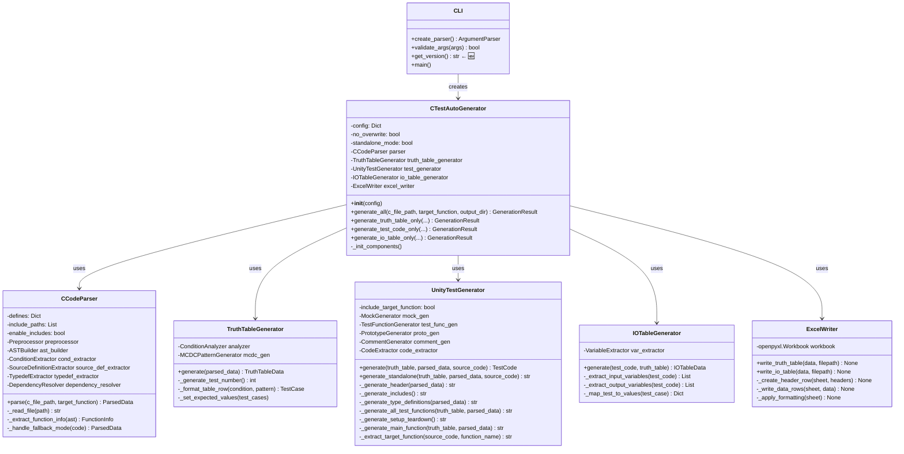
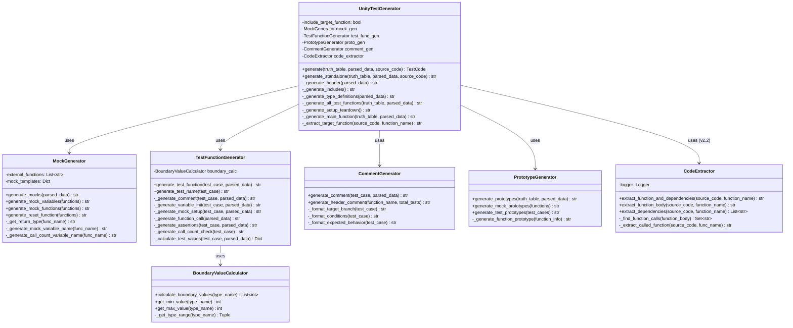
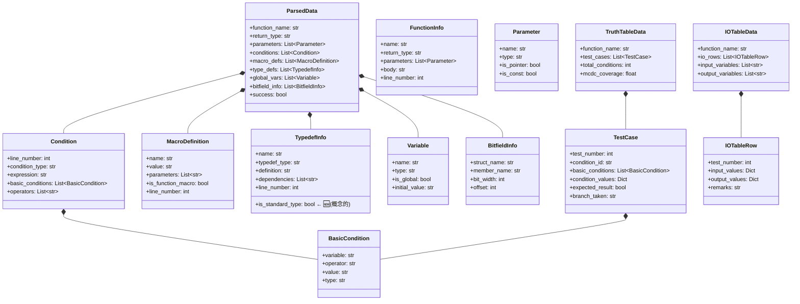
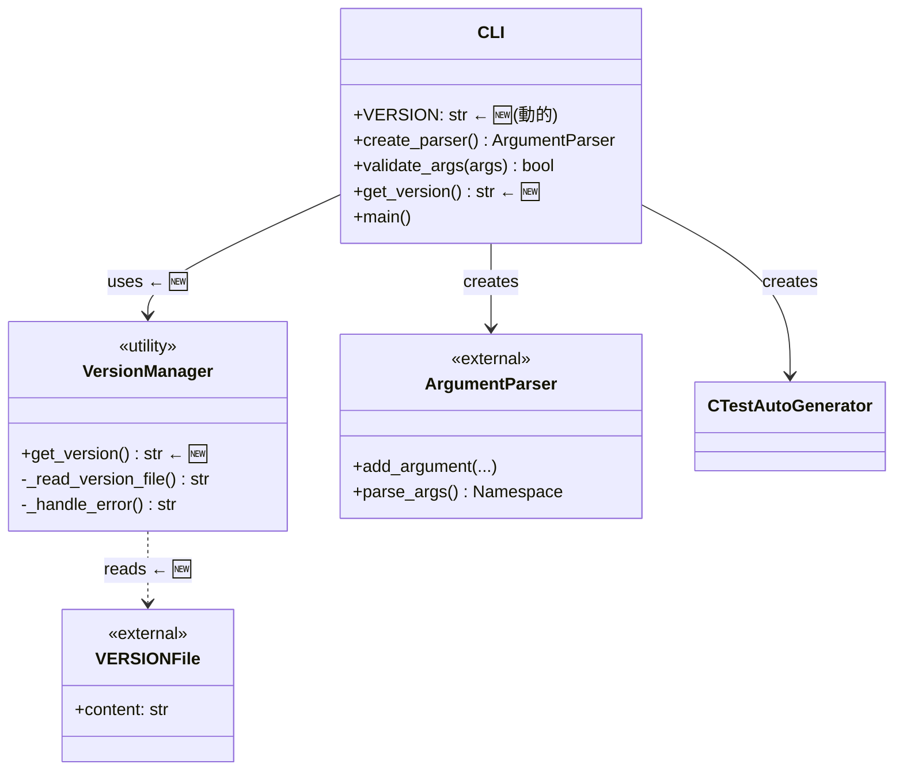
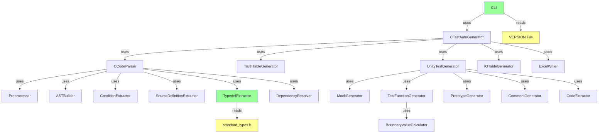

# AutoUniTestGen v2.4.4 - クラス図

**バージョン**: v2.4.4  
**最終更新**: 2025-11-19  
**対応機能**: スタンドアロンモード、フォールバックモード、標準型外部ファイル化、バージョン動的取得

---

## 目次

1. [全体クラス図](#1-全体クラス図)
2. [パーサー層クラス図](#2-パーサー層クラス図)
3. [テスト生成層クラス図](#3-テスト生成層クラス図)
4. [データ構造クラス図](#4-データ構造クラス図)
5. [補助コンポーネントクラス図](#5-補助コンポーネントクラス図)
6. [CLI層クラス図（v2.4.4）](#6-cli層クラス図v244) ← 🆕 新規

---

## 1. 全体クラス図



---

## 2. パーサー層クラス図

```mermaid
classDiagram
    %% メインパーサー
    class CCodeParser {
        -logger: Logger
        -defines: Dict
        -include_paths: List
        -enable_includes: bool
        -Preprocessor preprocessor
        -ASTBuilder ast_builder
        -ConditionExtractor cond_extractor
        -SourceDefinitionExtractor source_def_extractor
        -TypedefExtractor typedef_extractor
        -VariableDeclExtractor var_decl_extractor
        -DependencyResolver dependency_resolver
        +parse(c_file_path, target_function) ParsedData
        +parse_with_ast(c_file_path) ParsedData
        +parse_with_fallback(c_file_path) ParsedData
        -_read_file(path) str
        -_extract_function_info(ast, function_name) FunctionInfo
        -_handle_fallback_mode(source_code) ParsedData
    }

    %% 前処理
    class Preprocessor {
        -defines: Dict
        -include_paths: List
        -enable_includes: bool
        +preprocess(source_code) PreprocessedData
        +extract_macro_definitions(code) List~MacroDefinition~
        +remove_comments(code) str
        +extract_bitfield_info(code) List~BitfieldInfo~
        +expand_simple_macros(code, macros) str
        -_extract_includes(code) List~str~
        -_process_conditional_directives(code) str
    }

    %% AST構築
    class ASTBuilder {
        -pycparser.CParser parser
        +build_ast(preprocessed_code) AST
        +parse_source(source_code) AST
        -_prepare_source_for_parsing(code) str
        -_handle_parse_error(error) None
    }

    %% 条件抽出
    class ConditionExtractor {
        -logger: Logger
        +extract_conditions(ast, function_name) List~Condition~
        +extract_condition_from_node(node) Condition
        -_visit_if_statement(node) Condition
        -_visit_while_statement(node) Condition
        -_visit_for_statement(node) Condition
        -_parse_condition_expression(expr) List~BasicCondition~
        -_extract_operators(expr) List~str~
    }

    %% ソース定義抽出（フォールバック）
    class SourceDefinitionExtractor {
        -logger: Logger
        +extract_macros(source_code) List~MacroDefinition~
        +extract_typedefs(source_code) List~TypedefInfo~
        +extract_functions(source_code) List~FunctionInfo~
        -_find_macro_pattern(code) List~Match~
        -_find_typedef_pattern(code) List~Match~
        -_extract_struct_definition(code, name) str
        -_extract_union_definition(code, name) str
        -_extract_enum_definition(code, name) str
    }

    %% 型定義抽出 (v2.4.4更新)
    class TypedefExtractor {
        -logger: Logger
        -typedefs: List~TypedefInfo~
        -source_lines: List~str~
        -standard_types: Set~str~ ← 🆕
        +__init__() ← 🆕
        +extract_typedefs(ast, source_code) List~TypedefInfo~
        +_load_standard_types() Set~str~ ← 🆕
        -_extract_typedef_node(node) TypedefInfo
        -_extract_definition_from_source(name, type) str
        -_filter_standard_typedefs(typedefs) List~TypedefInfo~
        -_find_dependencies(definition) List~str~
        +parse_typedef_string(typedef_str) TypedefInfo
        -_extract_typedef_name(node) str
        -_extract_base_type(node) str
        -_extract_struct_members(node) List
        -_extract_union_members(node) List
        -_extract_enum_values(node) List
    }

    %% 変数宣言抽出
    class VariableDeclExtractor {
        +extract_global_variables(ast) List~str~
        +extract_local_variables(ast, function_name) List~str~
        +extract_function_parameters(ast, function_name) List~Dict~
        -_is_global_variable(node) bool
        -_get_variable_name(node) str
    }

    %% 依存関係解決
    class DependencyResolver {
        +resolve_dependencies(typedefs) List~TypedefInfo~
        -_build_dependency_graph(typedefs) Dict
        -_topological_sort(graph) List
        -_extract_type_references(typedef) List~str~
    }

    %% 関係性
    CCodeParser --> Preprocessor : uses
    CCodeParser --> ASTBuilder : uses
    CCodeParser --> ConditionExtractor : uses
    CCodeParser --> SourceDefinitionExtractor : uses (v2.4.2)
    CCodeParser --> TypedefExtractor : uses
    CCodeParser --> VariableDeclExtractor : uses
    CCodeParser --> DependencyResolver : uses
    TypedefExtractor ..> standard_types_h : reads ← 🆕
```



### 図2の説明（v2.4.4更新）

**TypedefExtractorの変更点:**

1. **新規フィールド**
   - `standard_types: Set[str]` - 標準型のセット（動的にロード）

2. **新規メソッド**
   - `__init__()` - 初期化時に`_load_standard_types()`を呼び出し
   - `_load_standard_types() -> Set[str]` - standard_types.hから標準型を読み込み

3. **依存関係**
   - `standard_types.h` ファイルへの読み取り依存を追加

---

## 3. テスト生成層クラス図



---

## 4. データ構造クラス図



### 図4の説明（v2.4.4更新）

**TypedefInfoの変更点:**

- `is_standard_type: bool` (概念的なフィールド)
  - 標準型かどうかを判別するための情報
  - 実装では `TypedefExtractor.standard_types` のセットで管理

---

## 5. 補助コンポーネントクラス図

```mermaid
classDiagram
    %% Excel出力
    class ExcelWriter {
        -openpyxl.Workbook workbook
        +write_truth_table(data, filepath) None
        +write_io_table(data, filepath) None
        -_create_header_row(sheet, headers) None
        -_write_data_rows(sheet, data) None
        -_apply_formatting(sheet) None
        -_set_column_widths(sheet) None
        -_apply_border(sheet, range) None
    }

    %% 設定管理
    class ConfigManager {
        -config: ConfigParser
        -config_file: str
        +load_config(filepath) Dict
        +get_value(section, key, default) Any
        +set_value(section, key, value) None
        +save_config() None
        -_validate_config(config) bool
    }

    %% モデルプリセット管理
    class ModelPresetManager {
        -presets: Dict
        -preset_file: str
        +load_presets(filepath) Dict
        +get_preset(model_name) Dict
        +apply_preset(model_name, config) Dict
        -_validate_preset(preset) bool
    }

    %% エラーハンドラ（Phase 7）
    class ErrorHandler {
        -error_log: List~ErrorRecord~
        +handle_error(error, level) None
        +get_error_summary() ErrorSummary
        +clear_errors() None
        -_format_error_message(error) str
        -_log_error(error) None
    }

    %% バッチプロセッサ（Phase 7）
    class BatchProcessor {
        -file_queue: List~str~
        -max_workers: int
        +process_batch(file_list) BatchResult
        +add_file(filepath) None
        -_process_single_file(filepath) Result
        -_collect_results(results) BatchResult
    }

    %% パフォーマンスモニタ（Phase 7）
    class PerformanceMonitor {
        -start_time: float
        -metrics: Dict
        +start_monitoring() None
        +stop_monitoring() PerformanceReport
        +record_metric(name, value) None
        -_calculate_statistics() Dict
    }

    %% ロガー
    class Logger {
        +info(message) None
        +warning(message) None
        +error(message) None
        +debug(message) None
    }

    %% ユーティリティ
    class Utils {
        +setup_logger(name) Logger
        +read_file(path) str
        +write_file(path, content) None
        +ensure_directory(path) None
        +get_file_encoding(path) str
    }
```



---

## 6. CLI層クラス図（v2.4.4）



### 図6の説明（v2.4.4新規）

**CLI層の変更点:**

1. **新規コンポーネント**
   - `VersionManager` - バージョン管理ユーティリティ（概念的）
   - `VERSIONFile` - 外部ファイル依存

2. **新規メソッド**
   - `get_version() -> str` - VERSIONファイルからバージョンを取得

3. **VERSION変数の動的化**
   ```python
   # Before (v2.4.3.1)
   VERSION = "2.2"  # ハードコード
   
   # After (v2.4.4)
   VERSION = get_version()  # 動的取得
   ```

4. **実装詳細**
   ```python
   def get_version() -> str:
       """VERSIONファイルからバージョンを取得"""
       try:
           version_file = Path(__file__).resolve().parent.parent / 'VERSION'
           with open(version_file, 'r', encoding='utf-8') as f:
               return f.read().strip()
       except FileNotFoundError:
           return "unknown"
       except Exception as e:
           print(f"Warning: Failed to read VERSION file: {e}", file=sys.stderr)
           return "unknown"
   ```

---

## クラス数とLOC統計

### 総クラス数

| 層 | クラス数 | 変更 |
|----|---------|------|
| CLI層 | 2 | +1 (v2.4.4) |
| 統合層 | 1 | - |
| パーサー層 | 7 | 更新 |
| テスト生成層 | 6 | - |
| 真偽表生成層 | 2 | - |
| I/O表生成層 | 2 | - |
| 出力層 | 1 | - |
| データ構造 | 13 | - |
| 補助 | 6 | - |
| **合計** | **40** | +1 |

### コード行数（推定）

| コンポーネント | LOC | 変更 |
|--------------|-----|------|
| `typedef_extractor.py` | 527 | +49 (v2.4.4) |
| `cli.py` | 771 | +14 (v2.4.4) |
| `standard_types.h` | 63 | +63 (v2.4.4新規) |
| その他 | ~8000 | - |
| **合計** | **~9400** | +126 |

---

## 主要な設計パターン

### 1. Strategy パターン
- **使用箇所**: `CCodeParser`
- **実装**: AST解析とフォールバックモードの切り替え

### 2. Factory パターン
- **使用箇所**: `TestFunctionGenerator`
- **実装**: テストケースに応じたテスト関数生成

### 3. Builder パターン
- **使用箇所**: `UnityTestGenerator`
- **実装**: テストコードの段階的構築

### 4. Template Method パターン
- **使用箇所**: `ExcelWriter`
- **実装**: 真偽表とI/O表の共通出力処理

### 5. Singleton パターン (概念的)
- **使用箇所**: `Logger`, `ConfigManager`
- **実装**: グローバル設定とログの管理

### 6. Facade パターン
- **使用箇所**: `CTestAutoGenerator`
- **実装**: 複雑なサブシステムへの統一インターフェース

---

## v2.4.4での主な変更点

### 1. TypedefExtractor の拡張

**新規メンバー**:
- `standard_types: Set[str]` - 動的にロードされる標準型セット

**新規メソッド**:
- `__init__()` - 初期化処理を追加
- `_load_standard_types() -> Set[str]` - 外部ファイルから標準型を読み込み

**変更されたメソッド**:
- `_extract_definition_from_source()` - `self.standard_types` を使用するように変更

**外部依存**:
- `standard_types.h` ファイルへの読み取り依存を追加

### 2. CLI の拡張

**新規メソッド**:
- `get_version() -> str` - VERSIONファイルからバージョンを取得

**変更されたメンバー**:
- `VERSION` - ハードコードから動的取得に変更

**外部依存**:
- `VERSION` ファイルへの読み取り依存を追加

### 3. 新規外部ファイル

- `standard_types.h` - 標準型定義（63行）
- `VERSION` - バージョン情報（1行）

---

## 依存関係グラフ



### 凡例
- 🟩 緑: v2.4.4で変更されたクラス
- 🟨 黄: v2.4.4で新規追加されたファイル

---

## クラス責務一覧

| クラス | 責務 | v2.4.4変更 |
|--------|------|-----------|
| CLI | コマンドライン引数処理、バージョン管理 | ✅ 変更 |
| CTestAutoGenerator | 全体の統合・オーケストレーション | - |
| CCodeParser | C言語コードの解析 | - |
| TypedefExtractor | 型定義の抽出、標準型管理 | ✅ 変更 |
| TruthTableGenerator | MC/DC真偽表の生成 | - |
| UnityTestGenerator | Unityテストコードの生成 | - |
| IOTableGenerator | I/O一覧表の生成 | - |
| ExcelWriter | Excelファイルへの出力 | - |

---

**作成日**: 2025-11-13  
**最終更新**: 2025-11-19 (v2.4.4対応)  
**バージョン**: v2.4.4  
**次回更新**: v2.5.0（pcpp対応）後
