# C言語単体テスト自動生成ツール - クラス図 (v4.3.3.1)

```mermaid
classDiagram
    %% ========================================
    %% メインファサード
    %% ========================================
    class CTestAutoGenerator {
        -CCodeParser parser
        -TruthTableGenerator truth_table_gen
        -UnityTestGenerator test_generator
        -IOTableGenerator io_table_gen
        -ExcelWriter excel_writer
        +__init__()
        +generate_all(c_file_path, function_name, output_dir) dict
        -_validate_input(c_file_path) bool
    }

    %% ========================================
    %% パーサー関連
    %% ========================================
    class CCodeParser {
        -Preprocessor preprocessor
        -ASTBuilder ast_builder
        -ConditionExtractor cond_extractor
        -TypedefExtractor typedef_extractor
        -VariableDeclExtractor var_extractor
        -SourceDefinitionExtractor source_def_extractor
        +parse(c_file_path, function_name) ParsedData
        -_read_file(path) str
        -_extract_function_info(ast) FunctionInfo
        -_extract_local_variables(code, function_name) dict
    }

    class Preprocessor {
        -dict defines
        -dict function_macros
        -list include_paths
        +preprocess(code) str
        -_remove_comments(code) str
        -_process_defines(code) str
        -_extract_macros(code) dict
        -_extract_function_macros(code) dict
        -_extract_bitfield_info(code) dict
    }

    class ASTBuilder {
        -pycparser.CParser parser
        +build_ast(code) AST
        -_add_fake_includes(code) str
        -_handle_parse_error(error) None
    }

    class ConditionExtractor {
        -list conditions
        -int current_line
        +extract_conditions(ast, function_name) list
        +visit_FuncDef(node) None
        +visit_If(node) None
        +visit_Switch(node) None
        -_analyze_binary_op(node) Condition
        -_extract_switch_cases(node) list
    }

    class TypedefExtractor {
        +extract_typedefs(code) list~TypedefInfo~
        +extract_struct_definitions(code) list~StructDefinition~
        -_parse_struct_members(definition) list~StructMember~
    }

    class VariableDeclExtractor {
        +extract_variables(code) list~VariableDeclInfo~
        -_parse_declaration(line) VariableDeclInfo
    }

    class SourceDefinitionExtractor {
        +extract_macros(code) dict
        +extract_macro_definitions(code) list~str~
    }

    %% ========================================
    %% 真偽表生成
    %% ========================================
    class TruthTableGenerator {
        -ConditionAnalyzer analyzer
        -MCDCPatternGenerator mcdc_gen
        +generate(parsed_data) TruthTableData
        -_generate_test_number() int
        -_format_table_row(condition, pattern) TestCase
    }

    class ConditionAnalyzer {
        +analyze_condition(condition) dict
        -_is_simple_condition(cond) bool
        -_is_or_condition(cond) bool
        -_is_and_condition(cond) bool
        -_split_conditions(expression) list
    }

    class MCDCPatternGenerator {
        +generate_patterns(condition) list
        +generate_or_patterns(n_conditions) list
        +generate_and_patterns(n_conditions) list
        +generate_switch_patterns(cases) list
        -_calculate_mcdc_combinations(n_conditions) list
    }

    %% ========================================
    %% テストコード生成
    %% ========================================
    class UnityTestGenerator {
        -MockGenerator mock_gen
        -TestFunctionGenerator func_gen
        -CommentGenerator comment_gen
        -PrototypeGenerator proto_gen
        -DependencyResolver dep_resolver
        +generate(truth_table, parsed_data) TestCode
        +generate_standalone(truth_table, parsed_data, source_code) TestCode
        -_generate_header() str
        -_generate_includes() str
        -_generate_type_definitions(parsed_data) str
        -_generate_setup_teardown() str
        -_generate_main_function(test_cases) str
    }

    class MockGenerator {
        -list external_functions
        -dict function_signatures
        +generate_mocks(parsed_data) str
        +generate_mock_variables(parsed_data) str
        +generate_mock_functions(parsed_data) str
        +generate_reset_function() str
        -_format_mock_function(func_name, signature) str
        -_get_return_type(func_name, parsed_data) str
    }

    class TestFunctionGenerator {
        -BoundaryValueCalculator boundary_calc
        -CommentGenerator comment_gen
        -ValueResolver value_resolver
        -AssignableVariableChecker var_checker
        +generate_test_function(test_case, parsed_data) str
        -_generate_test_name(test_case, parsed_data) str
        -_generate_variable_init(test_case, parsed_data) str
        -_generate_mock_setup(test_case, parsed_data) str
        -_generate_assertions(test_case, parsed_data) str
        -_generate_call_count_check(test_case, parsed_data) str
        -_process_init_code(init, parsed_data, lines) str
        -_validate_and_fix_init_code(init_code, parsed_data) str
    }

    class AssignableVariableChecker {
        -ParsedData parsed_data
        -dict _non_assignable
        -set _struct_member_names
        -set _assignable_vars
        +__init__(parsed_data)
        +is_assignable(var_name) bool
        +get_reason(var_name) str
        +get_reason_code(var_name) str
        +classify_variables(variables) tuple
        +is_struct_member_name(name) bool
        +is_loop_variable(name) bool
        +is_enum_constant(name) bool
        +is_function(name) bool
        -_build_non_assignable_set() void
        -_build_assignable_set() void
        -_is_root_assignable(root_name) bool
    }

    class BoundaryValueCalculator {
        +calculate_boundary(operator, value, truth) int
        +parse_comparison(expression) dict
        +generate_test_value(expression, truth) str
        +generate_test_value_with_parsed_data(expression, truth, parsed_data) str
        +extract_variables(expression) list
        +extract_assignable_variables(expression, parsed_data) tuple
    }

    class ValueResolver {
        -ParsedData parsed_data
        +resolve_value(identifier) tuple
        +get_boolean_init_value(truth) tuple
        +get_bitfield_init_value(truth, bit_width) tuple
        +get_bitfield_max_value(variable) int
        +get_variable_type(variable) str
        +get_max_value_for_type(type_name) int
    }

    class CommentGenerator {
        +generate_comment(test_case, parsed_data) str
        -_format_target_branch(test_case) str
        -_format_conditions(test_case, parsed_data) str
        -_format_expected_behavior(test_case) str
    }

    class PrototypeGenerator {
        +generate_prototypes(parsed_data) str
        +generate_mock_prototypes(parsed_data) str
        +generate_test_prototypes(test_cases) str
        -_format_prototype(func_info) str
    }

    class DependencyResolver {
        +sort_typedefs(typedefs) list~TypedefInfo~
        -_build_dependency_graph(typedefs) dict
        -_topological_sort(graph) list
    }

    %% ========================================
    %% I/O表生成
    %% ========================================
    class IOTableGenerator {
        -VariableExtractor var_extractor
        +generate(truth_table, parsed_data) IOTableData
        -_extract_input_variables(parsed_data) list
        -_extract_output_variables(parsed_data) list
        -_map_test_to_values(test_case) dict
    }

    class VariableExtractor {
        +extract_inputs(test_function) list
        +extract_outputs(test_function) list
        -_is_input_variable(var_name) bool
        -_is_output_variable(var_name) bool
    }

    %% ========================================
    %% 出力
    %% ========================================
    class ExcelWriter {
        -openpyxl.Workbook workbook
        +write_truth_table(data, filepath) None
        +write_io_table(data, filepath) None
        -_format_header(worksheet, headers) None
        -_apply_cell_style(cell, style) None
    }

    %% ========================================
    %% データ構造
    %% ========================================
    class ParsedData {
        +str file_name
        +str function_name
        +list~Condition~ conditions
        +list~str~ external_functions
        +list~str~ global_variables
        +FunctionInfo function_info
        +dict~str,str~ enums
        +list~str~ enum_values
        +dict~str,BitFieldInfo~ bitfields
        +list~TypedefInfo~ typedefs
        +list~VariableDeclInfo~ variables
        +dict~str,str~ macros
        +list~str~ macro_definitions
        +list~StructDefinition~ struct_definitions
        +dict~str,FunctionSignature~ function_signatures
        +dict~str,LocalVariableInfo~ local_variables
        +get_struct_definition(type_name) StructDefinition
        +to_dict() dict
    }

    class FunctionInfo {
        +str name
        +str return_type
        +list~dict~ parameters
        +list~str~ local_variables
        +to_dict() dict
    }

    class FunctionSignature {
        +str name
        +str return_type
        +list~dict~ parameters
        +bool is_static
        +format_parameters() str
        +format_declaration() str
    }

    class LocalVariableInfo {
        +str name
        +str var_type
        +str scope
        +int line_number
        +bool is_initialized
        +str initial_value
        +bool is_loop_variable
        +to_dict() dict
    }

    class Condition {
        +int line
        +ConditionType type
        +str expression
        +str operator
        +str left
        +str right
        +list~str~ conditions
        +list cases
        +to_dict() dict
    }

    class StructDefinition {
        +str name
        +list~StructMember~ members
        +bool is_typedef
        +str original_name
        +get_member(member_name) StructMember
        +get_all_members_flat(prefix) list
    }

    class StructMember {
        +str name
        +str type
        +int bit_width
        +bool is_pointer
        +bool is_array
        +int array_size
        +StructDefinition nested_struct
        +get_full_type() str
    }

    class TestCase {
        +int no
        +str truth
        +str condition
        +str expected
        +str test_name
        +str comment
        +dict input_values
        +dict output_values
        +to_dict() dict
    }

    class TruthTableData {
        +str function_name
        +list~TestCase~ test_cases
        +int total_tests
        +to_excel_format() list
        +to_dict() dict
    }

    class TestCode {
        +str header
        +str includes
        +str type_definitions
        +str prototypes
        +str mock_variables
        +str mock_functions
        +str test_functions
        +str setup_teardown
        +str target_function_code
        +str main_function
        +save(filepath) None
        +to_string() str
    }

    class IOTableData {
        +list~str~ input_variables
        +list~str~ output_variables
        +list~dict~ test_data
        +to_excel_format() list
    }

    %% ========================================
    %% 関係性
    %% ========================================
    CTestAutoGenerator --> CCodeParser
    CTestAutoGenerator --> TruthTableGenerator
    CTestAutoGenerator --> UnityTestGenerator
    CTestAutoGenerator --> IOTableGenerator
    CTestAutoGenerator --> ExcelWriter

    CCodeParser --> Preprocessor
    CCodeParser --> ASTBuilder
    CCodeParser --> ConditionExtractor
    CCodeParser --> TypedefExtractor
    CCodeParser --> VariableDeclExtractor
    CCodeParser --> SourceDefinitionExtractor
    CCodeParser ..> ParsedData : creates

    TruthTableGenerator --> ConditionAnalyzer
    TruthTableGenerator --> MCDCPatternGenerator
    TruthTableGenerator ..> TruthTableData : creates

    UnityTestGenerator --> MockGenerator
    UnityTestGenerator --> TestFunctionGenerator
    UnityTestGenerator --> CommentGenerator
    UnityTestGenerator --> PrototypeGenerator
    UnityTestGenerator --> DependencyResolver
    UnityTestGenerator ..> TestCode : creates

    TestFunctionGenerator --> BoundaryValueCalculator
    TestFunctionGenerator --> ValueResolver
    TestFunctionGenerator --> AssignableVariableChecker
    TestFunctionGenerator --> CommentGenerator

    BoundaryValueCalculator --> AssignableVariableChecker

    IOTableGenerator --> VariableExtractor
    IOTableGenerator ..> IOTableData : creates

    ParsedData --> FunctionInfo
    ParsedData --> FunctionSignature
    ParsedData --> LocalVariableInfo
    ParsedData --> Condition
    ParsedData --> StructDefinition
    StructDefinition --> StructMember
    TruthTableData --> TestCase
```

## 各クラスの責務

### メインファサード
| クラス | 責務 |
|--------|------|
| CTestAutoGenerator | 全体の処理フロー制御、各コンポーネントの連携 |

### パーサー関連
| クラス | 責務 |
|--------|------|
| CCodeParser | C言語ソースコードの解析、ParsedDataの生成 |
| Preprocessor | プリプロセス処理、マクロ抽出、ビットフィールド情報抽出 |
| ASTBuilder | pycparserを使用したAST構築 |
| ConditionExtractor | if/switch条件分岐の抽出 |
| TypedefExtractor | 型定義と構造体定義の抽出 |
| VariableDeclExtractor | 変数宣言の抽出 |
| SourceDefinitionExtractor | ソースコード内のマクロ定義抽出 |

### 真偽表生成
| クラス | 責務 |
|--------|------|
| TruthTableGenerator | MC/DC真偽表の生成 |
| ConditionAnalyzer | 条件式の解析（OR/AND/単純条件の判定） |
| MCDCPatternGenerator | MC/DCパターンの生成 |

### テストコード生成
| クラス | 責務 |
|--------|------|
| UnityTestGenerator | Unityテストコード全体の生成 |
| MockGenerator | モック/スタブ関数の生成 |
| TestFunctionGenerator | テスト関数本体の生成 |
| **AssignableVariableChecker** | **v4.3.3.1新規: 代入可能変数の判定一元化** |
| BoundaryValueCalculator | 境界値計算、変数抽出 |
| ValueResolver | enum/マクロ値の解決 |
| CommentGenerator | テストコメントの生成 |
| PrototypeGenerator | プロトタイプ宣言の生成 |
| DependencyResolver | 型定義の依存順序解決 |

### I/O表生成
| クラス | 責務 |
|--------|------|
| IOTableGenerator | I/O一覧表の生成 |
| VariableExtractor | 入出力変数の抽出 |

### 出力
| クラス | 責務 |
|--------|------|
| ExcelWriter | Excel形式での出力 |

## v4.3.3.1での変更点

### 新規クラス
- **AssignableVariableChecker**: 代入可能変数の判定を一元化するクラス
  - ローカル変数、ループ変数、構造体メンバー名、enum定数、関数名、マクロを検出
  - 代入不可の理由を日本語で提供

### 修正クラス
- **TestFunctionGenerator**: AssignableVariableCheckerを統合
- **BoundaryValueCalculator**: extract_assignable_variablesメソッド追加
