# AutoUniTestGen v4.1 - クラス図

## 概要
C言語単体テスト自動生成ツール AutoUniTestGen v4.1のクラス構成図

### v4.0からの主な変更点
- **FunctionSignature**: 関数シグネチャを保持する新データクラス
- **StdlibFunctionExtractor**: 標準ライブラリ関数を抽出・除外する新クラス
- **MockGenerator**: シグネチャ一致モック生成、パラメータキャプチャ対応
- **エンコーディング対応**: UTF-8/Shift-JIS自動検出、Shift-JIS出力

```mermaid
classDiagram
    %% ===== メインクラス =====
    class CTestAutoGenerator {
        -CCodeParser parser
        -TruthTableGenerator truth_table_gen
        -UnityTestGenerator test_generator
        -IOTableGenerator io_table_gen
        -ExcelWriter excel_writer
        -bool standalone_mode
        -bool no_overwrite
        +__init__(config)
        +generate_all(c_file_path, target_function, output_dir) GenerationResult
        +generate_truth_table_only() GenerationResult
        +generate_test_code_only() GenerationResult
        +generate_io_table_only() GenerationResult
    }

    %% ===== パーサー層 =====
    class CCodeParser {
        -Preprocessor preprocessor
        -ASTBuilder ast_builder
        -ConditionExtractor cond_extractor
        -StdlibFunctionExtractor stdlib_extractor
        +parse(c_file_path, target_function) ParsedData
        -_extract_function_info(ast, target_function) FunctionInfo
        -_extract_external_functions(conditions, ast, target_function, source_code) list
        -_extract_function_signatures(ast, code) dict
        -_extract_signatures_regex(code) dict
        -_extract_global_variables(ast) list
        -_extract_enums(ast) tuple
    }

    class Preprocessor {
        -dict defines
        -list include_paths
        -bool enable_includes
        -dict bitfields
        +preprocess(code) str
        -_remove_comments(code) str
        -_process_defines(code) str
        -_handle_includes(code) str
        +get_bitfields() dict
    }

    class ASTBuilder {
        -pycparser.CParser parser
        -int line_offset
        +build_ast(code) AST
        +build_ast_with_fallback(code) AST
        -_add_fake_includes(code) str
        -_handle_parse_error(error) None
        +get_line_offset() int
    }

    class ConditionExtractor {
        -list conditions
        -str target_function
        -list source_lines
        -int line_offset
        +extract_conditions(ast) list
        +set_source_lines(lines) None
        +set_line_offset(offset) None
        +visit_FuncDef(node) None
        +visit_If(node) None
        +visit_Switch(node) None
        -_analyze_binary_op(node) dict
        -_extract_switch_cases(node) list
    }

    class StdlibFunctionExtractor {
        <<v4.1 New>>
        -list include_paths
        -dict header_functions_cache
        -set stdlib_functions
        +STDLIB_HEADERS set
        +FALLBACK_STDLIB_FUNCTIONS set
        +extract_includes_from_source(source_code) list
        +find_header_file(header_name) str
        +extract_functions_from_header(header_path) set
        +get_stdlib_functions_from_source(source_code) set
        +is_stdlib_function(func_name, source_code) bool
        +filter_external_functions(external_functions, source_code) list
    }

    %% ===== 真偽表生成層 =====
    class TruthTableGenerator {
        -ConditionAnalyzer analyzer
        -MCDCPatternGenerator mcdc_gen
        +generate(parsed_data) TruthTableData
        -_generate_test_number() int
        -_format_table_row(condition, pattern) dict
    }

    class ConditionAnalyzer {
        +analyze_condition(condition) dict
        -_is_simple_condition(cond) bool
        -_is_or_condition(cond) bool
        -_is_and_condition(cond) bool
        -_split_binary_op(cond) tuple
        -_build_condition_tree(expression) ConditionNode
    }

    class MCDCPatternGenerator {
        +generate_patterns(condition_tree) list
        +generate_or_patterns() list
        +generate_and_patterns() list
        +generate_switch_patterns(cases) list
        -_calculate_mcdc_combinations(n_conditions) list
        -_generate_independence_pairs(tree) list
    }

    %% ===== テストコード生成層 =====
    class UnityTestGenerator {
        -MockGenerator mock_gen
        -TestFunctionGenerator func_gen
        -CommentGenerator comment_gen
        -PrototypeGenerator proto_gen
        -bool include_target_function
        +generate(truth_table, parsed_data, source_code) TestCode
        +generate_standalone(truth_table, parsed_data, source_code) str
        -_generate_header() str
        -_generate_includes() str
        -_generate_setup_teardown() str
        -_extract_target_function_body(source_code, function_name) str
    }

    class MockGenerator {
        <<v4.0 Major Update>>
        -list~MockFunction~ mock_functions
        +generate_mocks(parsed_data) str
        +generate_mock_variables() str
        +generate_mock_functions() str
        +generate_reset_function() str
        +generate_prototypes() str
        +generate_setup_code(test_case_no) str
        +generate_assert_call_counts() str
        +generate_param_assertions() str
        -_create_mock_function(func_name, signature) MockFunction
        -_guess_return_type(func_name) str
    }

    class TestFunctionGenerator {
        -BoundaryValueCalculator boundary_calc
        -ValueResolver value_resolver
        +generate_test_function(test_case, parsed_data) str
        -_generate_test_name(test_case) str
        -_generate_variable_init(test_case) str
        -_generate_mock_setup(test_case) str
        -_generate_assertions(test_case) str
        -_generate_call_count_check(test_case) str
    }

    class CommentGenerator {
        +generate_comment(test_case, parsed_data) str
        -_format_target_branch(test_case) str
        -_format_conditions(test_case) str
        -_format_expected_behavior(test_case) str
    }

    class PrototypeGenerator {
        +generate_prototypes(functions, signatures) str
        -_format_prototype(func_info) str
    }

    class BoundaryValueCalculator {
        +calculate_boundary(operator, value, truth) int
        -_parse_comparison(expression) dict
    }

    %% ===== I/O表生成層 =====
    class IOTableGenerator {
        -VariableExtractor var_extractor
        +generate(test_code, truth_table) IOTableData
        -_extract_input_variables(test_code) list
        -_extract_output_variables(test_code) list
        -_map_test_to_values(test_case) dict
    }

    class VariableExtractor {
        +extract_inputs(test_function) list
        +extract_outputs(test_function) list
        -_is_input_variable(var_name) bool
        -_is_output_variable(var_name) bool
    }

    %% ===== 出力層 =====
    class ExcelWriter {
        -openpyxl.Workbook workbook
        +write_truth_table(data, filepath) None
        +write_io_table(data, filepath) None
        -_format_header(worksheet, headers) None
        -_apply_cell_style(cell, style) None
    }

    %% ===== データ構造 =====
    class ParsedData {
        +str file_name
        +str function_name
        +list~Condition~ conditions
        +list external_functions
        +list global_variables
        +dict~str,FunctionSignature~ function_signatures
        +FunctionInfo function_info
        +dict~str,BitFieldInfo~ bitfields
        +list enums
        +dict enum_values
        +to_dict() dict
    }

    class FunctionSignature {
        <<v4.0 New>>
        +str name
        +str return_type
        +list~dict~ parameters
        +bool is_static
        +format_parameters() str
        +format_declaration() str
    }

    class MockFunction {
        <<v4.0 New>>
        +str name
        +str return_type
        +list~dict~ parameters
        +str return_variable
        +str call_count_variable
    }

    class FunctionInfo {
        +str name
        +str return_type
        +list parameters
        +int start_line
        +int end_line
    }

    class Condition {
        +int line
        +str type
        +str expression
        +str operator
        +str left
        +str right
        +list cases
    }

    class TruthTableData {
        +list test_cases
        +str function_name
        +int total_tests
        +to_excel_format() list
        +to_dict() dict
    }

    class TestCode {
        +str header
        +str includes
        +str type_definitions
        +str mock_code
        +str test_functions
        +str setup_teardown
        +str prototypes
        +save(filepath) None
        +to_string() str
    }

    class IOTableData {
        +list input_variables
        +list output_variables
        +list test_data
        +to_excel_format() list
    }

    class GenerationResult {
        +Path truth_table_path
        +Path test_code_path
        +Path io_table_path
        +bool success
        +str error_message
    }

    %% ===== ユーティリティ関数 =====
    class EncodingUtils {
        <<module functions>>
        +read_source_file(file_path) tuple~str,str~
        +write_source_file(file_path, content, encoding) bool
    }

    %% ===== 関係性 =====
    CTestAutoGenerator --> CCodeParser
    CTestAutoGenerator --> TruthTableGenerator
    CTestAutoGenerator --> UnityTestGenerator
    CTestAutoGenerator --> IOTableGenerator
    CTestAutoGenerator --> ExcelWriter
    CTestAutoGenerator --> EncodingUtils
    CTestAutoGenerator ..> GenerationResult

    CCodeParser --> Preprocessor
    CCodeParser --> ASTBuilder
    CCodeParser --> ConditionExtractor
    CCodeParser --> StdlibFunctionExtractor
    CCodeParser ..> ParsedData
    CCodeParser ..> FunctionSignature

    TruthTableGenerator --> ConditionAnalyzer
    TruthTableGenerator --> MCDCPatternGenerator
    TruthTableGenerator ..> TruthTableData

    UnityTestGenerator --> MockGenerator
    UnityTestGenerator --> TestFunctionGenerator
    UnityTestGenerator --> CommentGenerator
    UnityTestGenerator --> PrototypeGenerator
    UnityTestGenerator ..> TestCode

    MockGenerator ..> MockFunction
    MockGenerator --> FunctionSignature

    TestFunctionGenerator --> BoundaryValueCalculator

    IOTableGenerator --> VariableExtractor
    IOTableGenerator ..> IOTableData

    ParsedData o-- Condition
    ParsedData o-- FunctionSignature
    ParsedData o-- FunctionInfo
```

## クラス責務一覧

### メインクラス

| クラス | 責務 |
|--------|------|
| CTestAutoGenerator | 全体のオーケストレーション、設定管理、エラーハンドリング |

### パーサー層

| クラス | 責務 |
|--------|------|
| CCodeParser | C言語ソースの解析統括、各抽出処理の連携 |
| Preprocessor | プリプロセッサディレクティブ処理、コメント除去 |
| ASTBuilder | pycparserによるAST構築、フォールバック処理 |
| ConditionExtractor | if/switch/elseの条件分岐抽出 |
| **StdlibFunctionExtractor** | **v4.1新規**: 標準ライブラリ関数の検出・除外 |

### 真偽表生成層

| クラス | 責務 |
|--------|------|
| TruthTableGenerator | MC/DC真偽表の生成統括 |
| ConditionAnalyzer | 条件式の構造解析、ツリー構築 |
| MCDCPatternGenerator | MC/DCパターン生成、独立性ペア計算 |

### テストコード生成層

| クラス | 責務 |
|--------|------|
| UnityTestGenerator | Unityテストコード生成統括、スタンドアロンモード |
| **MockGenerator** | **v4.0改修**: シグネチャ一致モック生成、パラメータキャプチャ |
| TestFunctionGenerator | テスト関数本体の生成 |
| CommentGenerator | テストコメント生成 |
| PrototypeGenerator | プロトタイプ宣言生成 |
| BoundaryValueCalculator | 境界値計算 |

### I/O表生成層

| クラス | 責務 |
|--------|------|
| IOTableGenerator | I/O一覧表の生成統括 |
| VariableExtractor | 入出力変数の抽出 |

### 出力層

| クラス | 責務 |
|--------|------|
| ExcelWriter | Excel形式での出力 |

### データ構造

| クラス | 責務 |
|--------|------|
| ParsedData | 解析結果の保持 |
| **FunctionSignature** | **v4.0新規**: 関数シグネチャ情報 |
| **MockFunction** | **v4.0新規**: モック関数情報 |
| TruthTableData | 真偽表データ |
| TestCode | テストコード |
| IOTableData | I/O表データ |
| GenerationResult | 生成結果 |

---
**バージョン**: 4.1.0  
**更新日**: 2025-12-01
