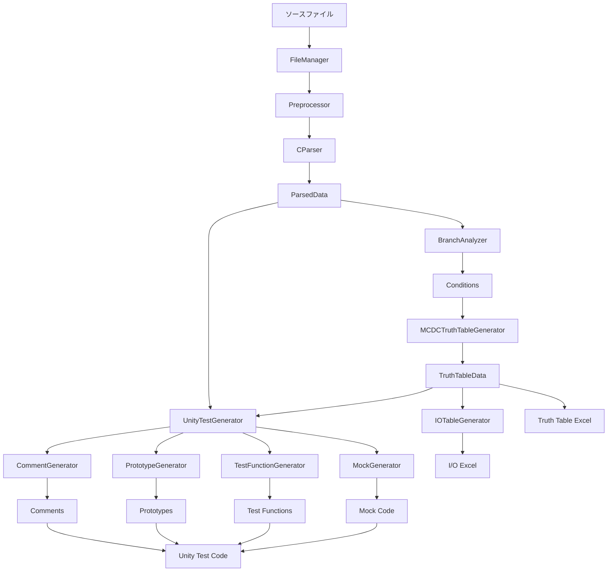

# AutoUniTestGen クラス図 (v2.6.5)

**最終更新**: 2025-11-20  
**バージョン**: 2.6.5

---

## 概要

このドキュメントでは、AutoUniTestGenの主要なクラスとその関係を説明します。

v2.6.5では、以下の改善を実施しました：
- v2.6.2: グローバル変数初期化の削除（MockGenerator）
- v2.6.3: コメント形式修正（UnityTestGenerator）、result変数型定義追加（TestFunctionGenerator）
- v2.6.4: デフォルト値モック設定の削除（TestFunctionGenerator）
- v2.6.5: パラメータ変数型定義追加（TestFunctionGenerator）

---

## クラス図（Mermaid）

```mermaid
classDiagram
    %% メインクラス
    class Main {
        +main()
        -parse_arguments()
        -run_generation()
    }
    
    %% ファイル処理
    class FileManager {
        -input_file: str
        -output_dir: str
        +read_file() str
        +write_file(content: str)
        +create_output_dir()
    }
    
    class Preprocessor {
        +preprocess(source: str) str
        -remove_comments(source: str) str
        -expand_macros(source: str) str
        -handle_directives(source: str) str
    }
    
    %% パーサー
    class CParser {
        +parse(source: str) ParsedData
        -build_ast(source: str) AST
        -extract_functions(ast: AST) List~Function~
        -extract_types(ast: AST) List~TypeDef~
    }
    
    class FunctionExtractor {
        +extract_function(source: str, name: str) FunctionInfo
        +extract_external_functions(source: str) List~str~
    }
    
    %% 分析
    class BranchAnalyzer {
        +analyze_branches(func: FunctionInfo) List~Condition~
        -extract_conditions(ast: AST) List~Condition~
        -classify_condition_type(cond: str) ConditionType
    }
    
    %% テスト生成（コアクラス）
    class UnityTestGenerator {
        -mock_gen: MockGenerator
        -test_func_gen: TestFunctionGenerator
        -proto_gen: PrototypeGenerator
        -comment_gen: CommentGenerator
        -code_extractor: CodeExtractor
        +generate(truth_table, parsed_data, source) TestCode
        -_generate_includes() str
        -_generate_setup_teardown() str
        -_generate_main_function() str
        -_generate_standalone_test(source, truth_table, parsed_data) str
    }
    
    %% モック生成（v2.6.2で更新）
    class MockGenerator {
        -mock_functions: List~MockFunction~
        +generate_mocks(parsed_data) str
        +generate_mock_variables() str ⚡v2.6.2: 初期化削除
        +generate_mock_functions() str
        +generate_reset_function() str
    }
    
    %% テスト関数生成（v2.6.3, v2.6.4, v2.6.5で更新）
    class TestFunctionGenerator {
        -boundary_calc: BoundaryValueCalculator
        +generate_test_functions(truth_table, parsed_data) List~str~
        -_generate_test_function(test_case, parsed_data) str
        -_generate_function_name(condition, truth) str
        -_generate_variable_init(test_case, parsed_data) str ⚡v2.6.3,v2.6.5: 型定義追加
        -_generate_mock_setup(test_case, parsed_data) str ⚡v2.6.4: デフォルト値削除
        -_generate_function_call(parsed_data) str
        -_generate_assertions(test_case, parsed_data) str
        -_determine_mock_return_value(func, test_case, parsed_data) str
    }
    
    class BoundaryValueCalculator {
        +generate_test_value(expression: str, truth: str) str
        +extract_variables(expression: str) List~str~
        -_calculate_boundary_value(expr: str, truth: str) int
    }
    
    %% その他の生成クラス
    class MCDCTruthTableGenerator {
        +generate(parsed_data: ParsedData) TruthTableData
        -_generate_combinations(conditions) List~TestCase~
        -_check_mcdc_coverage(combinations) bool
    }
    
    class IOTableGenerator {
        +generate(truth_table, parsed_data) ExcelFile
        -_create_worksheet(truth_table) Worksheet
        -_format_cells(ws: Worksheet)
    }
    
    class PrototypeGenerator {
        +generate_prototypes(truth_table) List~str~
    }
    
    class CommentGenerator {
        +generate_test_comment(test_case) str
        +generate_section_comment(section: str) str
    }
    
    class CodeExtractor {
        +extract_function_body(source: str, func_name: str) str
        +extract_type_definitions(source: str) str
    }
    
    %% データ構造
    class ParsedData {
        +function_info: FunctionInfo
        +conditions: List~Condition~
        +external_functions: List~str~
        +type_definitions: List~TypeDef~
        +bitfields: Dict
    }
    
    class FunctionInfo {
        +name: str
        +return_type: str
        +parameters: List~Parameter~
        +body: str
    }
    
    class Condition {
        +expression: str
        +type: ConditionType
        +variables: List~str~
    }
    
    class TestCase {
        +id: int
        +condition: str
        +truth: str
        +input_values: Dict
        +expected_output: str
    }
    
    class TruthTableData {
        +test_cases: List~TestCase~
        +coverage_rate: float
    }
    
    class MockFunction {
        +name: str
        +return_type: str
        +return_variable: str
        +call_count_variable: str
    }
    
    %% 関係性
    Main --> FileManager
    Main --> CParser
    Main --> BranchAnalyzer
    Main --> MCDCTruthTableGenerator
    Main --> UnityTestGenerator
    Main --> IOTableGenerator
    
    FileManager --> Preprocessor
    
    CParser --> FunctionExtractor
    CParser --> ParsedData
    
    BranchAnalyzer --> Condition
    
    UnityTestGenerator --> MockGenerator
    UnityTestGenerator --> TestFunctionGenerator
    UnityTestGenerator --> PrototypeGenerator
    UnityTestGenerator --> CommentGenerator
    UnityTestGenerator --> CodeExtractor
    
    MockGenerator --> MockFunction
    MockGenerator --> ParsedData
    
    TestFunctionGenerator --> BoundaryValueCalculator
    TestFunctionGenerator --> TestCase
    TestFunctionGenerator --> ParsedData
    
    MCDCTruthTableGenerator --> TruthTableData
    MCDCTruthTableGenerator --> TestCase
    
    IOTableGenerator --> TruthTableData
```



---

## 主要クラスの詳細

### 1. UnityTestGenerator（テスト生成の中核）

**責任**:
- Unityテストコード全体の生成を統括
- 各コンポーネントを調整してテストコードを構築

**主要メソッド**:
- `generate()`: テストコード生成のエントリポイント
- `_generate_standalone_test()`: スタンドアロン版テストコード生成（v2.4.3）
- `_generate_setup_teardown()`: setUp/tearDown関数の生成

**v2.6.3での変更**:
```python
# コメント形式の修正（120-122行目）
# Before
parts.append("=" * 80)
parts.append("/* 以下、自動生成されたテストコード */")
parts.append("=" * 80 + "\n")

# After
parts.append("//" + "=" * 78)
parts.append("// 以下、自動生成されたテストコード")
parts.append("//" + "=" * 78 + "\n")
```

---

### 2. MockGenerator（モック生成）⚡v2.6.2で更新

**責任**:
- モック関数の生成
- モック変数の生成
- reset_all_mocks()関数の生成

**主要メソッド**:
- `generate_mock_variables()`: モック変数の宣言を生成
- `generate_mock_functions()`: モック関数の実装を生成
- `generate_reset_function()`: reset_all_mocks()を生成

**v2.6.2での変更**:
```python
# グローバル変数の初期化を削除（110, 113行目）
# Before
lines.append(f"static {return_type} {return_variable} = 0;")
lines.append(f"static int {call_count_variable} = 0;")

# After
lines.append(f"static {return_type} {return_variable};")
lines.append(f"static int {call_count_variable};")
```

**生成コード例**:
```c
// v2.6.2以降
static uint16_t mock_f4_return_value;     // 初期化なし
static int mock_f4_call_count;            // 初期化なし

static void reset_all_mocks(void) {
    mock_f4_return_value = 0;             // setUp()から呼ばれて初期化
    mock_f4_call_count = 0;
}
```

---

### 3. TestFunctionGenerator（テスト関数生成）⚡v2.6.3, v2.6.4, v2.6.5で更新

**責任**:
- 個々のテスト関数の生成
- 変数初期化コードの生成
- モック設定コードの生成
- アサーションコードの生成

**主要メソッド**:
- `generate_test_functions()`: 全テスト関数を生成
- `_generate_variable_init()`: 変数初期化コードを生成 ⚡v2.6.3, v2.6.5
- `_generate_mock_setup()`: モック設定コードを生成 ⚡v2.6.4
- `_generate_assertions()`: アサーションコードを生成

**v2.6.3での変更（result変数の型定義追加）**:
```python
# result変数に型定義を追加（203-215行目）
# Before
if '*' in return_type:
    lines.append("    result = NULL;")
else:
    lines.append("    result = 0;")

# After
if '*' in return_type:
    lines.append(f"    {return_type} result = NULL;")
else:
    if '_t' in return_type or (return_type and return_type[0].isupper()):
        lines.append(f"    {return_type} result = {{0}};")
    else:
        lines.append(f"    {return_type} result = 0;")
```

**v2.6.4での変更（デフォルト値モック設定の削除）**:
```python
# デフォルト値（0）の場合は設定コードを生成しない（505-537行目）
# Before
def _generate_mock_setup(self, test_case, parsed_data):
    lines = []
    lines.append("    // モックを設定")
    
    for func_name in parsed_data.external_functions:
        return_value = self._determine_mock_return_value(func_name, test_case, parsed_data)
        lines.append(f"    mock_{func_name}_return_value = {return_value};")  # 常に生成
    
    return '\n'.join(lines)

# After
def _generate_mock_setup(self, test_case, parsed_data):
    lines = []
    mock_settings = []
    
    for func_name in parsed_data.external_functions:
        return_value = self._determine_mock_return_value(func_name, test_case, parsed_data)
        if return_value != "0":  # デフォルト値以外のみ
            mock_settings.append(f"    mock_{func_name}_return_value = {return_value};")
    
    if mock_settings:  # 設定が必要な場合のみ
        lines.append("    // モックを設定")
        lines.extend(mock_settings)
    
    return '\n'.join(lines)
```

**v2.6.5での変更（パラメータ変数の型定義追加）**:
```python
# パラメータに型定義を追加（217-241行目）
# Before
for param in parsed_data.function_info.parameters:
    param_name = param.get('name', '')
    param_type = param.get('type', 'int')
    
    if param_name in test_case.input_values:
        value = test_case.input_values[param_name]
        lines.append(f"    {param_name} = {value};")  # 型定義なし
        continue
    
    if '*' in param_type:
        lines.append(f"    {param_name} = NULL;")
    else:
        lines.append(f"    {param_name} = 0;")

# After
for param in parsed_data.function_info.parameters:
    param_name = param.get('name', '')
    param_type = param.get('type', 'int')
    
    if param_name in test_case.input_values:
        value = test_case.input_values[param_name]
        if '_t' in param_type or (param_type and param_type[0].isupper()):
            lines.append(f"    {param_type} {param_name} = {{{value}}};")  # 構造体
        else:
            lines.append(f"    {param_type} {param_name} = {value};")  # 基本型
        continue
    
    if '*' in param_type:
        lines.append(f"    {param_type} {param_name} = NULL;")  # ポインタ
    else:
        if '_t' in param_type or (param_type and param_type[0].isupper()):
            lines.append(f"    {param_type} {param_name} = {{0}};")  # 構造体
        else:
            lines.append(f"    {param_type} {param_name} = 0;")  # 基本型
```

**生成コード例**:
```c
// v2.6.5
void test_01_inState_status_eq_1_T(void) {
    // 変数を初期化
    state_def_t result = {0};     // v2.6.3: result変数に型定義
    state_def_t inState = {0};    // v2.6.5: パラメータにも型定義
    int count = 0;                // v2.6.5: パラメータにも型定義
    inState.status = 1;
    
    // モックを設定
    // （デフォルト値の場合はこのセクション自体が削除）v2.6.4
    
    // mock_func_return_value = 1;  // v2.6.4: 0以外の場合のみ生成
    
    // 対象関数を実行
    test_func_with_params();
}
```

---

### 4. BoundaryValueCalculator（境界値計算）

**責任**:
- 条件式から境界値を計算
- テストに使用する値を決定

**主要メソッド**:
- `generate_test_value()`: 条件式と真偽から適切なテスト値を生成
- `extract_variables()`: 条件式から変数を抽出

**生成例**:
```python
# 条件式: value > 10
# 真の場合: 11
# 偽の場合: 10

# 条件式: count >= 5
# 真の場合: 5
# 偽の場合: 4
```

---

### 5. MCDCTruthTableGenerator（真偽表生成）

**責任**:
- MC/DC（Modified Condition/Decision Coverage）基準の真偽表を生成
- 100%カバレッジを達成する最小限のテストケースを生成

**主要メソッド**:
- `generate()`: 真偽表データを生成
- `_generate_combinations()`: 条件の組み合わせを生成
- `_check_mcdc_coverage()`: MC/DCカバレッジを検証

---

### 6. IOTableGenerator（I/O表生成）

**責任**:
- Excel形式のI/O一覧表を生成
- 各テストケースの入力値と期待出力を整理

**主要メソッド**:
- `generate()`: I/O表を生成
- `_create_worksheet()`: ワークシートを作成
- `_format_cells()`: セルをフォーマット

---

## データフロー



---

## v2.6.2からv2.6.5での主な変更まとめ

### v2.6.2: モック初期化の最適化

**影響クラス**: `MockGenerator`

**変更内容**:
- グローバル変数宣言時の初期化（`= 0`）を削除
- 初期化は`setUp()`の`reset_all_mocks()`のみで実施

**効果**:
- 初期化の重複を50%削減（2箇所 → 1箇所）
- Unityベストプラクティスに完全準拠

---

### v2.6.3: コメント形式修正 + 型定義追加

**影響クラス**: `UnityTestGenerator`, `TestFunctionGenerator`

**変更内容**:
1. コメント形式を`/* */`から`//`に変更
2. result変数に型定義を追加

**効果**:
- コンパイルエラーの解消
- 型安全性の向上

---

### v2.6.4: デフォルト値モック設定の削除

**影響クラス**: `TestFunctionGenerator`

**変更内容**:
- デフォルト値（0）の場合はモック設定コードを生成しない
- 0以外の値が必要な場合のみ設定コードを生成

**効果**:
- テスト関数の行数を約25%削減
- 生成コードの総行数を約18%削減

---

### v2.6.5: パラメータ変数の型定義追加

**影響クラス**: `TestFunctionGenerator`

**変更内容**:
- パラメータのローカル変数にも型定義を追加
- 構造体、基本型、ポインタを自動判定

**効果**:
- すべてのローカル変数に型定義が完備
- コンパイルエラーの完全解消

---

## 設計原則

### 1. 単一責任の原則（SRP）

各クラスは明確な責任を持つ:
- `MockGenerator`: モック関連のコード生成のみ
- `TestFunctionGenerator`: テスト関数の生成のみ
- `BoundaryValueCalculator`: 境界値計算のみ

### 2. 依存性逆転の原則（DIP）

- 高レベルモジュール（`UnityTestGenerator`）は低レベルモジュール（`MockGenerator`など）に依存
- インターフェースではなく具象クラスに依存（Pythonの特性による）

### 3. 開放閉鎖の原則（OCP）

- 新しい機能追加時は既存コードを修正せず、クラスを追加
- 例: `PrototypeGenerator`, `CommentGenerator`は独立したクラス

---

## まとめ

AutoUniTestGenは、明確な責任分離と段階的な処理フローにより、保守性と拡張性を確保しています。

v2.6.2からv2.6.5にかけて、以下の改善を実施:
- **v2.6.2**: モック初期化の最適化（MockGenerator）
- **v2.6.3**: コメント形式修正と型定義追加（UnityTestGenerator, TestFunctionGenerator）
- **v2.6.4**: デフォルト値モック設定の削除（TestFunctionGenerator）
- **v2.6.5**: パラメータ変数の型定義追加（TestFunctionGenerator）

これらの改善により、生成されるテストコードの品質が大幅に向上しました。

---

**最終更新**: 2025-11-20  
**バージョン**: 2.6.5  
**作成者**: Claude (Anthropic)
