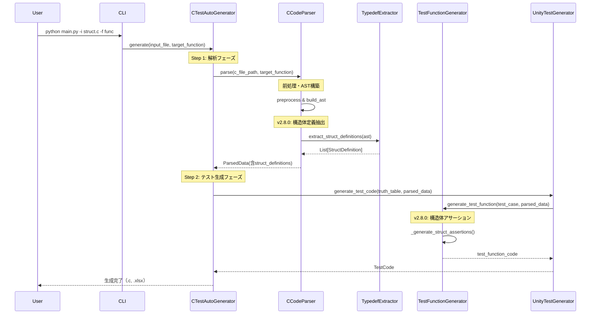
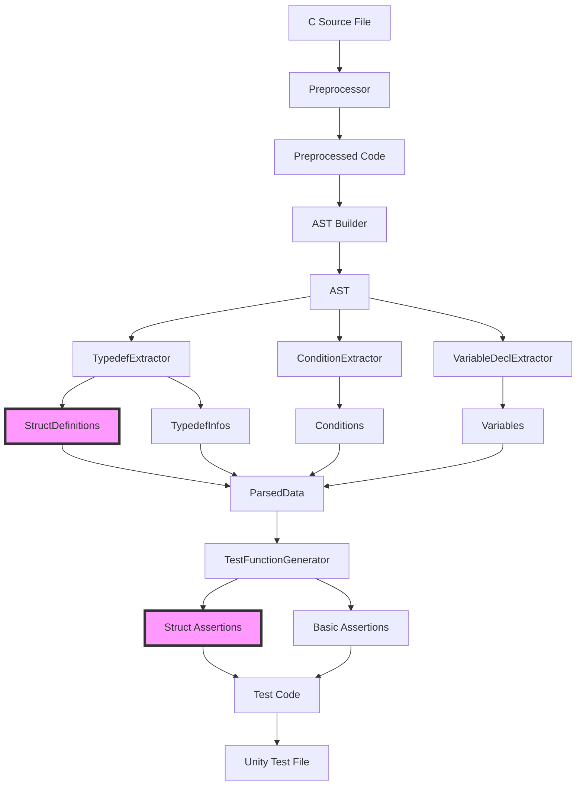

# AutoUniTestGen v2.8.0 シーケンス図

**更新日**: 2025-11-20  
**バージョン**: v2.8.0

## 概要
v2.8.0では構造体定義の抽出とメンバーごとのアサーション生成フローを追加しました。

## 1. 全体処理フロー



## 2. 構造体定義抽出フロー（v2.8.0新規）

```mermaid
sequenceDiagram
    participant CCodeParser
    participant TypedefExtractor
    participant AST
    participant StructDefinition
    participant StructMember
    
    CCodeParser->>TypedefExtractor: extract_struct_definitions(ast)
    
    TypedefExtractor->>TypedefExtractor: _walk_ast(ast)
    
    loop 各ASTノード
        TypedefExtractor->>TypedefExtractor: _is_typedef_struct(node)
        
        alt Typedef構造体の場合
            TypedefExtractor->>TypedefExtractor: _parse_typedef_struct(node)
            
            Note over TypedefExtractor: typedef名を取得
            TypedefExtractor->>AST: node.name
            AST-->>TypedefExtractor: "state_def_t"
            
            Note over TypedefExtractor: 構造体本体を取得
            TypedefExtractor->>AST: node.type
            
            alt TypeDecl -> Struct
                TypedefExtractor->>AST: type_node.type
                AST-->>TypedefExtractor: Struct node
            else 直接 Struct
                Note over TypedefExtractor: そのまま使用
            end
            
            TypedefExtractor->>TypedefExtractor: _extract_struct_members(struct_node)
            
            loop 各メンバー宣言
                TypedefExtractor->>TypedefExtractor: _parse_member_decl(decl)
                
                TypedefExtractor->>TypedefExtractor: _extract_type_info(decl.type)
                Note over TypedefExtractor: 型情報を解析
                
                create StructMember
                TypedefExtractor->>StructMember: new(name, type, ...)
                
                TypedefExtractor-->>TypedefExtractor: StructMember
            end
            
            create StructDefinition
            TypedefExtractor->>StructDefinition: new(name, members, ...)
            
            TypedefExtractor-->>TypedefExtractor: StructDefinition
        end
    end
    
    TypedefExtractor-->>CCodeParser: List[StructDefinition]
```

## 3. 構造体アサーション生成フロー（v2.8.0新規）

```mermaid
sequenceDiagram
    participant TestFunctionGenerator as TFG
    participant ParsedData
    participant StructDefinition
    participant StructMember
    
    Note over TFG: _generate_assertions()内
    
    TFG->>TFG: _is_struct_type(return_type)
    
    alt 構造体型の場合
        TFG->>TFG: _generate_struct_assertions(type_name, "result", parsed_data)
        
        TFG->>ParsedData: get_struct_definition(type_name)
        ParsedData-->>TFG: StructDefinition or None
        
        alt 構造体定義が見つかった場合
            TFG->>StructDefinition: get_all_members_flat()
            
            Note over StructDefinition: メンバーを再帰的に展開
            loop 各メンバー
                StructDefinition->>StructMember: メンバー情報取得
                
                alt nested_structがある場合
                    StructDefinition->>StructDefinition: 再帰的に展開
                    Note over StructDefinition: 例: position.x, position.y
                else 通常メンバー
                    Note over StructDefinition: 例: status, value
                end
                
                StructDefinition-->>StructDefinition: (access_path, member)
            end
            
            StructDefinition-->>TFG: List[(path, StructMember)]
            
            loop 各メンバーパス
                alt ポインタメンバー
                    TFG->>TFG: // TODO: ポインタメンバー
                else 配列メンバー
                    TFG->>TFG: // TODO: 配列メンバー
                else ビットフィールド
                    TFG->>TFG: TEST_ASSERT_EQUAL(0, result.{path}); // ビットフィールド
                else 通常メンバー
                    TFG->>TFG: TEST_ASSERT_EQUAL(0, result.{path});
                end
            end
            
            TFG-->>TFG: List[str] (アサーションコード)
        else 構造体定義なし
            TFG->>TFG: // 例: TEST_ASSERT_EQUAL(expected_value, result.member_name);
        end
    else 基本型の場合
        TFG->>TFG: TEST_ASSERT_EQUAL(expected, result);
    end
```

## 4. 型情報抽出フロー（詳細）

```mermaid
sequenceDiagram
    participant TypedefExtractor as TE
    participant ASTNode
    participant TypeInfo
    
    TE->>TE: _extract_type_info(type_node)
    
    create TypeInfo
    TE->>TypeInfo: {type_name: "unknown", is_pointer: false, ...}
    
    Note over TE: ポインタチェック
    loop type_node == PtrDecl
        TE->>TypeInfo: is_pointer = true
        TE->>ASTNode: type_node.type
        ASTNode-->>TE: next type_node
    end
    
    Note over TE: 配列チェック
    alt type_node == ArrayDecl
        TE->>TypeInfo: is_array = true
        TE->>ASTNode: type_node.dim.value
        ASTNode-->>TE: array_size
        TE->>TypeInfo: array_size = {size}
        TE->>ASTNode: type_node.type
        ASTNode-->>TE: next type_node
    end
    
    Note over TE: 基本型チェック
    alt type_node == TypeDecl
        TE->>ASTNode: type_node.type
        
        alt IdentifierType
            TE->>ASTNode: type.names
            ASTNode-->>TE: ["uint8_t"]
            TE->>TypeInfo: type_name = "uint8_t"
        else Struct
            TE->>ASTNode: type.name
            ASTNode-->>TE: struct_name
            TE->>TypeInfo: type_name = "struct {name}"
            
            Note over TE: ネスト構造体の処理
            opt has decls
                TE->>TE: _extract_struct_members(type_node.type)
                TE->>TypeInfo: nested_struct = StructDefinition
            end
        end
    end
    
    TE-->>TE: TypeInfo
```

## 5. データフロー図



## v2.8.0での主な変更点

### 新規シーケンス
1. **構造体定義抽出フロー**
   - AST走査による構造体検出
   - TypeDecl→Structパターンの処理
   - メンバー情報の再帰的抽出

2. **構造体アサーション生成フロー**
   - 構造体定義の検索
   - メンバーのフラット展開
   - メンバーごとのアサーション生成

### 拡張されたフロー
1. **CCodeParser.parse()**
   - 構造体定義抽出ステップの追加
   - ParsedDataへの格納

2. **TestFunctionGenerator._generate_assertions()**
   - 構造体型判定の分岐
   - メンバーごとのアサーション生成

## 既知の問題（v2.9.0で対応予定）

### ネスト構造体の不完全な処理
```
期待される動作:
  result.position.x
  result.position.y

現在の動作:
  result.position
```

### 原因
- `_extract_type_info()`でtypedef済み構造体型の解決が不完全
- 構造体定義の相互参照が未実装

### 解決策（v2.9.0）
1. 2パス処理の実装
   - 第1パス: すべての構造体定義を収集
   - 第2パス: 型参照を解決

2. 構造体定義マップの活用
   ```python
   struct_map = {s.name: s for s in struct_definitions}
   if member.type in struct_map:
       member.nested_struct = struct_map[member.type]
   ```
