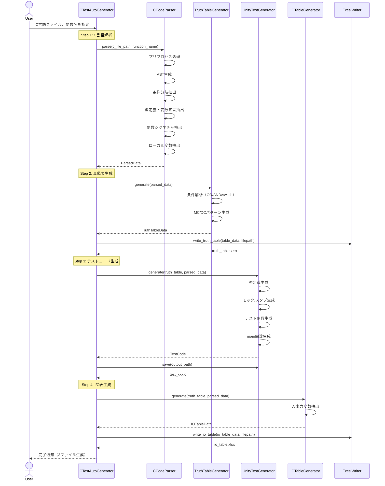
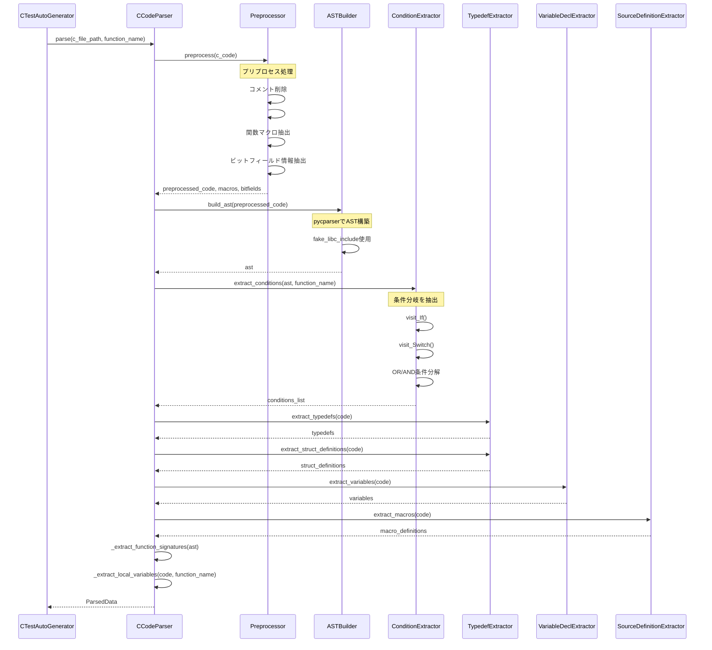
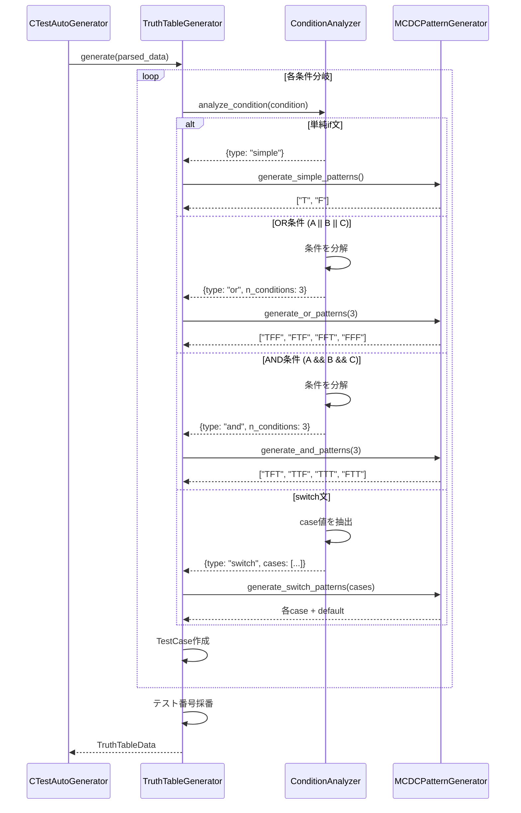
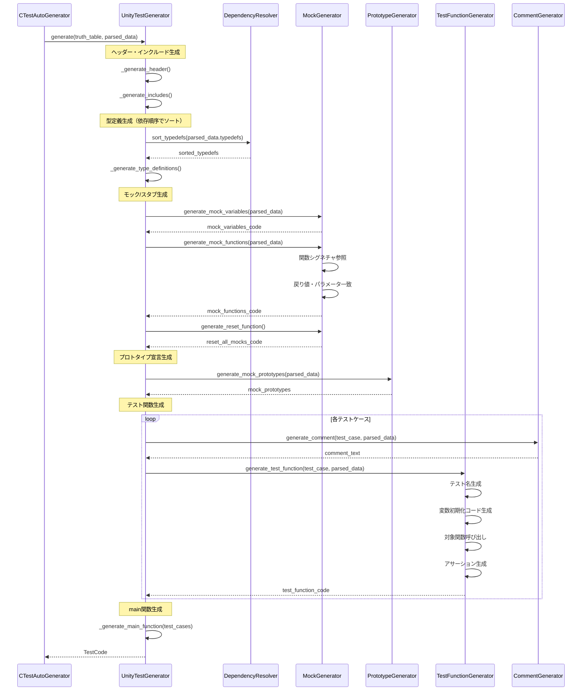
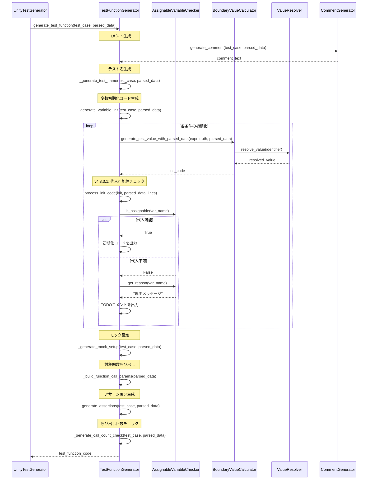
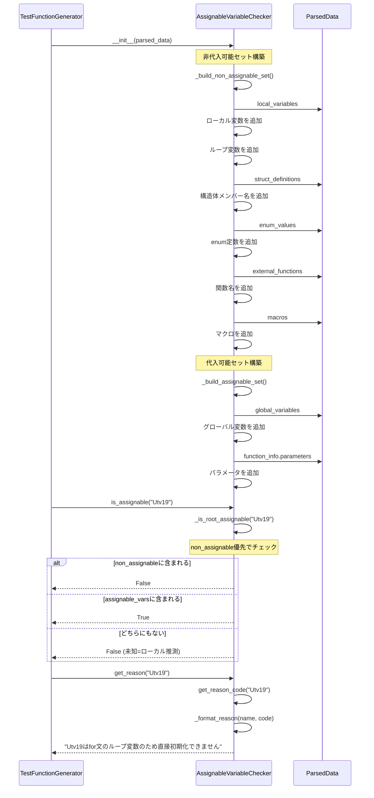
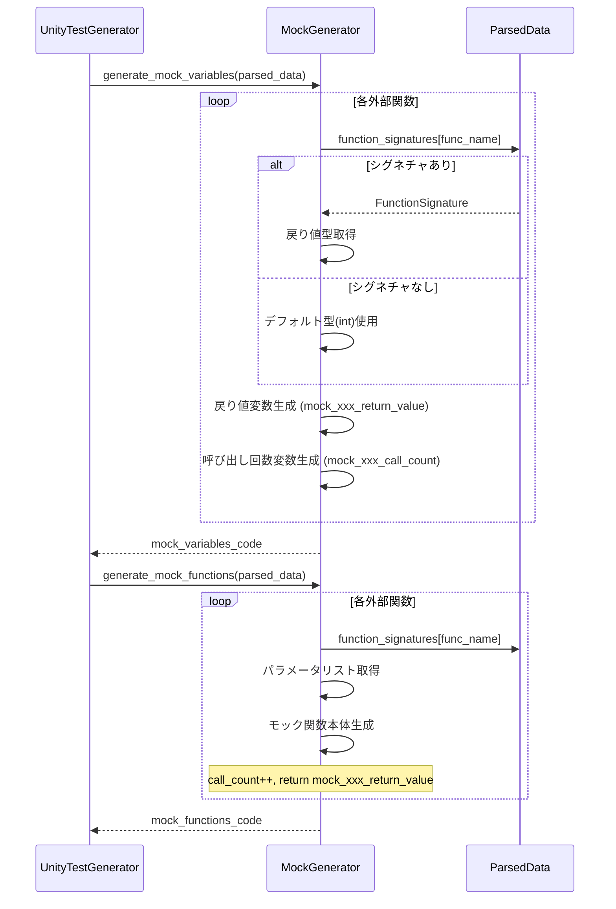
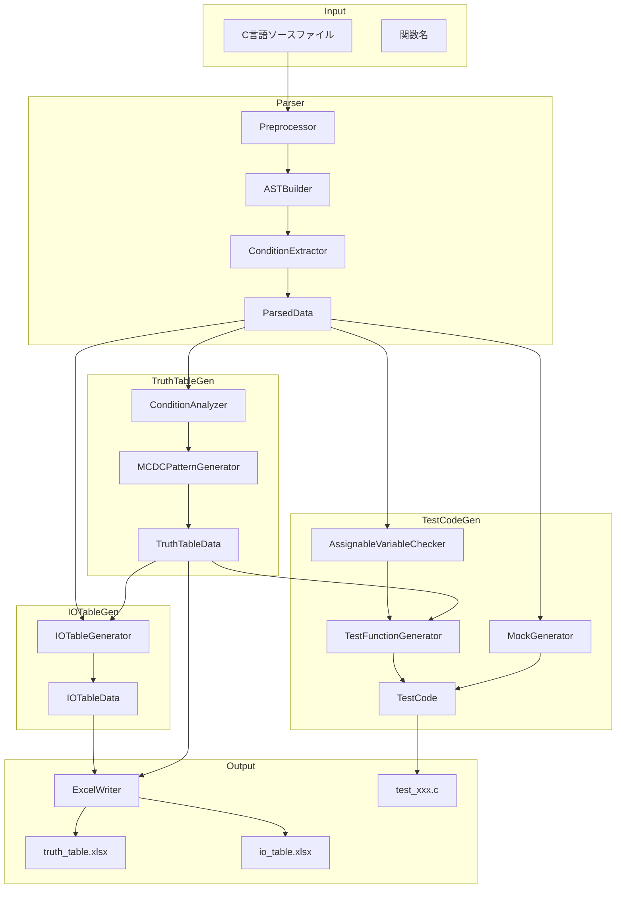

# C言語単体テスト自動生成ツール - シーケンス図 (v4.3.3.1)

## 1. 全体処理フロー

## 2. CCodeParser詳細シーケンス

## 3. TruthTableGenerator詳細シーケンス

## 4. UnityTestGenerator詳細シーケンス

## 5. TestFunctionGenerator詳細シーケンス (v4.3.3.1)

## 6. AssignableVariableChecker詳細シーケンス (v4.3.3.1 新規)

## 7. MockGenerator詳細シーケンス

## 8. データフロー概要

## v4.3.3.1での変更点

### 新規追加
- **AssignableVariableChecker詳細シーケンス**: 代入可能判定の詳細フローを追加
- **TestFunctionGenerator詳細シーケンス**: AssignableVariableCheckerとの連携を追加

### 修正
- TestFunctionGenerator内で`_process_init_code`がAssignableVariableCheckerを使用するフローを追加
