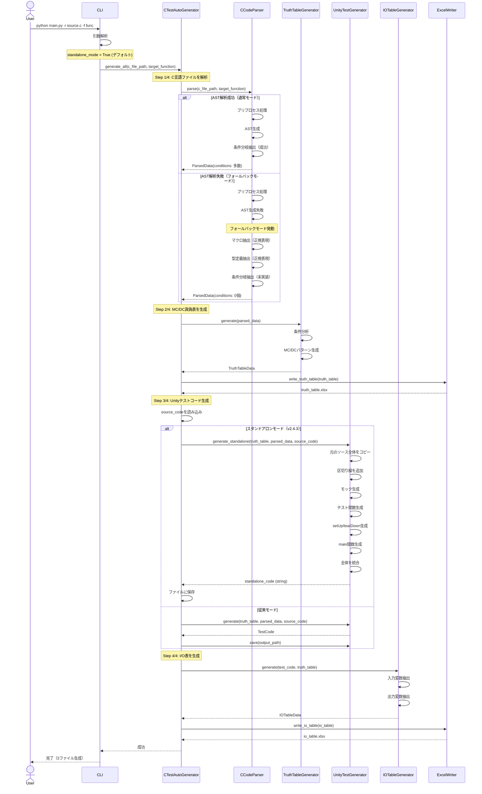
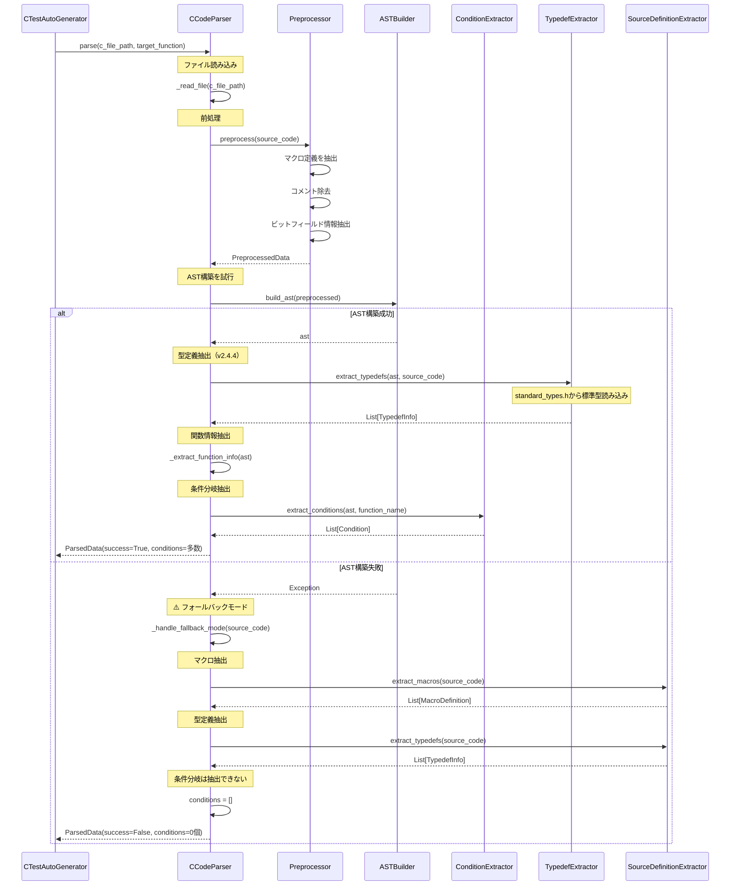
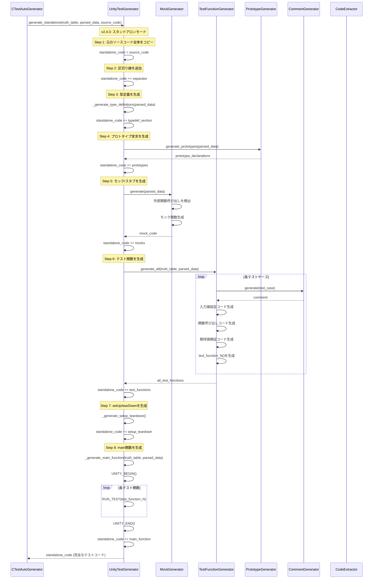
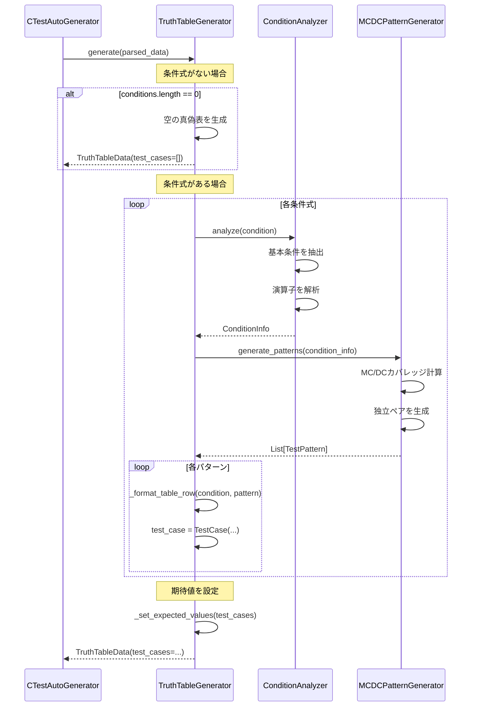
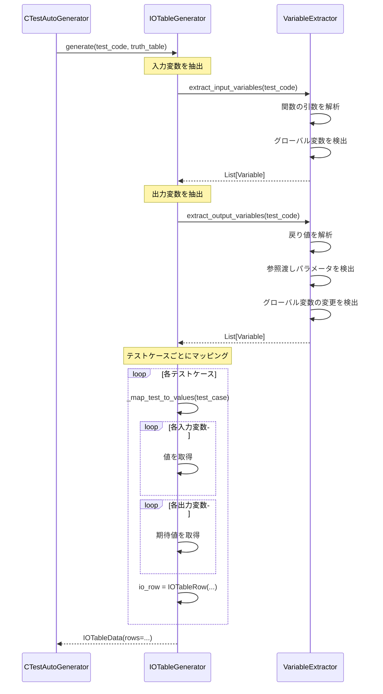
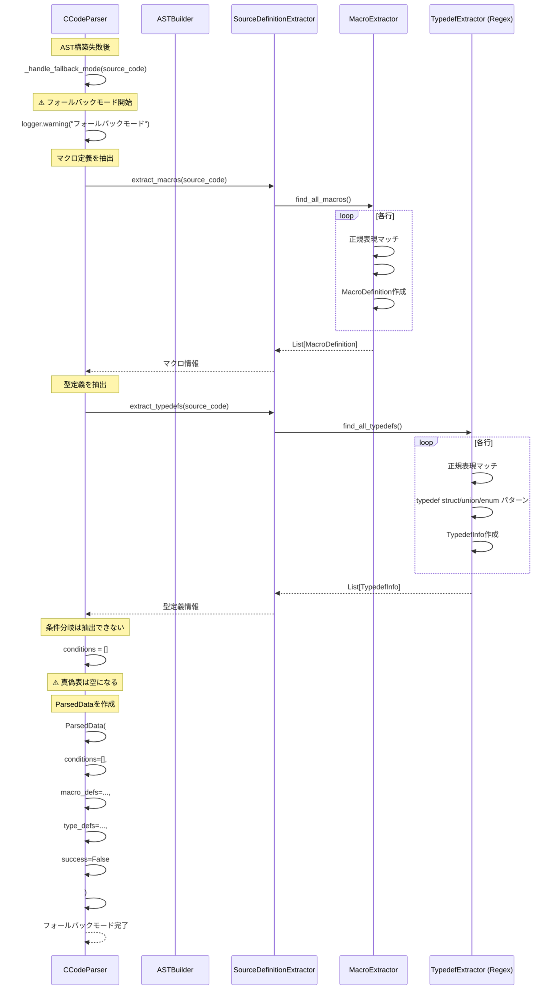
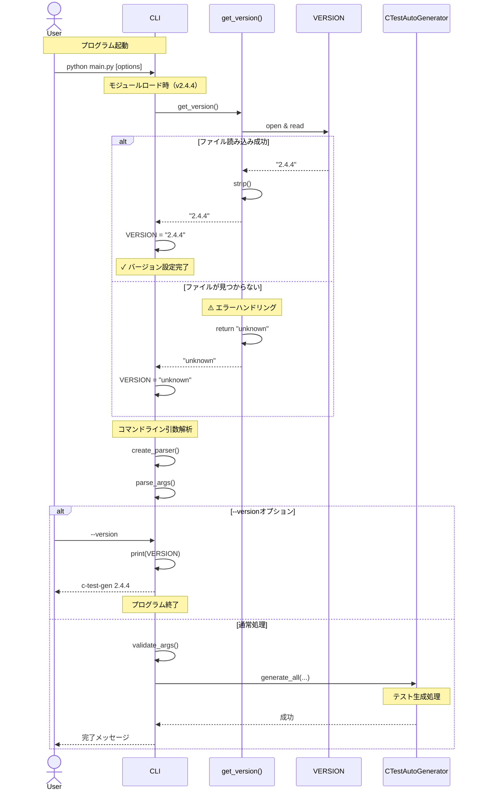

# AutoUniTestGen v2.4.4 - シーケンス図

**バージョン**: v2.4.4  
**最終更新**: 2025-11-19  
**対応機能**: スタンドアロンモード、フォールバックモード、標準型外部ファイル化、バージョン動的取得

---

## 目次

1. [全体処理フロー（v2.4.3対応）](#1-全体処理フローv243対応)
2. [CCodeParser詳細（フォールバックモード対応）](#2-ccodeparser詳細フォールバックモード対応)
3. [UnityTestGenerator詳細（スタンドアロンモード対応）](#3-unitytestgenerator詳細スタンドアロンモード対応)
4. [TruthTableGenerator詳細](#4-truthtablegenerator詳細)
5. [IOTableGenerator詳細](#5-iotablegenerator詳細)
6. [フォールバックモード詳細](#6-フォールバックモード詳細)
7. [スタンドアロンモード詳細](#7-スタンドアロンモード詳細)
8. [TypedefExtractor詳細（v2.4.4対応）](#8-typedefextractor詳細v244対応) ← 🆕 更新
9. [CLI起動フロー（v2.4.4対応）](#9-cli起動フローv244対応) ← 🆕 新規

---

## 1. 全体処理フロー（v2.4.3対応）



---

## 2. CCodeParser詳細（フォールバックモード対応）



---

## 3. UnityTestGenerator詳細（スタンドアロンモード対応）



---

## 4. TruthTableGenerator詳細



---

## 5. IOTableGenerator詳細



---

## 6. フォールバックモード詳細



---

## 7. スタンドアロンモード詳細

```mermaid
sequenceDiagram
    participant Main as CTestAutoGenerator
    participant TestGen as UnityTestGenerator
    participant File

    Note over Main: v2.4.3: スタンドアロンモード
    
    Main->>TestGen: generate_standalone(truth_table, parsed_data, source_code)
    
    Note over TestGen: 1. 元のソースをコピー
    TestGen->>TestGen: code = source_code
    
    Note over TestGen: 2. 区切り線
    TestGen->>TestGen: code += "\\n\\n"
    TestGen->>TestGen: code += "/* ========== TEST CODE ========== */"
    
    Note over TestGen: 3. Unity インクルード
    TestGen->>TestGen: code += "#include \\"unity.h\\""
    
    Note over TestGen: 4. 型定義
    TestGen->>TestGen: code += type_definitions
    
    Note over TestGen: 5. プロトタイプ宣言
    TestGen->>TestGen: code += prototypes
    
    Note over TestGen: 6. モック/スタブ
    TestGen->>TestGen: code += mocks
    
    Note over TestGen: 7. テスト関数
    TestGen->>TestGen: code += test_functions
    
    Note over TestGen: 8. setUp/tearDown
    TestGen->>TestGen: code += "void setUp(void) {}"
    TestGen->>TestGen: code += "void tearDown(void) {}"
    
    Note over TestGen: 9. main関数
    TestGen->>TestGen: code += "int main(void) {"
    TestGen->>TestGen: code += "    UNITY_BEGIN();"
    
    loop 各テスト関数
        TestGen->>TestGen: code += "    RUN_TEST(test_N);"
    end
    
    TestGen->>TestGen: code += "    return UNITY_END();"
    TestGen->>TestGen: code += "}"
    
    TestGen-->>Main: standalone_code
    
    Note over Main: ファイルに保存
    Main->>File: write(output_path, standalone_code)
    
    Note over Main: ✓ 1つのファイルで完結
    Note over Main: ✓ 即座にコンパイル可能
```

---

## 8. TypedefExtractor詳細（v2.4.4対応）

```mermaid
sequenceDiagram
    participant Parser as CCodeParser
    participant TypedefExt as TypedefExtractor
    participant StdTypesFile as standard_types.h
    participant AST

    Note over TypedefExt: 初期化時（v2.4.4）
    Parser->>TypedefExt: new TypedefExtractor()
    TypedefExt->>TypedefExt: __init__()
    TypedefExt->>TypedefExt: _load_standard_types()
    
    Note over TypedefExt: standard_types.hを読み込む
    TypedefExt->>StdTypesFile: open & read
    
    loop 各行
        TypedefExt->>TypedefExt: 正規表現マッチ
        TypedefExt->>TypedefExt: r'typedef\\s+.*\\s+(\\w+)\\s*;'
        TypedefExt->>TypedefExt: type_name.add()
    end
    
    alt ファイル読み込み成功
        StdTypesFile-->>TypedefExt: 34個の標準型
        Note over TypedefExt: ✓ 34個の標準型を読み込み
        TypedefExt->>TypedefExt: logger.info("34個の標準型を読み込みました")
    else ファイルが見つからない
        Note over TypedefExt: ⚠️ フォールバック
        TypedefExt->>TypedefExt: logger.warning("not found, using fallback")
        TypedefExt->>TypedefExt: 最小セット（14個）を使用
    end
    
    TypedefExt->>TypedefExt: self.standard_types = types
    TypedefExt-->>Parser: TypedefExtractor (初期化完了)
    
    Note over Parser,TypedefExt: 解析時
    Parser->>TypedefExt: extract_typedefs(ast, source_code)
    
    Note over TypedefExt: ASTを巡回
    TypedefExt->>AST: visit nodes
    
    loop 各typedef宣言
        AST-->>TypedefExt: typedef node
        
        TypedefExt->>TypedefExt: _extract_typedef_node(node)
        
        Note over TypedefExt: 型名を取得
        TypedefExt->>TypedefExt: name = node.name
        
        Note over TypedefExt: 型の種類を判定
        TypedefExt->>TypedefExt: typedef_type = 'struct'/'union'/'enum'/'basic'
        
        TypedefExt->>TypedefExt: _extract_definition_from_source(name, typedef_type)
        
        alt 標準型チェック (v2.4.4)
            Note over TypedefExt: self.standard_typesから判定
            TypedefExt->>TypedefExt: if name in self.standard_types
            TypedefExt->>TypedefExt: return "typedef /* standard */ {name};"
            Note over TypedefExt: ⭐ 警告を出さない
            
        else ユーザー定義型
            Note over TypedefExt: ソースから定義を抽出
            
            alt 定義が見つかった
                TypedefExt->>TypedefExt: パターンマッチング
                TypedefExt->>TypedefExt: return 完全な定義
                
            else 定義が見つからない
                Note over TypedefExt: ⚠️ 警告を出力
                TypedefExt->>TypedefExt: logger.warning()
                TypedefExt->>TypedefExt: return "typedef /* unknown */ {name};"
            end
        end
        
        Note over TypedefExt: 依存関係を検出
        TypedefExt->>TypedefExt: _find_dependencies(definition)
        
        Note over TypedefExt: TypedefInfoを作成
        TypedefExt->>TypedefExt: TypedefInfo(name, type, def, deps, line)
    end
    
    Note over TypedefExt: 標準型をフィルタリング
    TypedefExt->>TypedefExt: _filter_standard_typedefs()
    
    TypedefExt-->>Parser: List[TypedefInfo]
```

### 図8の説明（v2.4.4更新）

**v2.4.4の改善点:**

1. **standard_types.hからの動的読み込み**
   ```python
   def _load_standard_types(self) -> Set[str]:
       """standard_types.hから標準型を読み込む"""
       base_path = os.path.dirname(os.path.abspath(__file__))
       std_types_path = os.path.join(base_path, '../../standard_types.h')
       
       standard_types = set()
       
       try:
           with open(std_types_path, 'r', encoding='utf-8') as f:
               for line in f:
                   match = re.search(r'typedef\s+.*\s+(\w+)\s*;', line)
                   if match:
                       type_name = match.group(1)
                       standard_types.add(type_name)
           
           self.logger.info(f"standard_types.hから{len(standard_types)}個の標準型を読み込みました")
           
       except FileNotFoundError:
           # フォールバック: 最小限の標準型
           standard_types = { ... }
       
       return standard_types
   ```

2. **メリット**
   - ハードコードを排除
   - `standard_types.h` を編集するだけで標準型を追加可能
   - フォールバック機能で安全性確保

3. **読み込まれる標準型（34種類）**
   ```
   int8_t ~ uint64_t (8種類)
   int_least8_t ~ uint_least64_t (8種類)
   int_fast8_t ~ uint_fast64_t (8種類)
   intmax_t, uintmax_t, intptr_t, uintptr_t
   size_t, ssize_t, ptrdiff_t, wchar_t, wint_t, bool
   ```

4. **処理の流れ**
   ```
   初期化時
     ├─ standard_types.h読み込み試行
     ├─ 成功 → 34個の標準型をロード
     └─ 失敗 → フォールバック（14個の最小セット）
   
   解析時
     ├─ 標準型チェック (self.standard_types)
     ├─ Yes → 簡易定義を返す（警告なし）
     └─ No  → 通常の抽出処理
              ├─ 成功 → 完全な定義
              └─ 失敗 → 警告 + 簡易定義
   ```

---

## 9. CLI起動フロー（v2.4.4対応）



### 図9の説明（v2.4.4新規）

**v2.4.4の新機能:**

1. **バージョン動的取得**
   ```python
   def get_version() -> str:
       """VERSIONファイルからバージョンを取得"""
       try:
           version_file = Path(__file__).resolve().parent.parent / 'VERSION'
           with open(version_file, 'r', encoding='utf-8') as f:
               return f.read().strip()
       except FileNotFoundError:
           return "unknown"
       except Exception as e:
           print(f"Warning: Failed to read VERSION file: {e}", file=sys.stderr)
           return "unknown"
   
   VERSION = get_version()
   ```

2. **メリット**
   - VERSIONファイル編集のみでバージョン更新
   - コード修正不要
   - 単一の真実の源（Single Source of Truth）

3. **エラーハンドリング**
   - ファイルが見つからない場合: "unknown" を返す
   - その他のエラー: 警告を出力して "unknown" を返す

4. **使用例**
   ```bash
   $ cat VERSION
   2.4.4
   
   $ python main.py --version
   c-test-gen 2.4.4
   
   # バージョンを変更
   $ echo "2.9.9" > VERSION
   
   $ python main.py --version
   c-test-gen 2.9.9
   ```

---

## 処理パス一覧

### 正常パス（グリーンパス）
1. **AST解析成功パス** → 図2の左側
   - プリプロセス → AST構築 → 条件抽出 → テスト生成

2. **スタンドアロンモード** → 図7
   - ソースコピー → テストコード追加 → 1ファイル生成

3. **標準型読み込み成功** → 図8（v2.4.4）
   - standard_types.h読み込み → 34個の標準型ロード

4. **バージョン取得成功** → 図9（v2.4.4）
   - VERSIONファイル読み込み → バージョン設定

### 警告パス（イエローパス）
1. **フォールバックモード** → 図6
   - AST失敗 → 正規表現抽出 → 空の真偽表

2. **標準型フォールバック** → 図8（v2.4.4）
   - ファイル未発見 → 最小セット使用

3. **バージョンフォールバック** → 図9（v2.4.4）
   - ファイル未発見 → "unknown" 設定

### エラーパス（レッドパス）
1. **ファイル読み込み失敗** → 処理中断
2. **無効な引数** → エラーメッセージ表示
3. **出力ディレクトリ作成失敗** → エラー終了

---

## カラーコード

- 🟢 緑: 成功パス
- 🟡 黄: 警告・フォールバック
- 🔴 赤: エラー・未実装

---

## バージョン別の主な変更点

### v2.4.3での変更点

1. **フォールバックモード対応** (図2, 図6)
   - AST解析失敗時の処理フロー追加
   - 正規表現ベースの抽出ロジック

2. **スタンドアロンモード対応** (図1, 図3, 図7)
   - `generate_standalone()`の処理フロー追加
   - 元のソースとテストコードの統合処理

3. **処理の明確化**
   - 各ステップの責務を明確に図示
   - エラーハンドリングパスを明示

### v2.4.3.1での変更点

4. **標準型に対する警告抑制** (図8)
   - `TypedefExtractor._extract_definition_from_source()`に標準型チェックを追加
   - 標準型（int8_t, uint8_t等）については警告を出力しない

### v2.4.4での変更点 🆕

5. **標準型の外部ファイル化** (図8更新)
   - `standard_types.h` からの動的読み込み
   - `_load_standard_types()` メソッド追加
   - ハードコードを排除してメンテナンス性向上

6. **バージョン動的取得** (図9新規)
   - `get_version()` 関数実装
   - VERSIONファイルからの自動読み込み
   - バージョン管理の一元化

---

**作成日**: 2025-11-13  
**最終更新**: 2025-11-19 (v2.4.4対応)  
**バージョン**: v2.4.4  
**次回更新**: v2.5.0（pcpp対応）後
