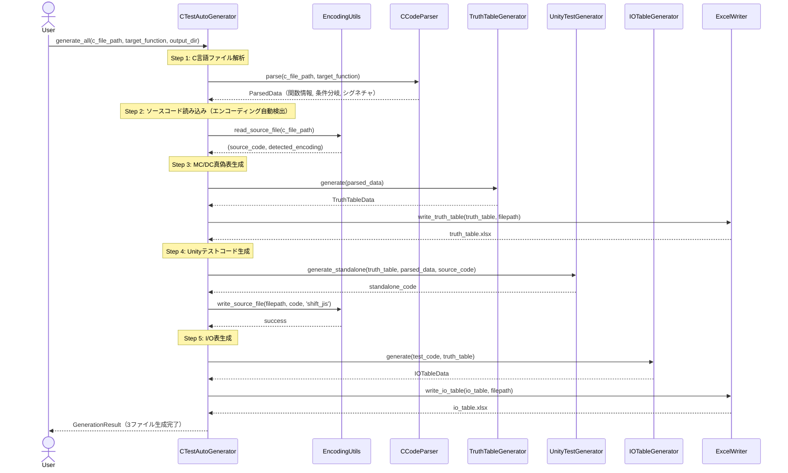
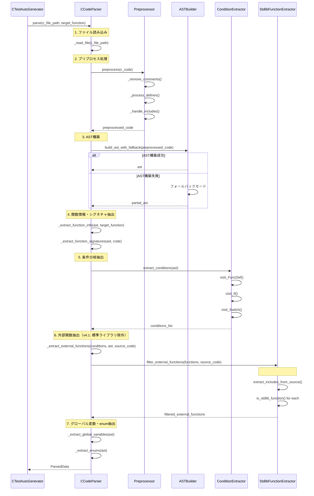
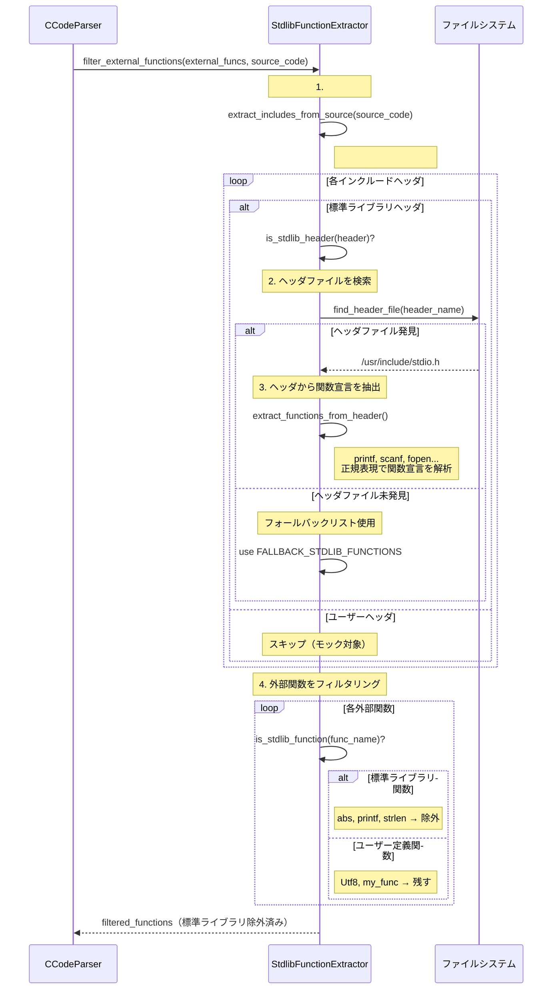
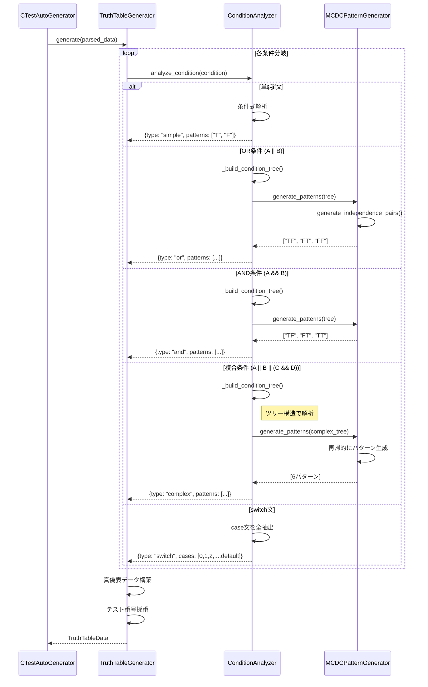
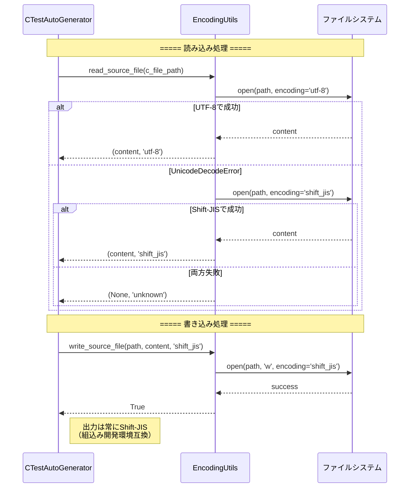
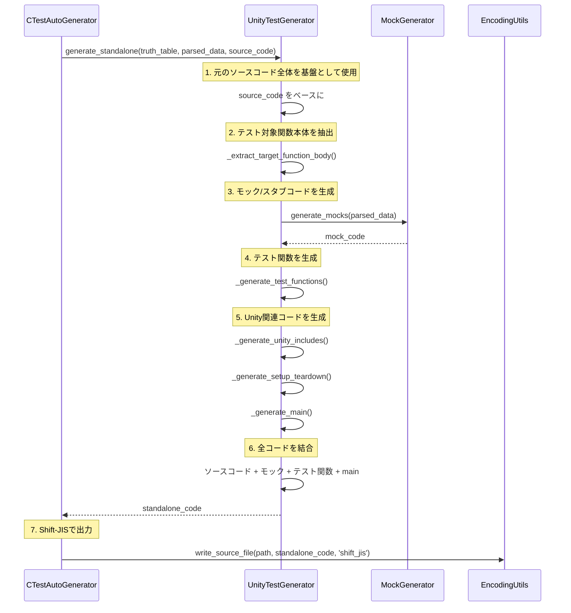

# AutoUniTestGen v4.1 - シーケンス図

## 概要
C言語単体テスト自動生成ツール AutoUniTestGen v4.1のシーケンス図

### v4.0からの主な変更点
- **標準ライブラリ関数除外処理**: `#include`解析による自動除外
- **シグネチャ一致モック生成**: 元の関数と同じシグネチャでモック生成
- **エンコーディング自動検出**: UTF-8/Shift-JIS自動判別、Shift-JIS出力

---

## 1. 全体処理フロー



---

## 2. CCodeParser詳細シーケンス（v4.1更新）



---

## 3. 標準ライブラリ関数除外処理（v4.1新規）



---

## 4. モック生成処理（v4.0/v4.1更新）

```mermaid
sequenceDiagram
    participant TestGen as UnityTestGenerator
    participant MockGen as MockGenerator
    participant ParsedData as ParsedData

    TestGen->>MockGen: generate_mocks(parsed_data)
    
    Note over MockGen: 1. 外部関数リストを取得（標準ライブラリ除外済み）
    MockGen->>ParsedData: external_functions
    ParsedData-->>MockGen: ['Utf8', 'Utf9', 'f4', 'mx27']
    
    Note over MockGen: 2. シグネチャ情報を取得
    MockGen->>ParsedData: function_signatures
    ParsedData-->>MockGen: {Utf8: FunctionSignature, ...}
    
    loop 各外部関数
        MockGen->>MockGen: _create_mock_function(func_name, signature)
        
        alt シグネチャあり
            Note right of MockGen: uint8_t Utf8(void)<br/>uint16_t Utf9(uint8_t, int)
            MockGen->>MockGen: 元のシグネチャを使用
        else シグネチャなし
            MockGen->>MockGen: _guess_return_type()でフォールバック
        end
    end
    
    Note over MockGen: 3. モック変数生成
    MockGen->>MockGen: generate_mock_variables()
    Note right of MockGen: static uint8_t mock_Utf8_return_value;<br/>static int mock_Utf8_call_count;<br/>static uint8_t mock_Utf9_param_param1;
    
    Note over MockGen: 4. モック関数生成（元の関数と同名・同シグネチャ）
    MockGen->>MockGen: generate_mock_functions()
    Note right of MockGen: uint8_t Utf8(void) {<br/>  mock_Utf8_call_count++;<br/>  return mock_Utf8_return_value;<br/>}
    
    Note over MockGen: 5. void型関数の特別処理
    Note right of MockGen: void Utf10(uint8_t Utv2) {<br/>  mock_Utf10_call_count++;<br/>  mock_Utf10_param_Utv2 = Utv2;<br/>  // return文なし<br/>}
    
    Note over MockGen: 6. リセット関数生成
    MockGen->>MockGen: generate_reset_function()
    
    MockGen-->>TestGen: mock_code
```

---

## 5. TruthTableGenerator詳細シーケンス



---

## 6. エンコーディング処理（v4.0.1新規）



---

## 7. スタンドアロンモード処理フロー



---

## データ構造

### ParsedData（v4.1）
```python
{
    'file_name': '22_難読化_obfuscated.c',
    'function_name': 'Utf1',
    'conditions': [
        {
            'line': 10,
            'type': 'if',
            'expression': '(Utf7() & 0xdf) != 0',
            'ast_node': <AST Node>
        },
        ...
    ],
    'external_functions': ['Utf7', 'Utf8', 'Utf9', ...],  # 標準ライブラリ除外済み
    'global_variables': ['Utv1', 'Utv2', ...],
    'function_signatures': {
        'Utf7': FunctionSignature(name='Utf7', return_type='uint8_t', parameters=[]),
        'Utf8': FunctionSignature(name='Utf8', return_type='void', parameters=[]),
        'Utf9': FunctionSignature(name='Utf9', return_type='uint16_t', 
                                  parameters=[{'type': 'uint8_t', 'name': 'param1'}]),
        ...
    },
    'function_info': FunctionInfo(name='Utf1', return_type='void', ...),
    'bitfields': {...},
    'enums': [...],
    'enum_values': {...}
}
```

### FunctionSignature（v4.0新規）
```python
FunctionSignature(
    name='Utf9',
    return_type='uint16_t',
    parameters=[
        {'type': 'uint8_t', 'name': 'param1'},
        {'type': 'int', 'name': 'param2'}
    ],
    is_static=False
)
```

### MockFunction（v4.0新規）
```python
MockFunction(
    name='Utf9',
    return_type='uint16_t',
    parameters=[
        {'type': 'uint8_t', 'name': 'param1'},
        {'type': 'int', 'name': 'param2'}
    ],
    return_variable='mock_Utf9_return_value',
    call_count_variable='mock_Utf9_call_count'
)
```

---
**バージョン**: 4.1.0  
**更新日**: 2025-12-01
