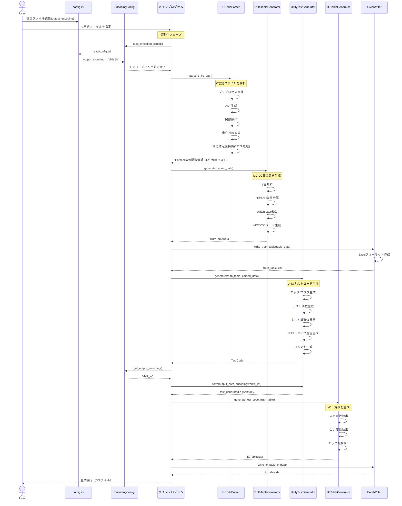
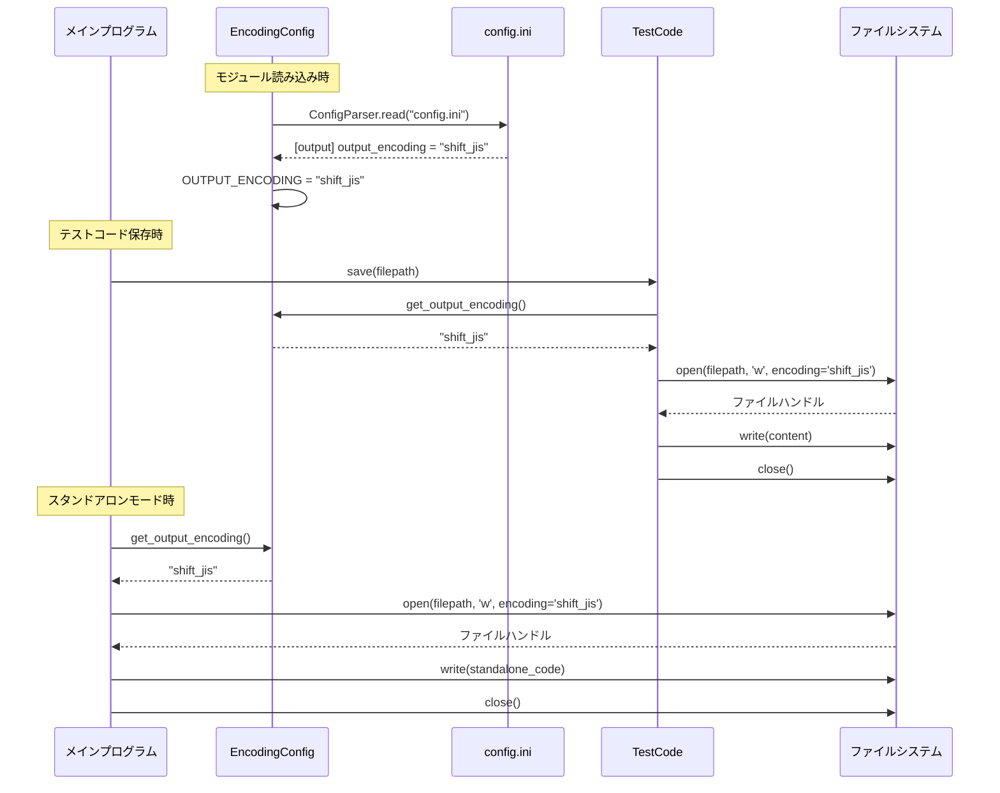
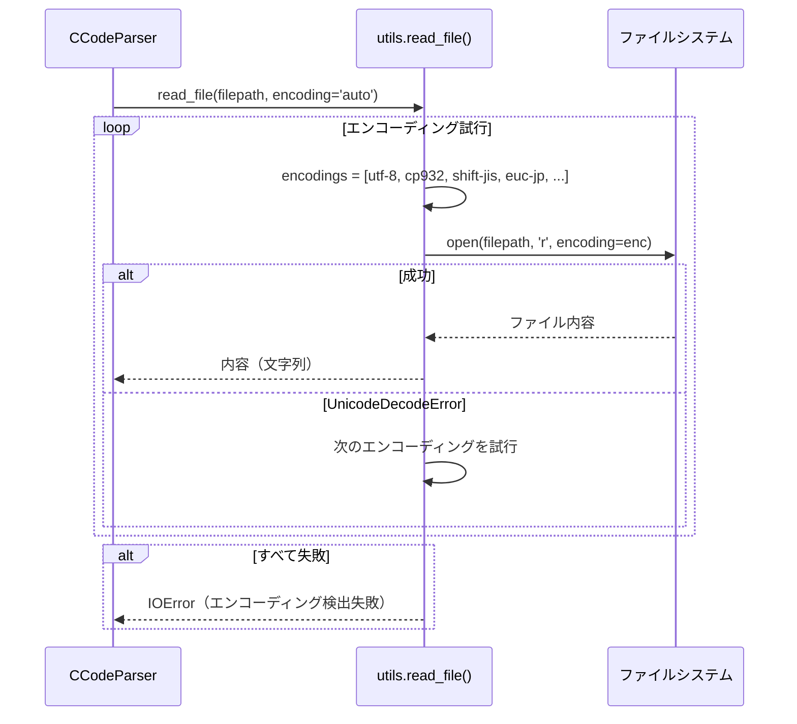
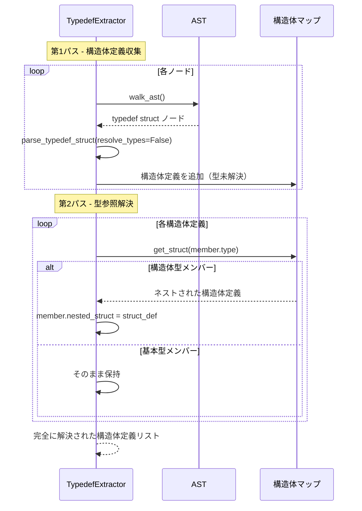
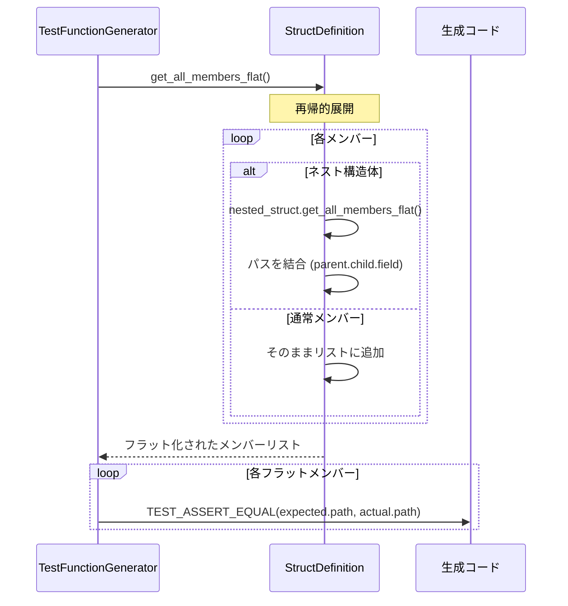
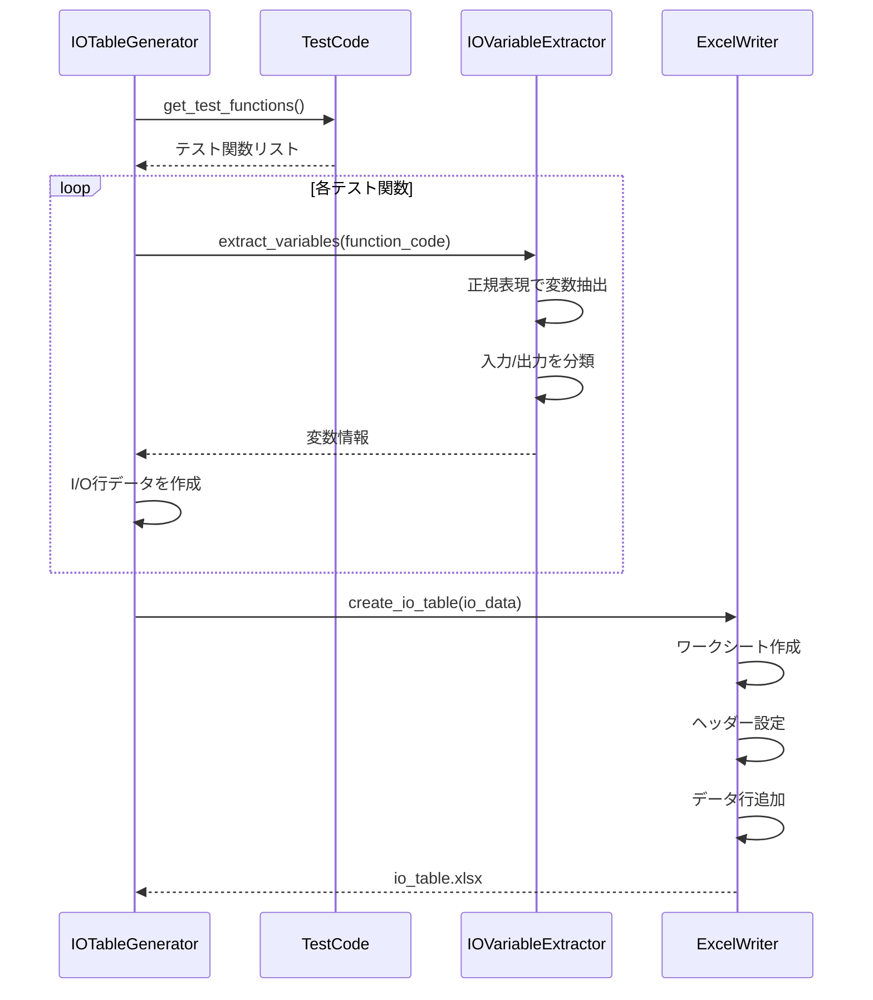
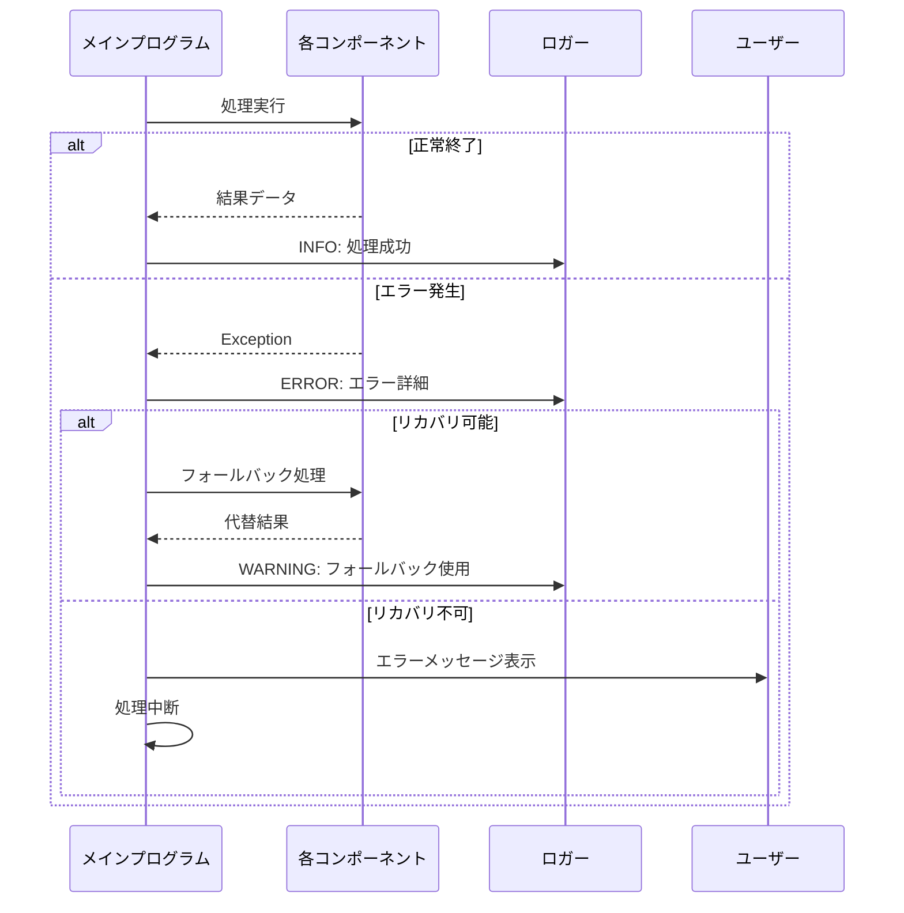

# C言語単体テスト自動生成ツール - シーケンス図 (v2.10.1)

## 1. 全体処理フロー

## 2. エンコーディング処理の詳細フロー (v2.10.1 新規)

## 3. ファイル読み込み処理（自動エンコーディング検出）

## 4. 構造体定義の2パス処理 (v2.9.0で追加)

## 5. テスト生成の詳細フロー

## 6. I/O表生成フロー

## 7. エラーハンドリングフロー

## 更新履歴

- **v2.10.1 (2025-11-21)**: エンコーディング設定処理を追加
- **v2.10.0 (2025-11-21)**: UTF-8対応（削除）
- **v2.9.0 (2025-11-21)**: 構造体の2パス処理を追加
- **v2.8.0**: ネスト構造体展開処理を追加
- **v2.7.0**: 初期バージョン
