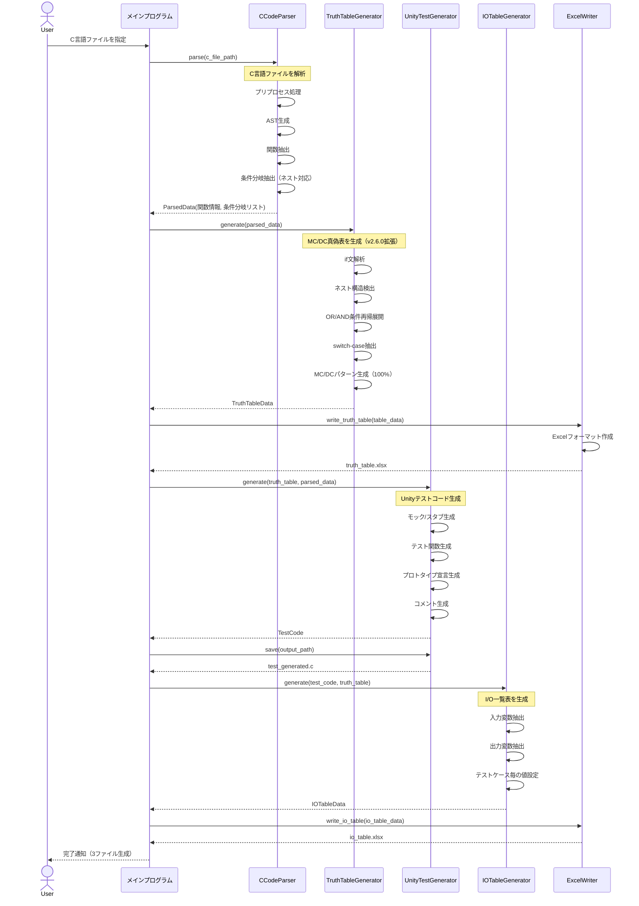
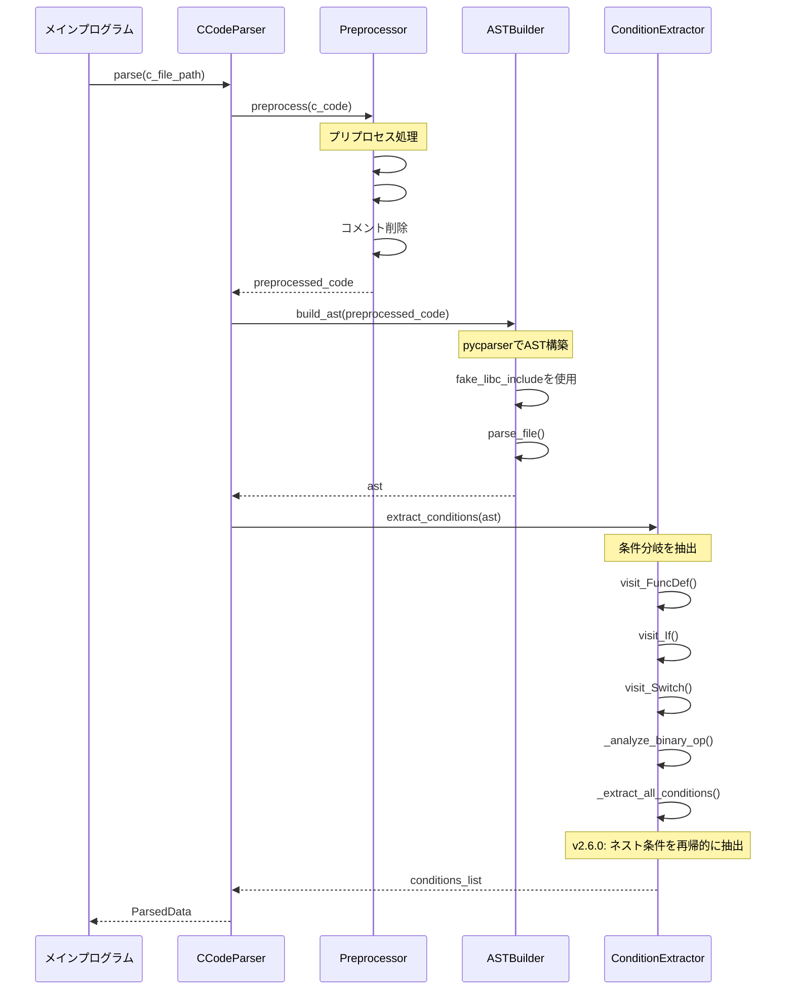
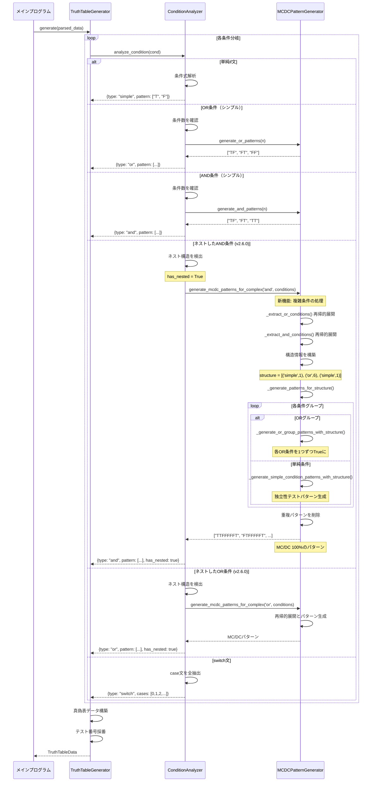
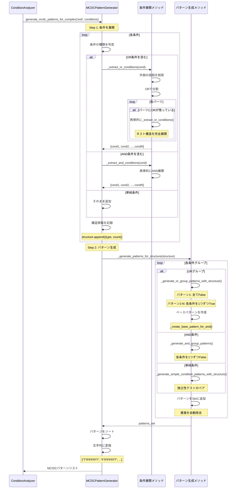
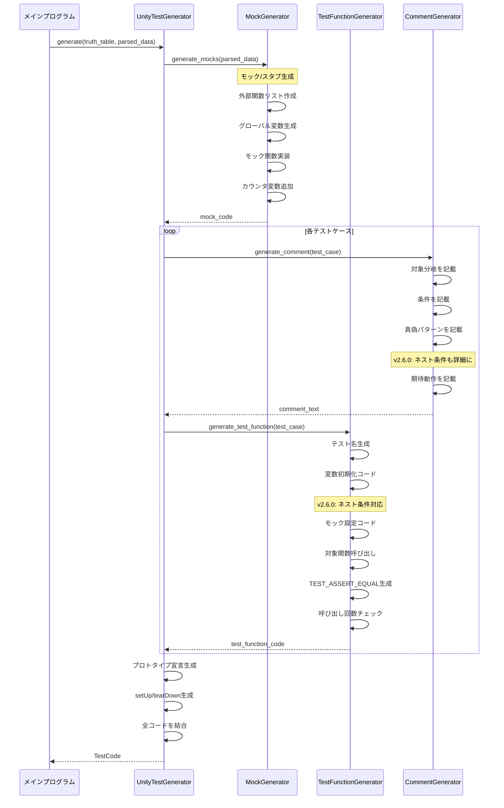
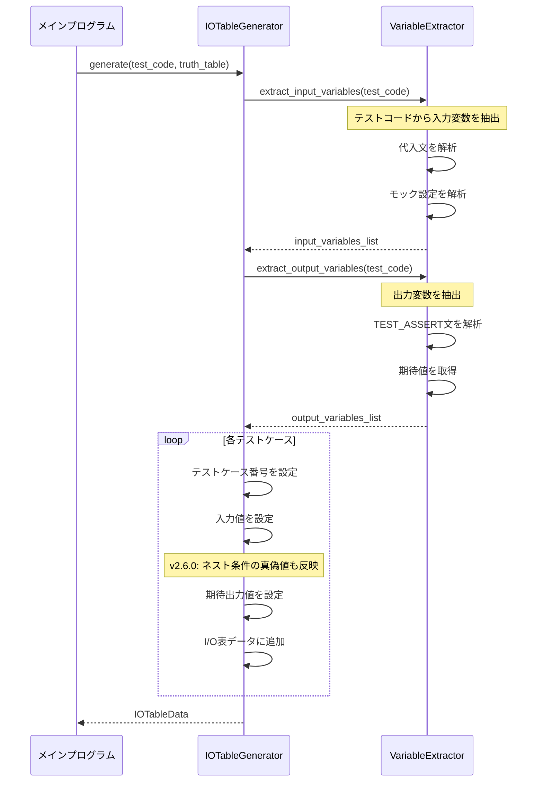
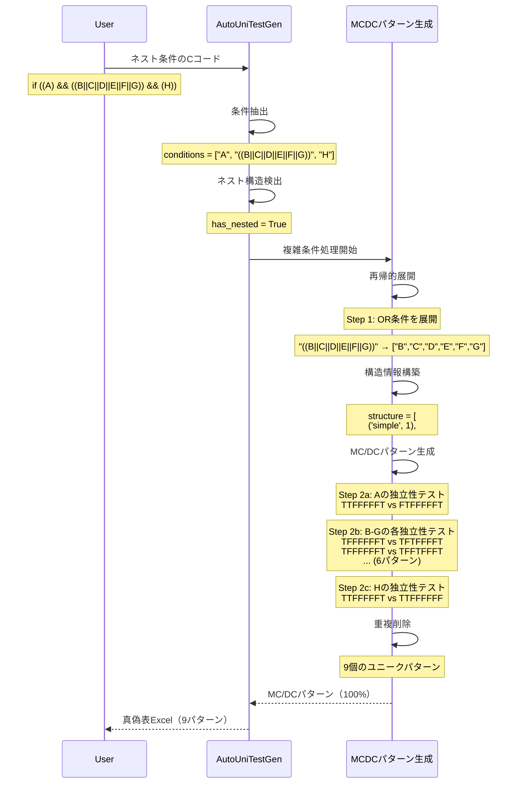

# C言語単体テスト自動生成ツール - シーケンス図 v2.6.0

**更新日**: 2025-11-19  
**バージョン**: v2.6.0  
**主な変更**: ネストしたAND/OR条件のMC/DC処理フロー追加

---

## 1. 全体処理フロー



---

## 2. CCodeParser詳細シーケンス



---

## 3. TruthTableGenerator詳細シーケンス（v2.6.0拡張）



---

## 4. MCDCPatternGenerator詳細シーケンス（v2.6.0新規）



---

## 5. UnityTestGenerator詳細シーケンス



---

## 6. IOTableGenerator詳細シーケンス



---

## 7. v2.6.0の主要な処理フロー（ネスト条件）



---

## 8. データ構造

### ParsedData（拡張版）
```python
{
    'file_name': 'sample.c',
    'function_name': 'process',
    'conditions': [
        {
            'line': 10,
            'type': 'and_condition',
            'expression': '((A) && ((B||C||D||E||F||G)) && (H))',
            'operator': 'and',
            'conditions': [  # v2.6.0: 展開された条件リスト
                '(A)',
                '((B||C||D||E||F||G))',
                '(H)'
            ],
            'has_nested': True,  # v2.6.0: ネスト構造フラグ
            'ast_node': <AST Node>
        }
    ],
    'external_functions': ['f4', 'mx27'],
    'global_variables': ['sensor', 'mode', 'status']
}
```

### TruthTableData（拡張版）
```python
{
    'test_cases': [
        {
            'no': 1,
            'truth': 'TTFFFFFT',  # v2.6.0: 8桁（展開後の条件数）
            'condition': 'if ((A) && ((B||C||D||E||F||G)) && (H))',
            'expected': '条件を満たす',
            'pattern_explanation': 'A=T, B=T(他F), H=T'  # v2.6.0: 詳細説明
        },
        {
            'no': 2,
            'truth': 'FTFFFFFT',
            'condition': 'if ((A) && ((B||C||D||E||F||G)) && (H))',
            'expected': '条件を満たさない',
            'pattern_explanation': 'A=F(独立性), B=T, H=T'
        },
        # ... 9パターン
    ]
}
```

---

## 変更履歴

### v2.6.0 (2025-11-19)
- ✅ ネストしたAND/OR条件の処理フロー追加
- ✅ MCDCPatternGeneratorの詳細シーケンス追加
- ✅ 再帰的展開のフロー図追加
- ✅ MC/DC 100%カバレッジの処理プロセス明確化

### v2.5.0以前
- 基本的な処理フロー
- 単純なOR/AND条件のみ対応

---

**注**: このシーケンス図は、v2.6.0で実装されたネストしたAND/OR条件のMC/DC処理を正確に反映しています。
