# AutoUniTestGen シーケンス図 (v2.7)

**最終更新**: 2025-11-20  
**バージョン**: 2.7.0

---

## 概要

このドキュメントでは、AutoUniTestGenの処理フローをシーケンス図で説明します。

v2.7では、以下の改善を予定しています：
- 構造体型戻り値のアサーション生成処理の追加
- 構造体判定ロジックの導入

過去のバージョン履歴：
- v2.6.6: 構造体アサーション問題の識別
- v2.6.5: パラメータ変数型定義追加
- v2.6.4: デフォルト値モック設定の削除
- v2.6.3: コメント形式修正、result変数型定義追加
- v2.6.2: グローバル変数初期化の削除

---

## 全体フロー

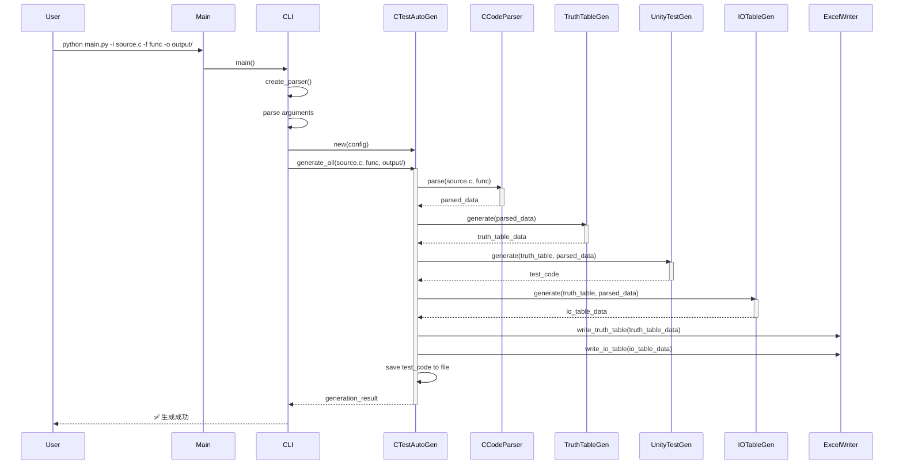

---

## 詳細フロー1: ファイル読み込みと前処理

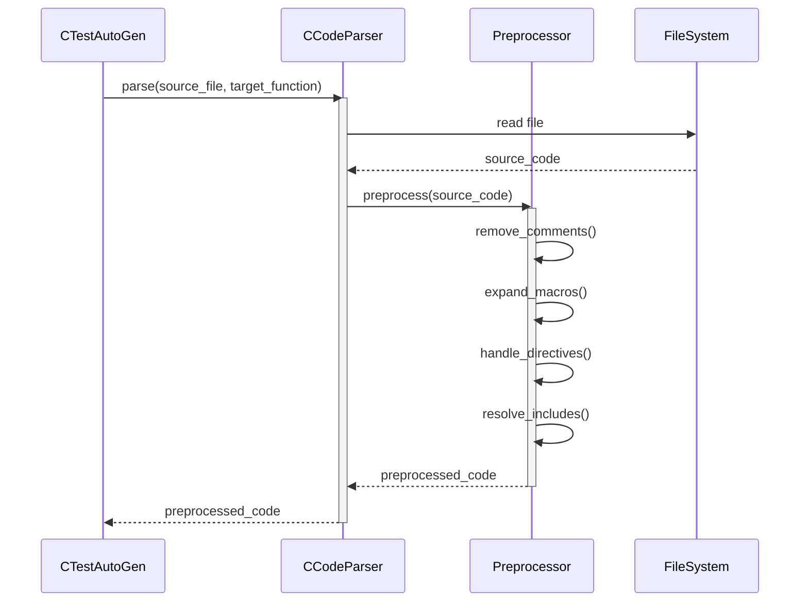

---

## 詳細フロー2: 構文解析とAST構築

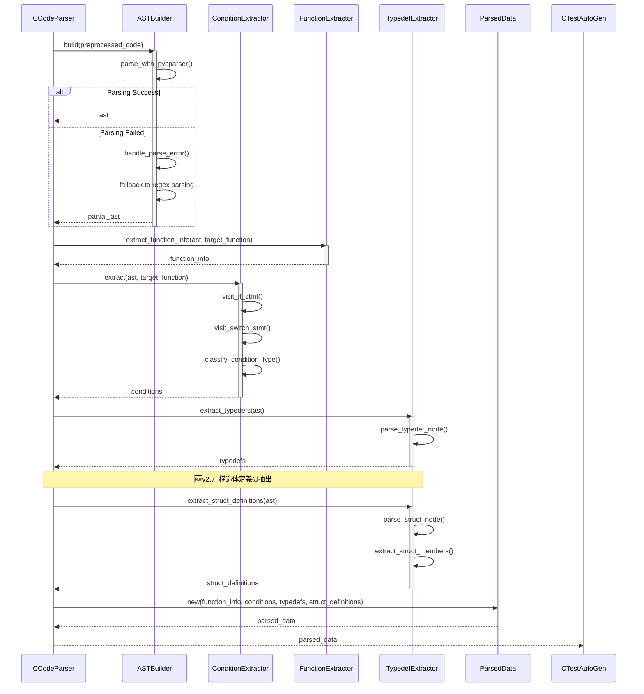

---

## 詳細フロー3: MC/DC真偽表の生成

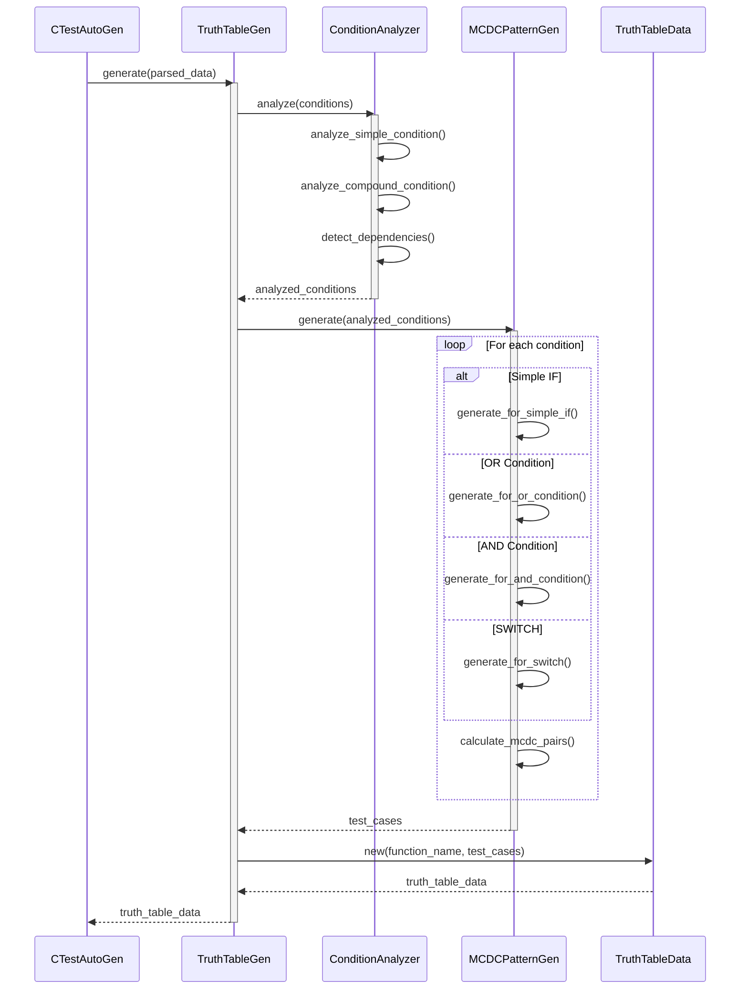

---

## 詳細フロー4: Unityテストコードの生成

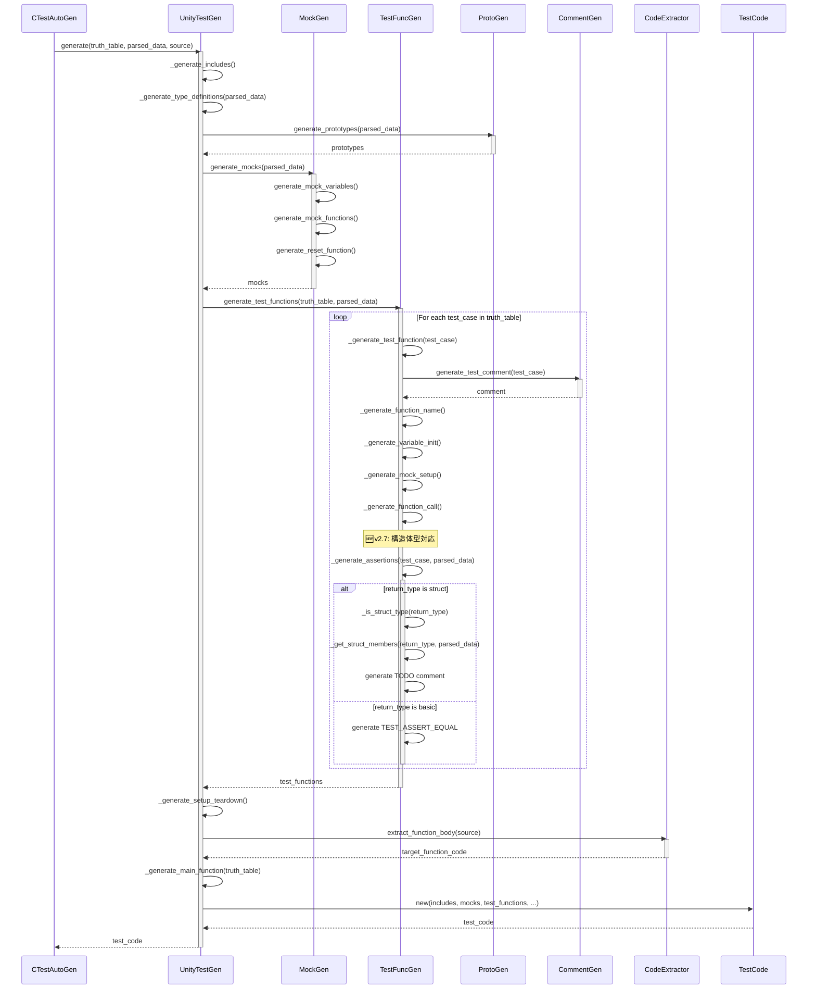

---

## 詳細フロー5: テスト関数の生成（構造体対応） 🆕v2.7

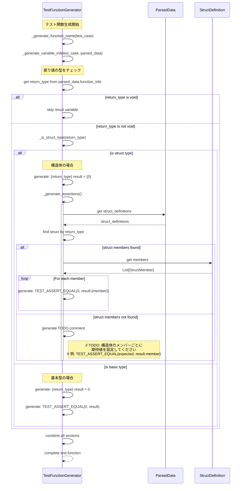

---

## 詳細フロー6: I/O表の生成

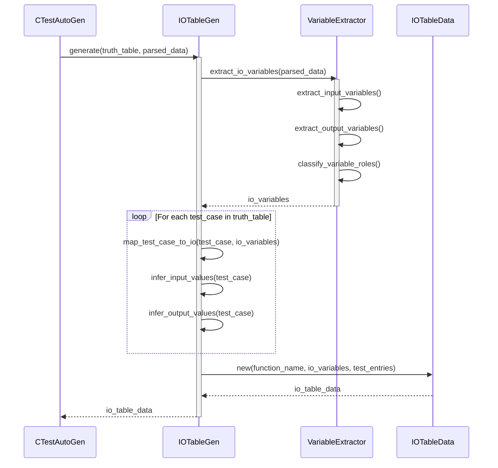

---

## 詳細フロー7: Excelファイルの出力

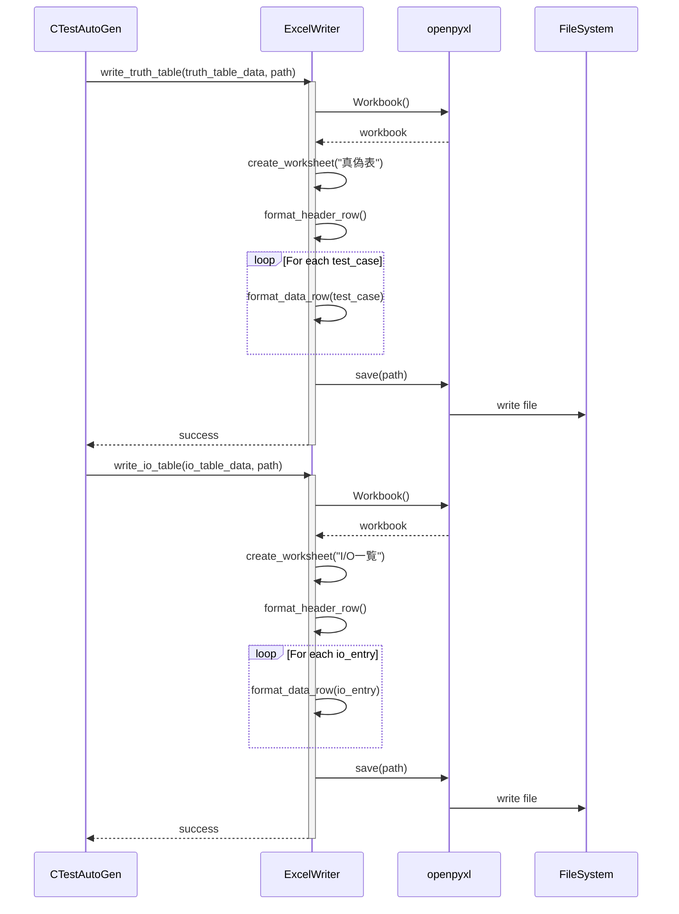

---

## バッチ処理フロー

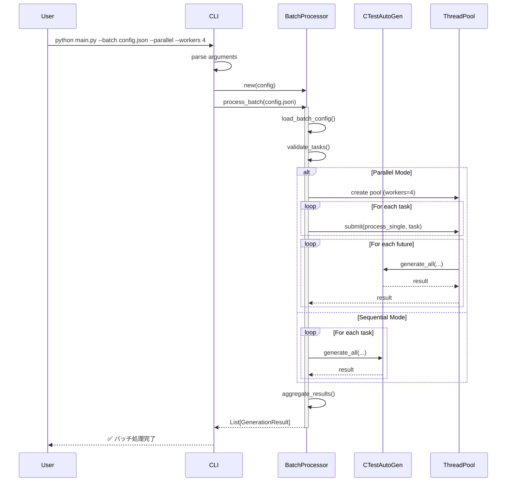

---

## エラーハンドリングフロー

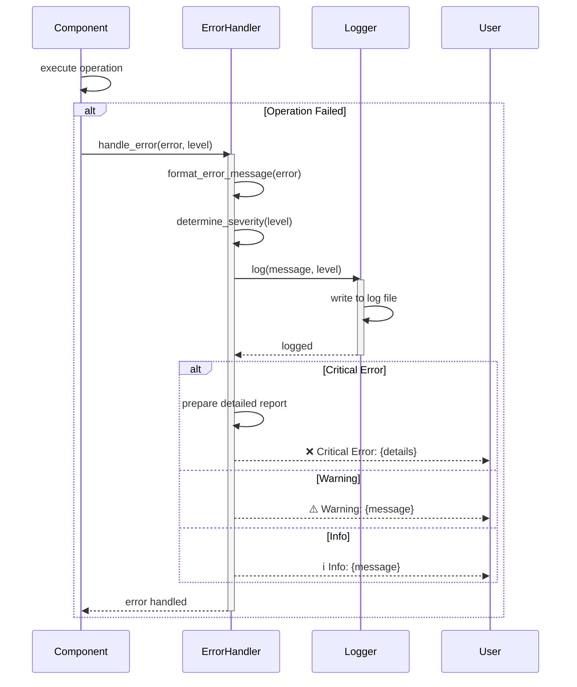

---

## パフォーマンス監視フロー

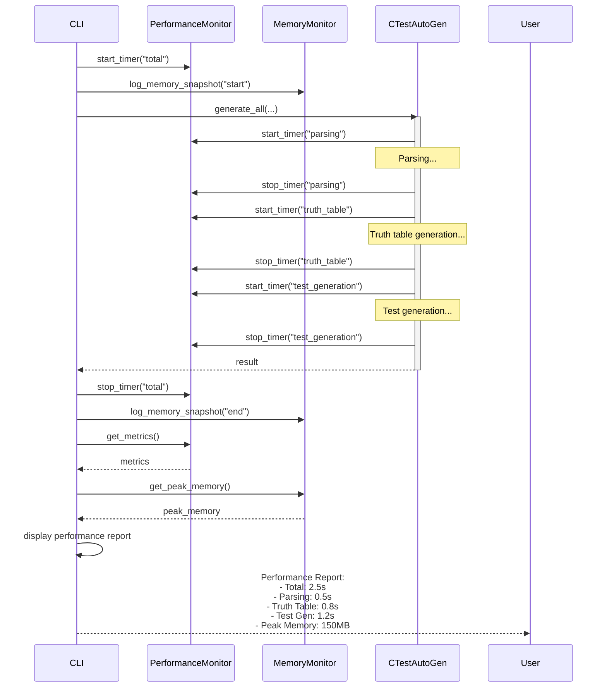

---

## v2.7での主要な変更点

### 構造体型アサーション生成フロー（新規追加）

v2.7では、`TestFunctionGenerator._generate_assertions()`メソッドに以下の処理が追加されます：

1. **戻り値の型チェック**
   - `parsed_data.function_info.return_type`を取得
   
2. **構造体判定**
   - `_is_struct_type(return_type)`を呼び出し
   - 型名から構造体かどうかを判定
   
3. **構造体の場合の処理**
   - `parsed_data.struct_definitions`から構造体定義を検索
   - メンバー情報が取得できた場合：
     - 各メンバーごとに`TEST_ASSERT_EQUAL`を生成
   - メンバー情報が取得できない場合：
     - TODOコメントを生成
   
4. **基本型の場合の処理**
   - 従来通りのアサーション生成

### データフロー変更

```
TypedefExtractor
    ↓ (v2.7で追加)
extract_struct_definitions()
    ↓
StructDefinition[] → ParsedData
    ↓
UnityTestGenerator
    ↓
TestFunctionGenerator
    ↓
_generate_assertions()
    ↓
_is_struct_type() → bool
    ↓
_get_struct_members() → List[StructMember]
    ↓
generate assertions or TODO comments
```

---

## 主要な処理時間の目安

| フェーズ | 処理時間 | 備考 |
|---------|---------|------|
| ファイル読み込み | 10-50ms | ファイルサイズに依存 |
| 前処理 | 50-200ms | マクロ展開、コメント除去 |
| AST構築 | 100-500ms | コードの複雑さに依存 |
| 条件抽出 | 50-200ms | 条件分岐の数に依存 |
| 真偽表生成 | 200-1000ms | MC/DCパターン計算 |
| テスト生成 | 300-1500ms | テストケース数に依存 |
| Excel出力 | 100-300ms | データ量に依存 |
| **合計** | **0.8-3.8秒** | 標準的なケース |

---

## 設計の特徴

1. **レイヤー化されたアーキテクチャ**: 各レイヤーが独立して動作
2. **依存性の注入**: コンポーネント間の疎結合
3. **エラーハンドリングの一元化**: ErrorHandlerによる集中管理
4. **段階的な処理**: 各ステップが明確に分離
5. **拡張性**: 新機能（構造体対応など）が追加しやすい構造

---

**作成日**: 2025-11-20  
**作成者**: AutoUniTestGen Development Team  
**バージョン**: 2.7.0  
**状態**: ✅ 最新
