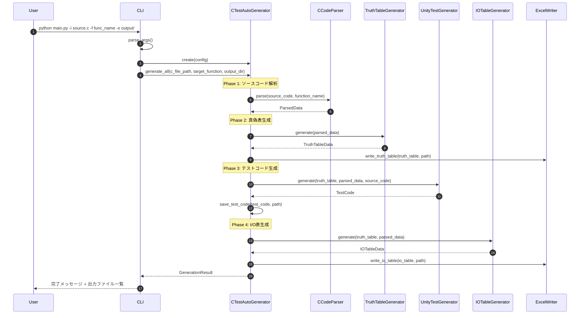
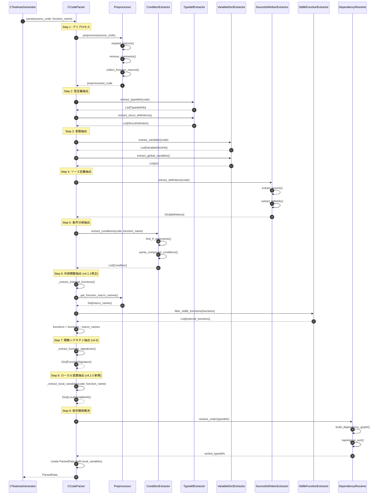
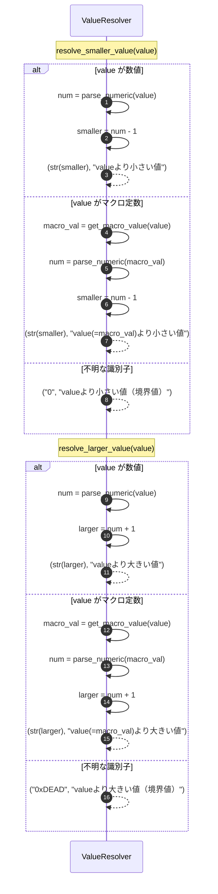
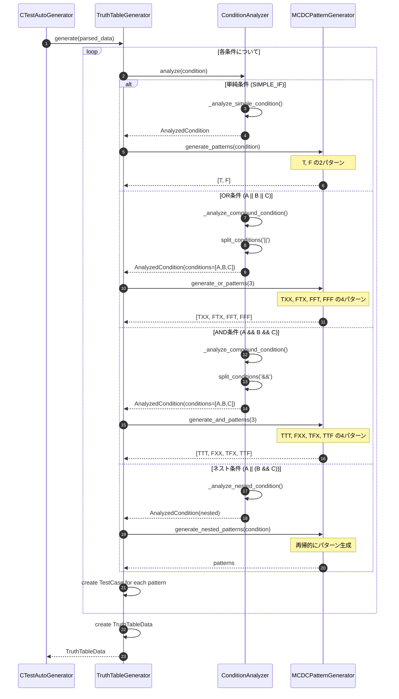
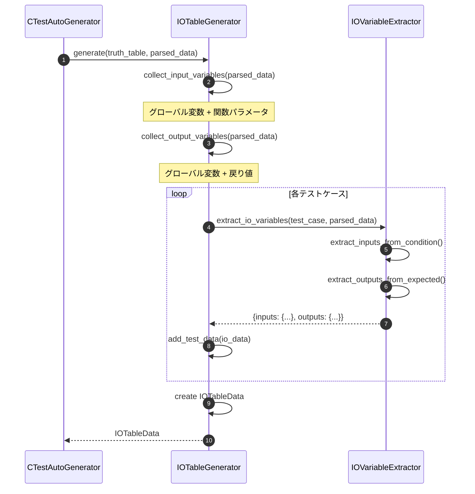
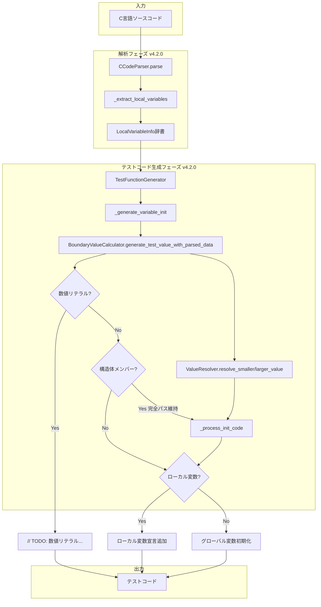
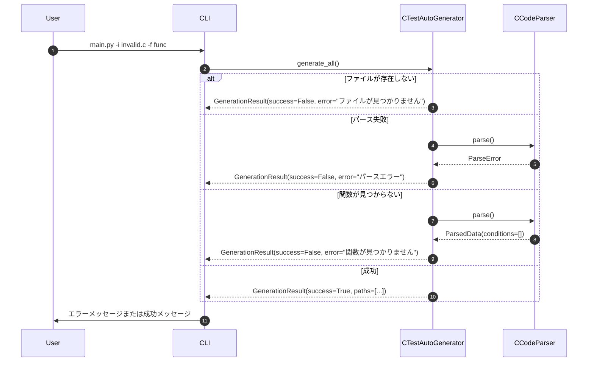

# AutoUniTestGen v4.2.0 シーケンス図

## 概要
C言語単体テスト自動生成ツールの処理フローを示します。

---

## 1. 全体処理フロー



---

## 2. ソースコード解析詳細 (CCodeParser.parse)



---

## 3. ローカル変数抽出詳細 (v4.2.0 新規)

```mermaid
sequenceDiagram
    autonumber
    participant Parser as CCodeParser
    participant Regex as RegexEngine
    
    Note over Parser: _extract_local_variables(code, function_name)
    
    Parser->>Parser: 関数本体を正規表現で抽出
    Note over Parser: static void Utf1(uint8_t Utv1) { ... }
    
    Parser->>Parser: 対応する閉じ括弧を探索
    Parser->>Parser: function_body を取得
    
    loop 各行について
        Parser->>Parser: コメント除去
        Parser->>Parser: for文の初期化部分を除外
        Parser->>Parser: 関数呼び出しを除外
        
        Parser->>Regex: 型名+変数名パターンを検索
        Note over Regex: pattern = r'(\w+)\s+(\w+)\s*(?:=\s*([^;]+))?\s*;'
        
        alt マッチあり
            Regex-->>Parser: type_name, var_name, init_value
            Parser->>Parser: キーワードチェック (if, for, etc.)
            Parser->>Parser: LocalVariableInfo作成
            Note over Parser: {name: Utx73, type: Utx10, scope: Utf1}
        end
    end
    
    Parser-->>Parser: Dict[var_name, LocalVariableInfo]
```

---

## 4. テスト関数生成詳細 (v4.2.0 修正)

```mermaid
sequenceDiagram
    autonumber
    participant Unity as UnityTestGenerator
    participant TFunc as TestFunctionGenerator
    participant Boundary as BoundaryValueCalculator
    participant VResolver as ValueResolver
    participant Comment as CommentGenerator
    
    Unity->>TFunc: generate_test_function(test_case, parsed_data)
    
    TFunc->>Comment: generate_comment(test_case, parsed_data)
    Comment-->>TFunc: comment
    
    TFunc->>TFunc: _generate_test_name()
    
    Note over TFunc: 変数初期化コード生成
    TFunc->>TFunc: _generate_variable_init(test_case, parsed_data)
    
    loop 各条件変数
        TFunc->>Boundary: generate_test_value_with_parsed_data(expr, truth, data)
        
        Note over Boundary: v4.2.0: 数値リテラルチェック
        alt 変数名が数値 (例: "10")
            Boundary-->>TFunc: "// TODO: 数値リテラル 10 は初期化できません"
        else 識別子同士の比較 (>=, <=, >, <)
            Boundary->>VResolver: resolve_smaller_value(value) or resolve_larger_value(value)
            VResolver-->>Boundary: (値, コメント)
            Boundary-->>TFunc: "Utx75.Utm1.Utm11 = 0;  // Utx220より小さい値"
        else 通常の比較
            Boundary-->>TFunc: "variable = value"
        end
        
        Note over TFunc: v4.2.0: 初期化コード後処理
        TFunc->>TFunc: _process_init_code(init, parsed_data, lines)
    end
    
    TFunc->>TFunc: _generate_mock_setup()
    TFunc->>TFunc: _build_function_call_params(parsed_data) v4.1.3
    TFunc->>TFunc: _generate_assertions()
    TFunc->>TFunc: _generate_call_count_check()
    
    TFunc-->>Unity: test_function_code
```

---

## 5. 初期化コード後処理詳細 (v4.2.0 新規)

```mermaid
sequenceDiagram
    autonumber
    participant TFunc as TestFunctionGenerator
    participant PData as ParsedData
    
    Note over TFunc: _process_init_code(init, parsed_data, lines)
    
    alt initがNullまたはコメント
        TFunc-->>TFunc: return init (そのまま)
    end
    
    TFunc->>TFunc: "変数 = 値" 形式からvar_partを抽出
    Note over TFunc: init = "Utx73.Utm13 = 0xDEAD"
    Note over TFunc: var_part = "Utx73.Utm13"
    
    Note over TFunc: 問題3チェック: 数値リテラル
    alt var_partが数値 (例: "10")
        TFunc-->>TFunc: "// TODO: 数値リテラル 10 は変数ではないため初期化できません"
    end
    
    Note over TFunc: 問題2チェック: 構造体メンバー
    alt var_partに "." を含む
        TFunc->>TFunc: root_var = var_part.split('.')[0]
        Note over TFunc: root_var = "Utx73"
        
        Note over TFunc: 問題1チェック: ローカル変数
        TFunc->>TFunc: _is_local_variable(root_var, parsed_data)
        TFunc->>PData: local_variables[root_var]
        
        alt ローカル変数である
            PData-->>TFunc: LocalVariableInfo{type=Utx10}
            TFunc->>TFunc: lines.append("Utx10 Utx73 = {0};  // ローカル変数")
            TFunc-->>TFunc: return init (完全パス維持)
        else グローバル変数
            TFunc-->>TFunc: return init (そのまま)
        end
    end
    
    Note over TFunc: 単独変数のローカル変数チェック
    TFunc->>TFunc: _is_local_variable(var_part, parsed_data)
    alt ローカル変数である
        TFunc->>TFunc: 宣言を追加
        TFunc-->>TFunc: return init
    else グローバル変数
        TFunc-->>TFunc: return init
    end
```

---

## 6. 境界値計算詳細 (v4.2.0 修正)

```mermaid
sequenceDiagram
    autonumber
    participant Boundary as BoundaryValueCalculator
    participant VResolver as ValueResolver
    
    Note over Boundary: generate_test_value_with_parsed_data(expr, truth, data)
    
    Boundary->>Boundary: parse_comparison(expr)
    Note over Boundary: expr = "(Utx75.Utm1.Utm11 >= Utx220)"
    
    Note over Boundary: v4.2.0: 識別子パターン拡張
    Note over Boundary: 新規追加: >=, <=, >, < パターン
    
    Boundary-->>Boundary: {variable: "Utx75.Utm1.Utm11", operator: ">=", value: "Utx220", is_identifier: True}
    
    Note over Boundary: v4.2.0: 数値リテラルチェック
    alt variable.isdigit()
        Boundary-->>Boundary: "// TODO: 数値リテラル X は変数ではないため初期化できません"
    end
    
    alt is_identifier && operator == ">="
        alt truth == "T"
            Boundary-->>Boundary: "variable = value"
            Note over Boundary: Utx75.Utm1.Utm11 = Utx220
        else truth == "F"
            Boundary->>VResolver: resolve_smaller_value("Utx220")
            VResolver-->>Boundary: ("0", "Utx220より小さい値")
            Boundary-->>Boundary: "variable = 0;  // Utx220より小さい値"
        end
    else is_identifier && operator == ">"
        alt truth == "T"
            Boundary->>VResolver: resolve_larger_value("value")
            VResolver-->>Boundary: (larger_value, comment)
        else truth == "F"
            Boundary-->>Boundary: "variable = value"
        end
    end
```

---

## 7. ValueResolver 大小比較処理 (v4.2.0 新規)



---

## 8. 真偽表生成詳細 (TruthTableGenerator.generate)



---

## 9. モックリセット関数生成詳細 (v4.1.2)

```mermaid
sequenceDiagram
    autonumber
    participant Mock as MockGenerator
    
    Note over Mock: generate_reset_function()
    Mock->>Mock: lines = ["static void reset_all_mocks(void) {"]
    
    loop 各関数のモック変数
        Mock->>Mock: get return_value type
        Mock->>Mock: _is_primitive_type(type)?
        
        alt プリミティブ型 (int, uint8_t, bool, etc.)
            Mock->>Mock: "mock_XXX_return_value = 0;"
        else ポインタ型 (* in type)
            Mock->>Mock: "mock_XXX_return_value = NULL;"
        else 構造体/union型
            Mock->>Mock: "memset(&mock_XXX_return_value, 0, sizeof(...));"
            Mock->>Mock: _needs_string_h = True
        end
        
        Mock->>Mock: "mock_XXX_call_count = 0;"
        
        loop 各パラメータ
            Mock->>Mock: get param type
            Mock->>Mock: _get_init_code(param_name, param_type)
        end
    end
    
    Mock->>Mock: lines.append("}")
    Mock-->>Mock: reset_function_code
```

---

## 10. I/O表生成詳細



---

## v4.2.0 修正フロー全体図



---

## エラーハンドリングフロー



---

**バージョン**: v4.2.0
**作成日**: 2025-12-02
