# C言語単体テスト自動生成ツール - シーケンス図

## 1. 全体処理フロー


## 2. CCodeParser詳細シーケンス


## 3. TruthTableGenerator詳細シーケンス


## 4. UnityTestGenerator詳細シーケンス

```mermaid
sequenceDiagram
    participant Main as メインプログラム
    participant TestGen as UnityTestGenerator
    participant MockGen as MockGenerator
    participant TestFuncGen as TestFunctionGenerator
    participant CommentGen as CommentGenerator

    Main->>TestGen: generate(truth_table, parsed_data)
    
    TestGen->>MockGen: generate_mocks(parsed_data)
    Note over MockGen: モック/スタブ生成
    MockGen->>MockGen: 外部関数リスト作成
    MockGen->>MockGen: グローバル変数生成
    MockGen->>MockGen: モック関数実装
    MockGen->>MockGen: カウンタ変数追加
    MockGen-->>TestGen: mock_code
    
    loop 各テストケース
        TestGen->>CommentGen: generate_comment(test_case)
        CommentGen->>CommentGen: 対象分岐を記載
        CommentGen->>CommentGen: 条件を記載
        CommentGen->>CommentGen: 期待動作を記載
        CommentGen-->>TestGen: comment_text
        
        TestGen->>TestFuncGen: generate_test_function(test_case)
        TestFuncGen->>TestFuncGen: テスト名生成
        TestFuncGen->>TestFuncGen: 変数初期化コード
        TestFuncGen->>TestFuncGen: モック設定コード
        TestFuncGen->>TestFuncGen: 対象関数呼び出し
        TestFuncGen->>TestFuncGen: TEST_ASSERT_EQUAL生成
        TestFuncGen->>TestFuncGen: 呼び出し回数チェック
        TestFuncGen-->>TestGen: test_function_code
    end
    
    TestGen->>TestGen: プロトタイプ宣言生成
    TestGen->>TestGen: setUp/tearDown生成
    TestGen->>TestGen: 全コードを結合
    TestGen-->>Main: TestCode
```



## 5. データ構造

### ParsedData
```python
{
    'file_name': 'f1_target.c',
    'function_name': 'f1',
    'conditions': [
        {
            'line': 10,
            'type': 'if',
            'expression': '(f4() & 0xdf) != 0',
            'ast_node': <AST Node>
        },
        {
            'line': 15,
            'type': 'if',
            'expression': '(mx63 == m47) || (mx63 == m46)',
            'operator': 'or',
            'left': 'mx63 == m47',
            'right': 'mx63 == m46'
        },
        {
            'line': 25,
            'type': 'switch',
            'expression': 'v9',
            'cases': [0, 1, 2, 3, 4, 5, 6, 7, 'default']
        }
    ],
    'external_functions': ['f4', 'mx27', 'mx52', 'f8', 'f18'],
    'global_variables': ['mx63', 'v7', 'v9', 'v10']
}
```

### TruthTableData
```python
{
    'test_cases': [
        {
            'no': 1,
            'truth': 'T',
            'condition': 'if ((f4() & 0xdf) != 0)',
            'expected': 'v9が7'
        },
        {
            'no': 2,
            'truth': 'F',
            'condition': 'if ((f4() & 0xdf) != 0)',
            'expected': 'v9!=7'
        },
        {
            'no': 3,
            'truth': 'TF',
            'condition': 'if ((mx63 == m47) || (mx63 == m46))',
            'expected': 'mx27()呼び出し'
        }
    ]
}
```
