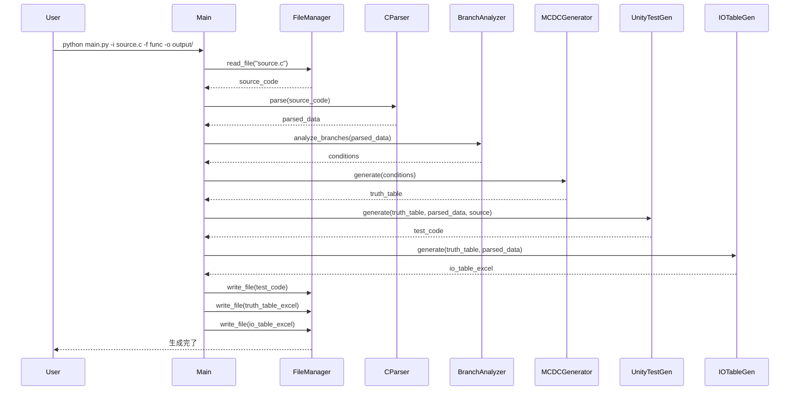
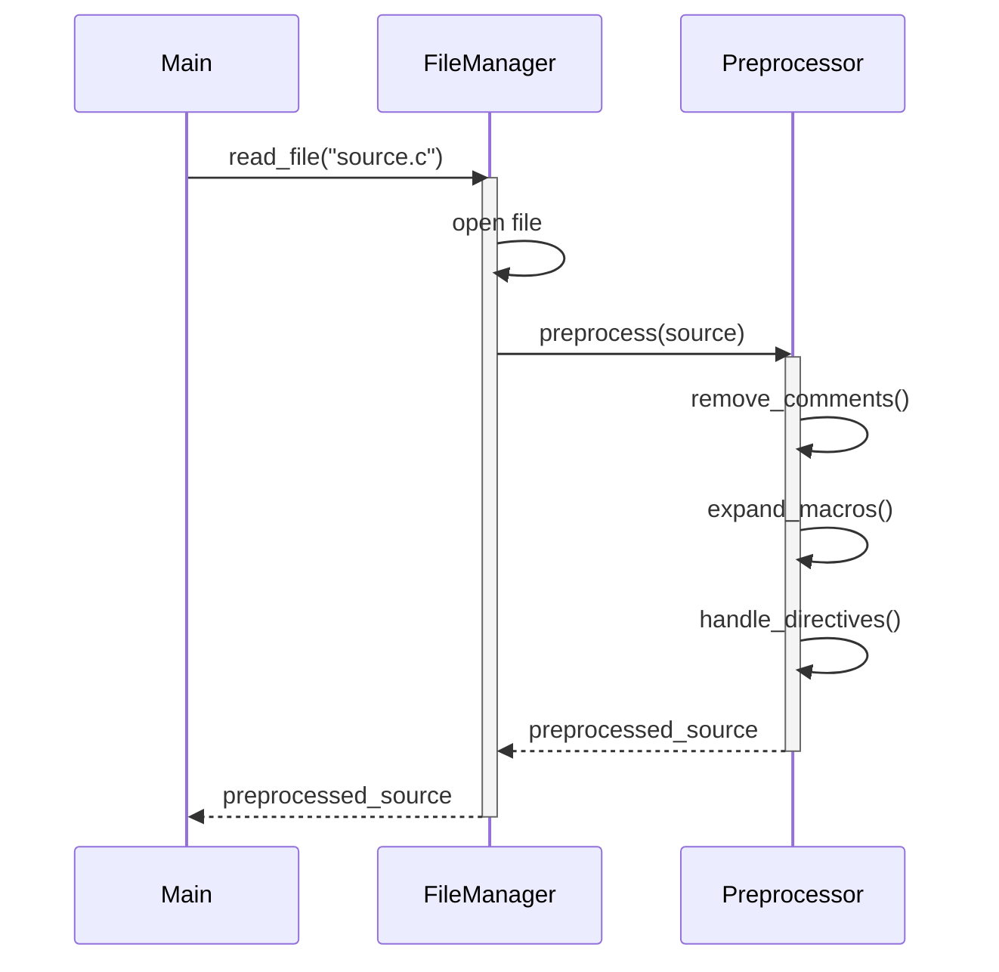
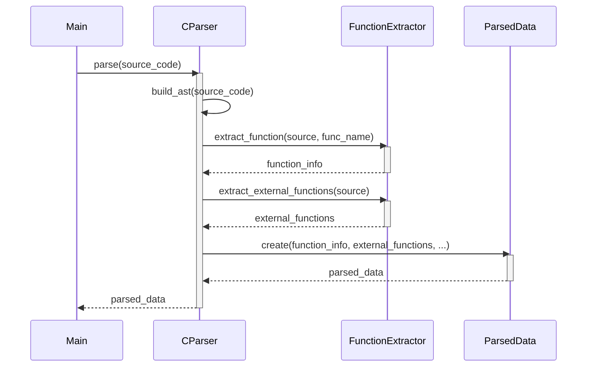
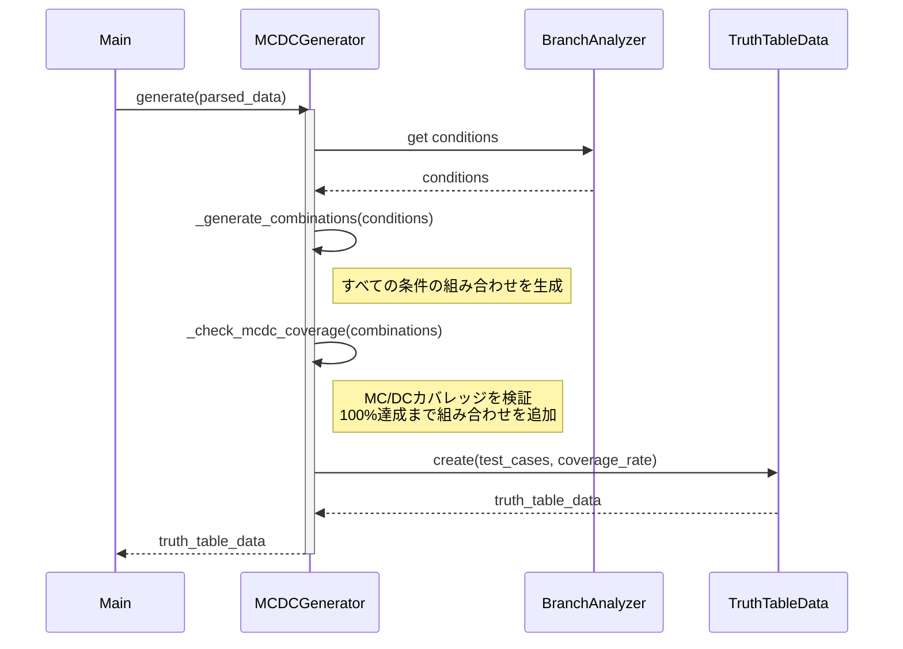
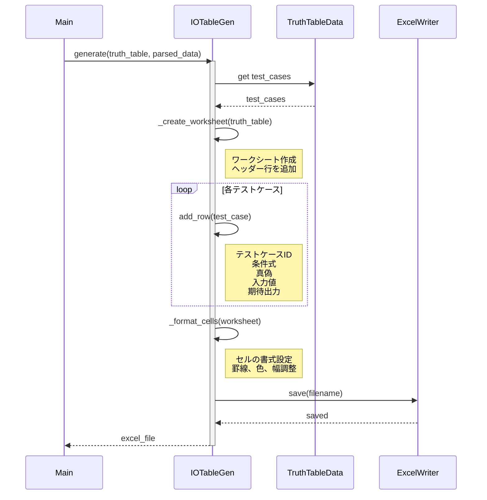
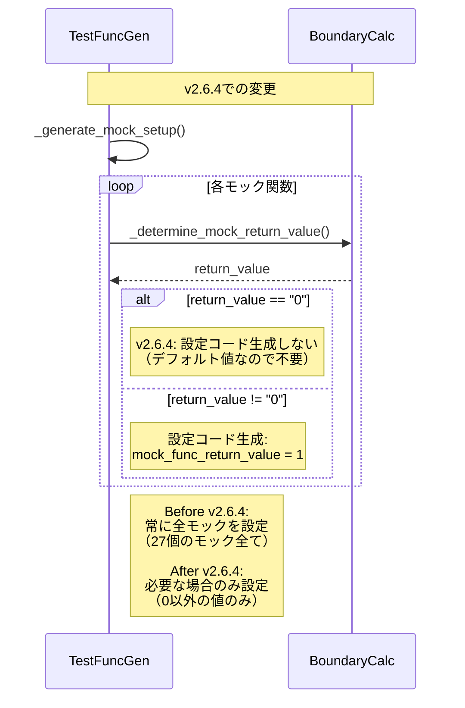
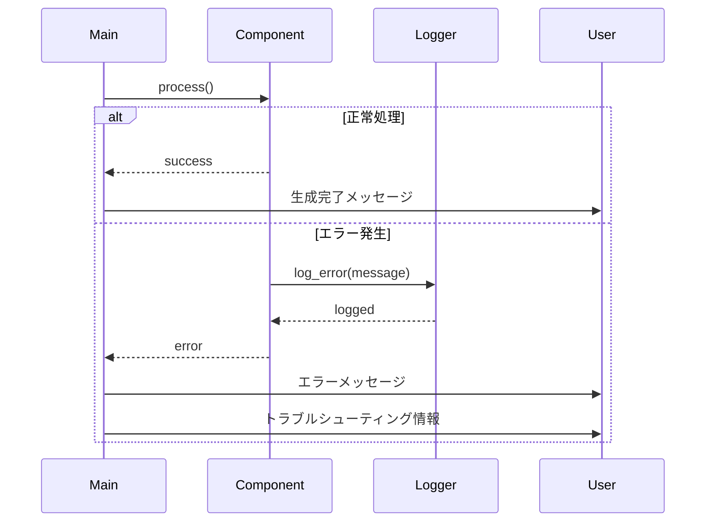
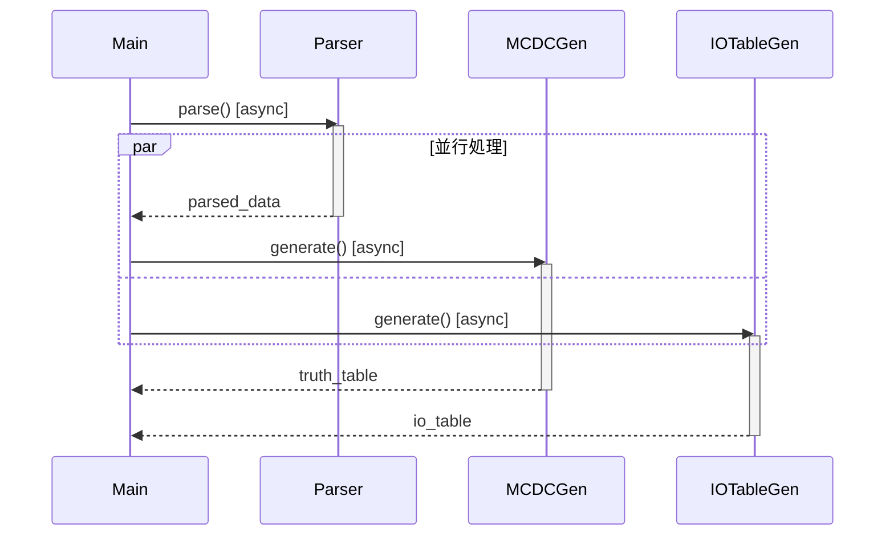

# AutoUniTestGen シーケンス図 (v2.6.5)

**最終更新**: 2025-11-20  
**バージョン**: 2.6.5

---

## 概要

このドキュメントでは、AutoUniTestGenの処理フローをシーケンス図で説明します。

v2.6.5では、以下の改善を実施しました：
- v2.6.2: グローバル変数初期化の削除
- v2.6.3: コメント形式修正、result変数型定義追加
- v2.6.4: デフォルト値モック設定の削除
- v2.6.5: パラメータ変数型定義追加

---

## 全体フロー



---

## 詳細フロー1: ファイル読み込みと前処理



---

## 詳細フロー2: 構文解析



---

## 詳細フロー3: Unityテストコード生成（v2.6.2-v2.6.5対応）

```mermaid
sequenceDiagram
    participant Main
    participant UnityTestGen
    participant MockGen
    participant TestFuncGen
    participant ProtoGen
    participant CommentGen
    participant CodeExtractor
    
    Main->>UnityTestGen: generate(truth_table, parsed_data, source)
    activate UnityTestGen
    
    Note over UnityTestGen: v2.6.3: コメント形式を // に変更
    UnityTestGen->>UnityTestGen: _generate_includes()
    UnityTestGen->>CodeExtractor: extract_type_definitions(source)
    CodeExtractor-->>UnityTestGen: type_defs
    
    UnityTestGen->>CodeExtractor: extract_function_body(source, func_name)
    CodeExtractor-->>UnityTestGen: function_body
    
    Note over UnityTestGen,MockGen: v2.6.2: グローバル変数初期化削除
    UnityTestGen->>MockGen: generate_mocks(parsed_data)
    activate MockGen
    
    MockGen->>MockGen: generate_mock_variables()
    Note right of MockGen: v2.6.2: = 0 を削除<br/>static int mock_count;
    
    MockGen->>MockGen: generate_mock_functions()
    MockGen->>MockGen: generate_reset_function()
    Note right of MockGen: reset_all_mocks()で初期化
    
    MockGen-->>UnityTestGen: mock_code
    deactivate MockGen
    
    UnityTestGen->>UnityTestGen: _generate_setup_teardown()
    Note right of UnityTestGen: setUp()でreset_all_mocks()呼び出し
    
    Note over UnityTestGen,TestFuncGen: v2.6.3,v2.6.4,v2.6.5: 変数型定義とモック設定最適化
    UnityTestGen->>TestFuncGen: generate_test_functions(truth_table, parsed_data)
    activate TestFuncGen
    
    loop 各テストケース
        TestFuncGen->>TestFuncGen: _generate_test_function(test_case, parsed_data)
        
        Note over TestFuncGen: v2.6.3,v2.6.5: 変数に型定義追加
        TestFuncGen->>TestFuncGen: _generate_variable_init(test_case, parsed_data)
        Note right of TestFuncGen: v2.6.3: result変数に型定義<br/>state_def_t result = {0};<br/>v2.6.5: パラメータにも型定義<br/>int count = 0;
        
        Note over TestFuncGen: v2.6.4: デフォルト値は設定しない
        TestFuncGen->>TestFuncGen: _generate_mock_setup(test_case, parsed_data)
        Note right of TestFuncGen: v2.6.4: 0以外の値のみ設定<br/>if return_value != "0"
        
        TestFuncGen->>TestFuncGen: _generate_function_call(parsed_data)
        TestFuncGen->>TestFuncGen: _generate_assertions(test_case, parsed_data)
    end
    
    TestFuncGen-->>UnityTestGen: test_functions
    deactivate TestFuncGen
    
    UnityTestGen->>ProtoGen: generate_prototypes(truth_table)
    ProtoGen-->>UnityTestGen: prototypes
    
    UnityTestGen->>CommentGen: generate_test_comment(test_case)
    CommentGen-->>UnityTestGen: comments
    
    UnityTestGen->>UnityTestGen: _generate_main_function()
    
    UnityTestGen-->>Main: test_code
    deactivate UnityTestGen
```

---

## 詳細フロー4: モックコード生成（v2.6.2で更新）

```mermaid
sequenceDiagram
    participant UnityTestGen
    participant MockGen
    participant ParsedData
    
    UnityTestGen->>MockGen: generate_mocks(parsed_data)
    activate MockGen
    
    MockGen->>ParsedData: external_functions
    ParsedData-->>MockGen: ["func1", "func2", ...]
    
    Note over MockGen: v2.6.2: 初期化を削除
    MockGen->>MockGen: generate_mock_variables()
    Note right of MockGen: // グローバル変数（初期化なし）<br/>static uint16_t mock_func1_return_value;<br/>static int mock_func1_call_count;
    
    MockGen->>MockGen: generate_mock_functions()
    Note right of MockGen: // モック関数実装<br/>uint16_t func1(void) {<br/>  mock_func1_call_count++;<br/>  return mock_func1_return_value;<br/>}
    
    MockGen->>MockGen: generate_reset_function()
    Note right of MockGen: // 初期化関数<br/>static void reset_all_mocks(void) {<br/>  mock_func1_return_value = 0;<br/>  mock_func1_call_count = 0;<br/>}
    
    MockGen-->>UnityTestGen: mock_code
    deactivate MockGen
```

---

## 詳細フロー5: テスト関数生成（v2.6.3, v2.6.4, v2.6.5で更新）

```mermaid
sequenceDiagram
    participant UnityTestGen
    participant TestFuncGen
    participant BoundaryCalc
    participant TestCase
    
    UnityTestGen->>TestFuncGen: generate_test_functions(truth_table, parsed_data)
    activate TestFuncGen
    
    loop 各テストケース
        TestFuncGen->>TestCase: get test_case
        TestCase-->>TestFuncGen: test_case_data
        
        TestFuncGen->>TestFuncGen: _generate_function_name(condition, truth)
        Note right of TestFuncGen: test_01_condition_T
        
        Note over TestFuncGen: v2.6.3: result変数に型定義<br/>v2.6.5: パラメータにも型定義
        TestFuncGen->>TestFuncGen: _generate_variable_init(test_case, parsed_data)
        Note right of TestFuncGen: v2.6.3:<br/>state_def_t result = {0};<br/><br/>v2.6.5:<br/>state_def_t inState = {0};<br/>int count = 0;
        
        TestFuncGen->>BoundaryCalc: generate_test_value(condition, truth)
        BoundaryCalc-->>TestFuncGen: test_value
        
        Note over TestFuncGen: v2.6.4: デフォルト値は設定しない
        TestFuncGen->>TestFuncGen: _generate_mock_setup(test_case, parsed_data)
        Note right of TestFuncGen: v2.6.4:<br/>デフォルト値（0）の場合は<br/>モック設定セクション自体を削除<br/><br/>0以外の値の場合のみ:<br/>mock_func_return_value = 1;
        
        TestFuncGen->>TestFuncGen: _generate_function_call(parsed_data)
        Note right of TestFuncGen: test_func_with_params();
        
        TestFuncGen->>TestFuncGen: _generate_assertions(test_case, parsed_data)
        Note right of TestFuncGen: TEST_ASSERT_EQUAL(...);<br/>TEST_ASSERT_TRUE(...);
    end
    
    TestFuncGen-->>UnityTestGen: test_functions
    deactivate TestFuncGen
```

---

## 詳細フロー6: 真偽表生成（MC/DC）



---

## 詳細フロー7: I/O表生成



---

## v2.6.2からv2.6.5での処理フロー変更点

### v2.6.2: モック初期化の最適化

```mermaid
sequenceDiagram
    participant MockGen
    participant UnityTestGen
    participant TestExecution
    
    Note over MockGen: v2.6.2での変更
    
    MockGen->>MockGen: generate_mock_variables()
    Note right of MockGen: Before v2.6.2:<br/>static int mock_count = 0;<br/><br/>After v2.6.2:<br/>static int mock_count;
    
    MockGen->>MockGen: generate_reset_function()
    Note right of MockGen: 変更なし:<br/>static void reset_all_mocks(void) {<br/>  mock_count = 0;<br/>}
    
    UnityTestGen->>UnityTestGen: _generate_setup_teardown()
    Note right of UnityTestGen: 変更なし:<br/>void setUp(void) {<br/>  reset_all_mocks();<br/>}
    
    Note over TestExecution: 実行時の初期化フロー
    TestExecution->>TestExecution: プログラム起動
    Note right of TestExecution: グローバル変数宣言<br/>（初期化なし、値は不定）
    
    TestExecution->>TestExecution: test_01実行
    TestExecution->>TestExecution: setUp()
    TestExecution->>TestExecution: reset_all_mocks()
    Note right of TestExecution: ここで初期化（1回のみ）<br/>mock_count = 0;
```

### v2.6.3: コメント形式修正 + 型定義追加

```mermaid
sequenceDiagram
    participant UnityTestGen
    participant TestFuncGen
    
    Note over UnityTestGen,TestFuncGen: v2.6.3での変更
    
    UnityTestGen->>UnityTestGen: _generate_standalone_test()
    Note right of UnityTestGen: コメント形式変更:<br/>Before: /* 以下、自動生成 */<br/>After: // 以下、自動生成
    
    TestFuncGen->>TestFuncGen: _generate_variable_init()
    Note right of TestFuncGen: result変数に型定義追加:<br/>Before: result = 0;<br/>After: state_def_t result = {0};
```

### v2.6.4: デフォルト値モック設定の削除



### v2.6.5: パラメータ変数の型定義追加

```mermaid
sequenceDiagram
    participant TestFuncGen
    participant ParsedData
    
    Note over TestFuncGen,ParsedData: v2.6.5での変更
    
    TestFuncGen->>TestFuncGen: _generate_variable_init()
    
    TestFuncGen->>ParsedData: get function_info.parameters
    ParsedData-->>TestFuncGen: parameters
    
    loop 各パラメータ
        TestFuncGen->>TestFuncGen: 型を判定
        
        alt 構造体型（_t含む or 大文字開始）
            Note right of TestFuncGen: v2.6.5:<br/>state_def_t inState = {0};
        else ポインタ型（*含む）
            Note right of TestFuncGen: v2.6.5:<br/>uint8_t* ptr = NULL;
        else 基本型
            Note right of TestFuncGen: v2.6.5:<br/>int count = 0;
        end
    end
    
    Note right of TestFuncGen: Before v2.6.5:<br/>inState = 0; ❌<br/>count = 0; ❌<br/><br/>After v2.6.5:<br/>state_def_t inState = {0}; ✅<br/>int count = 0; ✅
```

---

## エラーハンドリングフロー



---

## 並行処理（将来の拡張）

現在は逐次処理ですが、将来的に以下の並行処理が可能です：



---

## まとめ

AutoUniTestGenの処理フローは以下の特徴を持ちます：

1. **段階的処理**: 各ステップが明確に分離されている
2. **モジュール性**: 各コンポーネントが独立して動作
3. **拡張性**: 新しい機能を追加しやすい設計

v2.6.2からv2.6.5にかけて、以下の改善を実施：
- **v2.6.2**: モック初期化フローの最適化
- **v2.6.3**: コメント形式と型定義の改善
- **v2.6.4**: モック設定ロジックの最適化
- **v2.6.5**: パラメータ変数の型定義完備

これらの改善により、生成されるコードの品質とコンパイル成功率が大幅に向上しました。

---

**最終更新**: 2025-11-20  
**バージョン**: 2.6.5  
**作成者**: Claude (Anthropic)
